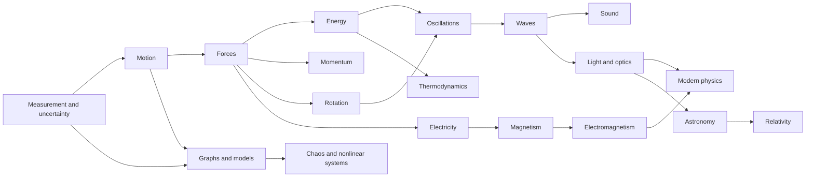
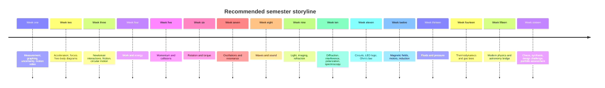
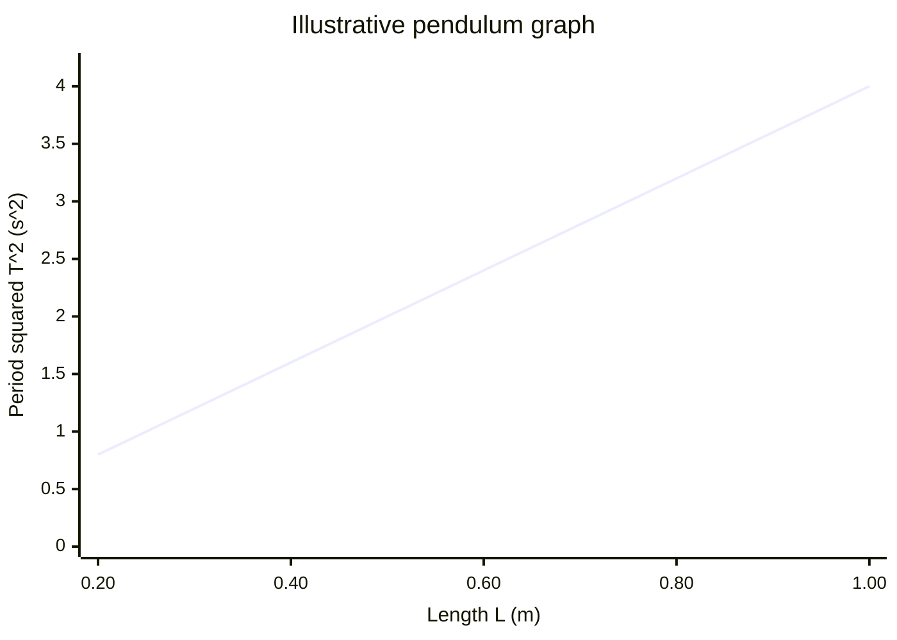
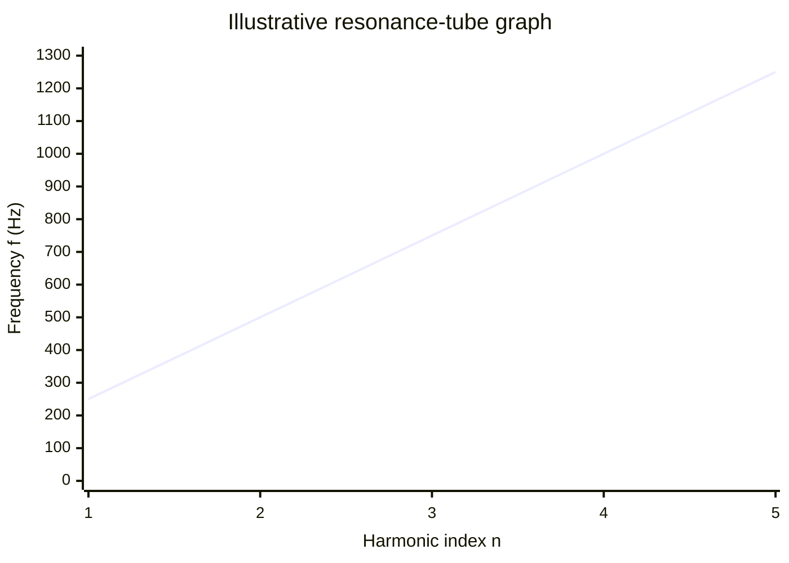
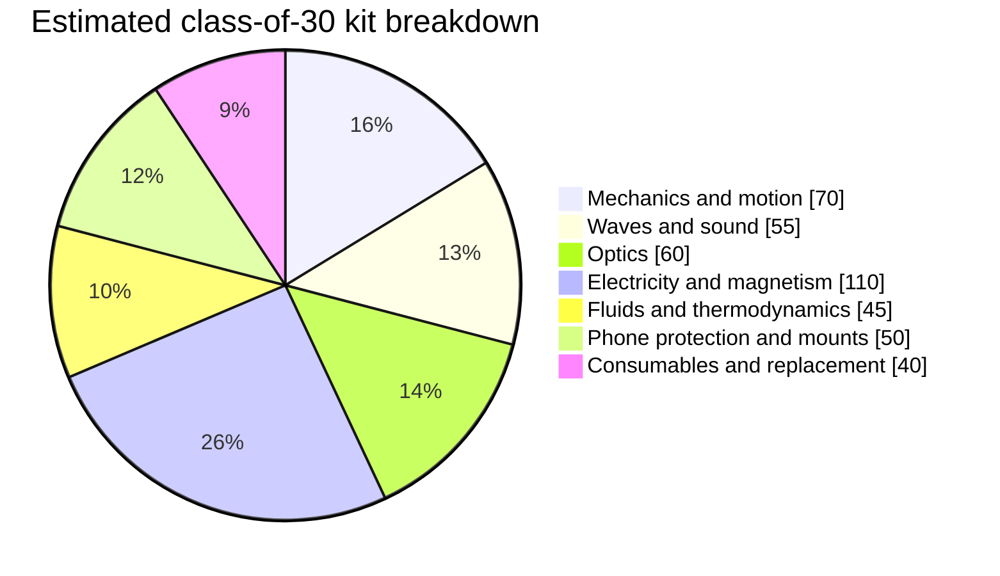
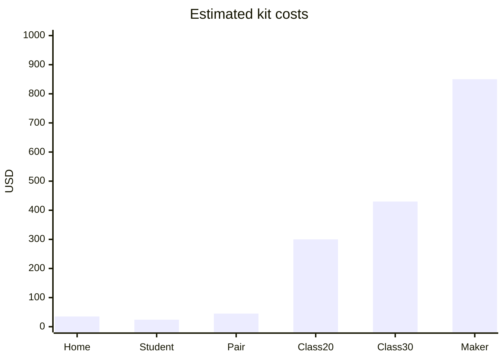

# Blueprint for a World-Class Hands-On Introductory Physics Course

## Executive summary

This report proposes a discovery-first introductory physics course built around **forty-two core experiments**, a **sensor-by-sensor smartphone lab**, a **compact extension catalog**, and a **ranked WOW list of one hundred memorable demonstrations**. The design assumption, because the user did not specify age or course context, is a primary audience of **ages 15–19 or algebra-based introductory college**, with adaptation notes for stronger middle-school cohorts and calculus-based college sections. The course is meant to work in ordinary classrooms, homes, makerspaces, and low-budget university labs using mostly household materials, simple electronics, recycled objects, and smartphones rather than specialized apparatus. citeturn13view2turn22search8turn23view1

The central recommendation is not “more demos,” but a different architecture for learning. The strongest evidence-based sequence is: **prediction before observation, observation before formalization, measurement before symbolic manipulation, and repeated cycling between model and world**. Passive demonstrations are often memorable but instructionally weak; students who merely watch demonstrations often learn little more than students who do not see them at all, whereas Interactive Lecture Demonstrations, Physics by Inquiry, ISLE, and related research-based materials improve conceptual engagement by making students predict, discuss, observe, explain, and revise. citeturn0search12turn13view0turn13view1turn13view2turn13view3turn0search8

The course therefore treats physics as **a sequence of testable questions**: How do we know whether motion is changing? Where does energy go? Why do oscillators pick out special frequencies? How do fields act at a distance? When do models fail? These questions are tied to a recurring toolkit: free-body diagrams, energy bar charts, motion maps, graphing, dimensional analysis, linearization, and uncertainty estimation. AAPT’s laboratory goals explicitly emphasize understanding uncertainty and the limits of measurement, and this blueprint pushes those skills into the first weeks rather than leaving them for the end. citeturn22search8turn13view1turn13view2

The strongest practical pillars are:

| Course pillar | Why it belongs at the center |
|---|---|
| Video analysis of real motion | Turns hallway, playground, and tabletop motion into quantitative data with Tracker or Tracker Online. citeturn11view7turn11view8 |
| Smartphone sensors | Makes acceleration, rotation, magnetic field, pressure, light, sound, and location measurable with devices students already own. citeturn11view5turn23view2turn6search1 |
| Household-wave labs | Slinkies, strings, bottles, and microphones make resonance, superposition, standing waves, harmonics, and Doppler effects visible and measurable. citeturn11view17turn3search8turn3search22turn16search2 |
| Optics from common materials | Water, magnifiers, mirrors, soap films, CDs, sunglasses, and phone cameras give genuine refraction, imaging, diffraction, polarization, and spectroscopy. citeturn19search10turn19search15turn11view17 |
| Low-voltage electricity and magnetism | LEDs, AA batteries, wire, coils, compasses, magnets, and PhET/Falstad reveal invisible fields safely and cheaply. citeturn20search0turn20search1turn20search4turn20search16turn11view10 |
| Hybrid hands-on plus simulation | Some topics, especially fields, modern physics, and relativity, are best learned by coordinating inexpensive physical experiments with carefully designed simulations. PhET’s research base is especially strong here. citeturn11view3turn1search1turn20search16 |

The bottom-line implementation recommendation is a **three-layer curriculum**. Layer one is a compact twelve-session “greatest hits” course for constrained settings. Layer two is a sixteen-week semester course that integrates experiments, discussion, graphing, and mathematical modeling. Layer three is a full-year course that extends into optics, thermodynamics, electromagnetism, astronomy, modern physics, and nonlinear systems. In all versions, the most important design choice is to center instruction on **forty-two core investigations that are repeatable, safe, measurable, and cheap**, then use the wider catalog and WOW list for differentiation, outreach, and strategic curiosity shocks. citeturn13view0turn13view1turn13view2turn13view3turn23view1

## Research basis and teaching philosophy

Students struggle with physics for reasons that are now well documented in physics education research. They do not arrive as blank slates; they arrive with durable intuitive models about motion, force, light, electricity, and heat. Those models are often context-sensitive, so a student may reason correctly in one setting and incorrectly in another. PER syntheses and conceptual-inventory work show that traditional instruction often leaves these intuitions largely intact, especially in mechanics. citeturn2search7turn2search3turn2search6turn2search28

That matters because the classic “show a cool thing, then explain the law” template often fails. Crouch, Fagen, Callan, and Mazur found that students who **passively observed demonstrations** understood the underlying concepts no better than students who did not see them, while later work on interactive demonstrations and ILDs found stronger learning when students had to predict, discuss, then compare observation with expectation. PhysPort’s ILD summary distills this into an eight-step routine built around individual prediction, peer discussion, and live comparison with measured data. citeturn0search12turn2search0turn13view0turn13view4turn0search8

The practical teaching philosophy that follows is:

**Curiosity before formalism.** Every major topic starts with an event that is observable and slightly dissonant: a light object and heavy object falling together; a phone graph lagging behind what the body feels in an elevator; standing waves “choosing” only certain frequencies; a compass twitching near a current; a CD acting like a spectrometer; a balloon rocket behaving like recoil. This creates a reason to care before symbols appear. citeturn11view17turn23view2turn20search0turn19search10

**Prediction before demonstration.** Students should write a prediction, defend it, and commit publicly enough that the observation can surprise them. That is the difference between entertainment and instruction. ILD, ISLE, and ACORN materials all operationalize this principle in different ways. citeturn13view0turn13view1turn13view3

**Measurement before algebraic abstraction.** Students should first produce graphs, compare runs, estimate uncertainty, and discover which variables matter. AAPT’s laboratory goals explicitly state that students should understand uncertainty and the limits of measurement. In this course, uncertainty is introduced with repeated timing trials, slope variability, calibration, residuals, and order-of-magnitude checks, not saved for a one-off “error analysis” week. citeturn22search8turn22search2

**Models as compressed explanations, not formulas to memorize.** ISLE emphasizes observational experiments, multiple candidate explanations, testing experiments, and representational tools such as graphs, motion diagrams, energy bars, ray diagrams, and wavefront diagrams. Physics by Inquiry likewise stresses depth over breadth and insists that concepts be constructed from observation and reasoning, not passively received. citeturn13view1turn13view2

**Mathematics introduced in layers.** The course should begin with proportional reasoning, units, graphs, and slope. Linear models come before quadratics; quadratic models come before trig-based oscillations; discrete difference ideas can precede differential equations. This is not anti-math. It is mathematically sequenced so that symbols enter when students already know what must be represented. PhET’s teaching guidance aligns with this by emphasizing sense-making, prior knowledge, and inquiry-based design rather than answer-chasing. citeturn1search1turn11view3

**Demos become investigations whenever possible.** A good demonstration is one a student can partially own: change one variable, collect one dataset, plot one graph, decide one uncertainty source, and make one improvement. When a large-class demonstration cannot become fully hands-on, it should still become intellectual labor through ILD-style prediction, discussion, and explanation. citeturn13view0turn13view3

**Technology remains subordinate to cognition.** Smartphones are extraordinarily valuable, but phyphox’s own developers warn that raw data often becomes extraneous cognitive load if students cannot see or interpret it during the experiment. The best smartphone activities therefore either use live remote visualization, in-app analysis, or heavily scaffolded data reduction. citeturn23view2

The resulting design principles are these: use visual conflict sparingly but intentionally; keep setups cheap enough to repeat; avoid “one perfect run” labs; make every module produce at least one graph with slope or intercept meaning; make uncertainty visible; and preserve a strong distinction between **observing**, **measuring**, **modeling**, and **generalizing**. Those are the habits that make a course memorable years later.

**Phase summary and next priorities.** The evidence base strongly supports a course built around prediction, measurement, and model revision rather than passive watching. The next design priority is therefore course architecture: which sequence best supports deep understanding while still feeling hands-on and coherent. citeturn13view0turn13view1turn13view2turn13view3turn2search7

## Course architecture and concept map

The course is best organized not as a parade of chapters, but as **interlocking storylines**. The table below gives the recommended module architecture. The misconceptions column is intentionally prominent because the experiments are chosen to challenge exactly these bad-but-stable intuitions.

| Module | Core question | Learning goals | Persistent misconceptions to target | Math prerequisites | Visual intuition, applications, history, engineering |
|---|---|---|---|---|---|
| Motion | How do we describe change? | Position, velocity, acceleration; motion graphs; frame choice | “Flat graph means rest,” “steeper always means faster in every graph” | Units, slopes, graph reading | Motion maps, ramps, video analysis; Galileo; traffic sensing, robotics |
| Forces | What changes motion? | Newton’s laws, interactions, free-body diagrams | Motion requires ongoing force; heavier falls faster | Vectors, decomposition | Tug-of-war, carts, springs; Newton; vehicles, structures |
| Energy | Where does it go? | Work, kinetic/potential/internal energy, transfer and storage | Energy is “used up”; force and energy are the same | Area under curve, proportionality | Bounces, springs, rollers; Joule; engines, batteries |
| Momentum | What is conserved in interaction? | Impulse, conservation, recoil, collisions | Bigger speed always means bigger “impact”; momentum and force are interchangeable | Products, vector sums | Balloon rockets, collisions; Huygens/Newton; crash design |
| Rotation | Why is spinning different? | Torque, rotational inertia, angular momentum | “Same force gives same turning”; heavier side always tips | Lever arms, center of mass | Meter sticks, wheels, stools; Euler; flywheels, tools |
| Oscillations | Why do systems return and overshoot? | SHM, period, damping, resonance seeds | Heavier pendula swing faster; amplitude changes period strongly at small angles | Graphs, trig later | Pendula, springs; Huygens; clocks, suspension systems |
| Waves | How does disturbance travel? | Speed, wavelength, frequency, reflection, superposition | Matter travels with the wave; bigger amplitude means faster wave | Ratios, graphing | Slinkies and strings; Young/Fourier; signals, seismic waves |
| Sound | Why do we hear pitch and timbre? | Harmonics, resonance, FFT, Doppler | Loudness equals pitch; timbre equals volume | Frequency, spectra | Bottles, tubes, phones; Helmholtz; acoustics, ultrasound |
| Light | What controls where light goes? | Reflection, refraction, image formation | Images “sit on” mirrors or lenses; refraction is bending toward surface not normal | Similar triangles | Water tanks, lenses, pinholes; Snell/Fermat; cameras, fiber optics |
| Optics and waves | When does light behave wave-like? | Diffraction, interference, polarization, spectra | White light is simple; polarization is just “brightness” | Ratios, patterns | CDs, soap films, sunglasses; Young and Fresnel; displays, spectroscopy |
| Electricity | How do charges create circuits and fields? | Potential difference, current, resistance, simple circuits | Current gets used up; battery is constant-current source | Graphs, linear fits | LEDs, breadboards; Volta/Ohm; electronics, sensing |
| Magnetism and electromagnetism | How do changing currents and fields interact? | Magnetic fields, induction, motors, generators | Magnets attract all metals; magnetic field is only near visible magnets | Right-hand reasoning, proportionality | Compasses, coils, motors; Ørsted/Faraday; power generation |
| Fluids | How do pressure and flow create force? | Density, buoyancy, continuity, pressure differences | Heavier objects always sink; fast flow implies high pressure | Ratios, graphs | Hydrometers, syringes, levitation; Archimedes/Bernoulli; ships, flight |
| Thermodynamics | Why does “useful” energy spread out? | Temperature, heat transfer, gas laws, thermal equilibrium | Cold flows; metal is “colder” because it has lower temperature | Linearization, ideal-gas reasoning | Cooling curves, syringes, convection; Boyle/Joule; refrigeration, climate control |
| Modern physics | When do classical pictures fail? | Discreteness, spectra, photoelectric ideas, atomic models | Brighter light means more energetic photons; atoms are mini solar systems | Graphing and model limits | Spectroscopy, LEDs plus PhET; Planck/Einstein/Bohr; semiconductors |
| Relativity, astronomy, chaos, nonlinear systems | When do scale, frame, and sensitivity matter? | Reference frames, finite signal speed, parallax, orbital insights, deterministic unpredictability | Simultaneity is universal; small causes always give small effects | Ratios, trig, simulation literacy | Sundials, parallax, double pendulum, orbital sims; Einstein, Poincaré, Hubble; GPS, navigation, weather |

This architecture is best visualized as a connected concept map rather than a straight line.

For a semester implementation, the sequence below is the most coherent:

The architecture above synthesizes research-based instructional sequences from Physics by Inquiry, ISLE, ILD, ACORN, and PhET pedagogy, while adapting them to a low-cost, smartphone-rich environment. citeturn13view0turn13view1turn13view2turn13view3turn11view3

**Phase summary and next priorities.** The course structure is now clear: concepts recur through repeated modeling tools, and each module begins with observation-rich phenomena. The next priority is the core experimental backbone that keeps the course practical, memorable, and quantitatively honest. citeturn13view1turn13view2

## Core experiment portfolio

The forty-two experiments below form the recommended backbone. To keep the report readable while still honoring the user’s **twenty-five-field experiment record**, each experiment is compressed into five fixed bundles:

- **Fields 1–6:** title, topic, level, central question, hook, learning objectives  
- **Fields 7–9:** materials, cost, sourcing, prep, investigation sequence  
- **Fields 10–15:** measurements, expected observations, mathematical model, example calculation, graphs, interpretation  
- **Fields 16–20:** misconceptions, uncertainty, troubleshooting, safety, variations/extensions  
- **Fields 21–25:** engineering connection, smartphone/simulation enhancement, time, evidence quality, original sources  

Before the records, the table below compares twelve flagship investigations that are especially strong for classroom adoption.

| Flagship core experiment | Surprise | Conceptual value | Cost | Safety | Measurement potential | Inquiry suitability |
|---|---:|---:|---:|---:|---:|---:|
| Pendulum plus phone accelerometer | 4 | 5 | 5 | 4 | 5 | 5 |
| Rolling tube plus gyroscope | 5 | 5 | 4 | 4 | 5 | 5 |
| Bouncing ball video analysis | 4 | 5 | 5 | 5 | 5 | 5 |
| Standing waves on string | 5 | 5 | 4 | 4 | 4 | 5 |
| Resonance tube speed of sound | 5 | 5 | 5 | 5 | 5 | 5 |
| DIY spectroscope | 5 | 4 | 5 | 5 | 4 | 4 |
| Oersted field mapping | 4 | 5 | 5 | 5 | 4 | 5 |
| Coil and magnet induction | 5 | 5 | 4 | 5 | 4 | 5 |
| Syringe Boyle’s law | 4 | 5 | 5 | 5 | 5 | 5 |
| Parallax distance lab | 4 | 4 | 5 | 5 | 4 | 5 |
| Sundial solar-noon tracking | 4 | 4 | 5 | 5 | 4 | 4 |
| Double pendulum chaos | 5 | 4 | 4 | 4 | 3 | 5 |

The scoring is a curriculum-design judgment synthesized from the source pool used throughout this report: PER methods pages, smartphone-lab literature, Exploratorium activities, PhET and Tracker resources, and NASA classroom materials. citeturn13view0turn13view1turn23view1turn11view17turn11view3turn11view7turn19search10

**M1 Projectile or rolling-object video lab**  
**Fields 1–6:** Mechanics; ages 14+; question: how do position, velocity, and acceleration relate in real motion? Hook: ordinary hallway motion becomes a graph-rich data source. Goals: graph interpretation, model fitting, constant-acceleration reasoning.  
**Fields 7–9:** Materials: phone camera, meter stick, ball/cart/ramp; near-zero cost; home/classroom suitable; prep 5 minutes; film motion with scale in frame and analyze in Tracker.  
**Fields 10–15:** Measure x(t); expect parabolic position under near-constant acceleration; model x=x₀+v₀t+½at²; example fit a≈0.82 m/s² down a ramp; graph x–t and v–t.  
**Fields 16–20:** Fixes “speed is slope of all graphs” and “curved graph means irregular force”; errors: parallax, poor scaling, frame blur; safety: clear track. Extend to projectile motion and rolling resistance.  
**Fields 21–25:** Connects to machine vision and sports analysis; Tracker/Tracker Online strongly recommended; 35–45 minutes; evidence strong; sources: Tracker official docs and video-modeling resources. citeturn11view7turn11view8turn9search8

**M2 Motion stopwatch on an incline**  
**Fields 1–6:** Kinematics; ages 13+; question: can an accelerometer-triggered stopwatch replace traditional gates? Hook: a phone “starts itself” when the cart is tapped. Goals: interval timing, repeated-measurement uncertainty, average acceleration.  
**Fields 7–9:** Phone with phyphox, cart or toy car, ramp, tape marks; ~$5 excluding phone; prep 5 minutes; use motion-stopwatch or manual timing across equal spacings.  
**Fields 10–15:** Measure time between shocks or checkpoints; expect shorter times on steeper ramps; model a≈2Δx/t² from rest; graph t² vs distance or acceleration vs angle.  
**Fields 16–20:** Counters “timing is exact if it is digital”; manage shock sensitivity and false triggers; use padding and repeat trials; keep phone secured.  
**Fields 21–25:** Relates to industrial timing and sensor triggering; phyphox motion-stopwatch is built for this; 25–35 minutes; evidence moderate-to-strong; sources: phyphox experiment catalog and sensor documentation. citeturn8search0turn11view5turn23view2

**M3 Pendulum with smartphone accelerometer**  
**Fields 1–6:** Oscillations/mechanics; ages 15+; question: what sets pendulum period? Hook: the phone swings “blind,” but the graph reveals the rhythm. Goals: period, small-angle approximation, linearization, g estimation.  
**Fields 7–9:** Phone, string, clamp, tape, soft case; ~$3 excluding phone; prep 8 minutes; compare several lengths and amplitudes.  
**Fields 10–15:** Measure peak-to-peak period; expect T² proportional to L at small angles; model T=2π√(L/g); example L=0.64 m and T=1.60 s gives g≈9.87 m/s²; graph T² vs L.  
**Fields 16–20:** Corrects “heavier pendula swing faster”; errors: large amplitude, pivot friction, phone mass shifting effective length; secure mount; no overhead swinging near faces.  
**Fields 21–25:** Links to clocks and seismometers; phyphox pendulum experiment is directly relevant; 35–45 minutes; evidence strong; sources: phyphox docs and smartphone-pendulum literature cataloged by Kuhn/Vogt and the phyphox paper. citeturn8search8turn23view2turn16search10turn16search1

**M4 Free-fall acoustic timing**  
**Fields 1–6:** Mechanics; ages 14+; question: how can falling time be measured without dropping the phone? Hook: the microphone turns two sounds into a free-fall timer. Goals: g from timing, event detection, uncertainty comparison.  
**Fields 7–9:** Ball, drop height, hard floor or metal tray, microphone app/phyphox audio tools; near-zero cost; prep 5 minutes; record release sound and impact sound.  
**Fields 10–15:** Measure Δt between peaks; expect h≈½gΔt²; example Δt=0.45 s gives h≈0.99 m; graph h vs t².  
**Fields 16–20:** Counters “there is no way to time short events cheaply”; errors from delay between release action and sound, echo, finite ball size; use identical release method, quiet room.  
**Fields 21–25:** Connects to acoustic sensing and ballistic timing; smartphone audio tools make this practical; 20–30 minutes; evidence strong; sources include smartphone free-fall literature and phyphox audio tools. citeturn16search13turn3search22turn23view2

**M5 Rolling tube with gyroscope**  
**Fields 1–6:** Rotation/energy; ages 15+; question: how does angular speed connect to linear speed in rolling? Hook: a hidden phone inside a cardboard tube becomes a rolling sensor. Goals: no-slip condition, rotational kinematics, energy partition.  
**Fields 7–9:** Cardboard mailing tube, phone, padding, ramp; ~$6 excluding phone; prep 10 minutes; roll tube at several inclines and radii.  
**Fields 10–15:** Measure ω(t); use v=ωR; compare with translational motion; graph peak speed vs ramp height.  
**Fields 16–20:** Corrects “rolling and sliding are basically the same”; errors: phone not centered, slipping, gyro drift; fix with tight padding and short runs; use soft stop.  
**Fields 21–25:** Engineering link: wheel-speed sensing and inertial navigation; phyphox remote access and in-app analysis are ideal here; 35–50 minutes; evidence strong; source explicitly described by phyphox developers. citeturn23view2

**M6 Friction on an adjustable incline**  
**Fields 1–6:** Forces; ages 13+; question: what determines when sliding begins, and how large is kinetic friction? Hook: changing surface textures visibly changes thresholds but not in simplistic ways. Goals: static vs kinetic friction, normal force, coefficients.  
**Fields 7–9:** Board, books, blocks, sandpaper/felt/plastic, smartphone inclinometer if available; <$10; prep 5 minutes; slowly raise incline and measure critical angle, then time motion.  
**Fields 10–15:** Model μₛ≈tanθ_c and a=g(sinθ−μ_k cosθ); graph acceleration vs angle.  
**Fields 16–20:** Fixes “friction always equals μN” and “bigger area means more friction” for dry sliding; errors: jerky release, variable surfaces; keep surfaces clean.  
**Fields 21–25:** Connects to tires, brakes, manufacturing; phone inclinometer and Tracker help; 30–40 minutes; evidence strong as a classic lab with strong inquiry value. citeturn11view5turn11view14

**M7 Balloon rocket and impulse**  
**Fields 1–6:** Momentum; ages 12+; question: why does expelled air drive a rocket forward? Hook: almost no one forgets a balloon racing along a string. Goals: momentum conservation, thrust, design iteration.  
**Fields 7–9:** Balloon, string, straw, tape, measuring tape; <$3; prep 3 minutes; compare balloon size, nozzle control, and added mass.  
**Fields 10–15:** Measure travel time and distance; infer average speed and compare qualitative thrust; graph range or speed vs inflation size.  
**Fields 16–20:** Corrects “rocket pushes on air behind it, not on itself”; errors: line sag, rubbing straw, inconsistent inflation; use taut line.  
**Fields 21–25:** Connects to jet propulsion and fluid reaction forces; phone slow-motion video improves timing; 15–25 minutes; evidence moderate but excellent for inquiry. citeturn11view17

**M8 Marble or cart collisions with video analysis**  
**Fields 1–6:** Momentum/energy; ages 14+; question: what is conserved in a collision? Hook: the eye misses the timing, but slow motion doesn’t. Goals: momentum conservation, elastic vs inelastic losses, restitution.  
**Fields 7–9:** Marbles/carts, ruler, phone slow-motion video, flat surface; <$10; prep 5 minutes; compare head-on and unequal-mass cases.  
**Fields 10–15:** Extract pre/post velocities; compute p and kinetic energy; graph p_before vs p_after.  
**Fields 16–20:** Counters “momentum and kinetic energy are always both conserved”; errors: off-axis hits, rolling friction, camera angle; use leveled surface.  
**Fields 21–25:** Connects to crash reconstruction and sports science; Tracker or frame-by-frame phone apps work well; 35–45 minutes; evidence strong. citeturn11view7turn11view8

**M9 Bouncing-ball energy loss**  
**Fields 1–6:** Energy; ages 12+; question: where does mechanical energy go in a bounce? Hook: familiar motion hides systematic loss. Goals: potential-to-kinetic conversion, restitution, log-style decay patterns.  
**Fields 7–9:** Ball, meter stick, phone slow motion; <$5; prep 3 minutes; record multiple bounces.  
**Fields 10–15:** Measure bounce heights; expect hₙ₊₁/hₙ≈e² for roughly constant restitution; graph bounce number vs height.  
**Fields 16–20:** Fixes “lost energy vanished” and “same drop height always means same rebound fraction regardless of surface”; errors: spin, off-axis bounce, scale visibility.  
**Fields 21–25:** Links to material testing and sports-ball standards; Tracker recommended; 20–35 minutes; evidence strong. citeturn11view7turn11view8

**M10 Spring launcher and work–energy**  
**Fields 1–6:** Energy; ages 15+; question: how does stored spring energy become motion? Hook: small launches make invisible energy storage tangible. Goals: Hooke’s law, work, launch speed prediction.  
**Fields 7–9:** Spring or rubber band launcher, block/marble, ruler, masses; $5–$12; prep 10 minutes; calibrate x and compare outcomes.  
**Fields 10–15:** Model ½kx²≈½mv² or ΔU→K; graph v² vs x² or range vs compression.  
**Fields 16–20:** Corrects “more force means more energy” without path distinction; errors: friction, nonideal spring, inconsistent release; use repeated trials and low compressions.  
**Fields 21–25:** Connects to ballistics, toy design, suspension systems; video plus curve fitting helps; 35–50 minutes; evidence moderate-to-strong. citeturn11view3

**M11 Meter-stick torque balance**  
**Fields 1–6:** Rotation/statics; ages 13+; question: how do force and lever arm trade off? Hook: a long stick balances impossible-looking loads. Goals: torque, equilibrium, center of mass.  
**Fields 7–9:** Meter stick, masses, string, clamp/fulcrum; <$10; prep 5 minutes; predict before balancing.  
**Fields 10–15:** Model Στ=0; example 0.20 kg at 0.10 m balances 0.10 kg at 0.20 m; graph force vs arm length.  
**Fields 16–20:** Fixes “heavier side always wins”; errors: ignoring stick mass and pivot friction; include stick COM.  
**Fields 21–25:** Connects to cranes and human biomechanics; phone camera useful for geometry; 20–35 minutes; evidence strong as a classic conceptual lab. citeturn13view1turn13view2

**M12 Spool or yo-yo rolling paradox**  
**Fields 1–6:** Rotation; ages 14+; question: why can a pulled spool roll toward the puller? Hook: highly counterintuitive reversal. Goals: torque direction, friction role, rolling constraints.  
**Fields 7–9:** Thread spool or yo-yo, string, surface; <$5; prep 2 minutes; vary pull angle and predict motion.  
**Fields 10–15:** Observe threshold angle for reversal; use torque and instantaneous center reasoning; graph outcome vs pull angle.  
**Fields 16–20:** Counters “objects always move in direction of pull”; errors: loose string, slipping; use textured surface.  
**Fields 21–25:** Connects to conveyor rollers and wheel design; phone video helps reveal onset; 15–25 minutes; evidence moderate, educational value very high. citeturn11view17

**M13 Angular momentum with stool and wheel**  
**Fields 1–6:** Rotation; ages 15+; question: why does spinning a wheel twist the body? Hook: dramatic full-body reaction. Goals: angular momentum conservation, vector intuition, precession seeds.  
**Fields 7–9:** Rotating stool/chair, bicycle wheel or weighted wheel; classroom demonstration or supervised lab; low cost if wheel available; prep 8 minutes.  
**Fields 10–15:** Mostly qualitative plus angular-speed estimates from video; compare body rotation with wheel orientation changes.  
**Fields 16–20:** Counters “only forces matter, not rotational state”; errors: chair friction, unbalanced wheel; clear surrounding space.  
**Fields 21–25:** Connects to spacecraft attitude control and reaction wheels; slow-motion video useful; 15–25 minutes; evidence strong as a classic high-impact demo. citeturn11view17

**M14 Torsion pendulum and shear modulus**  
**Fields 1–6:** Rotation/materials; ages 16+; question: how can twisting reveal material stiffness? Hook: the phone itself becomes the pendulum bob. Goals: torsional oscillation, restoring torque, material property measurement.  
**Fields 7–9:** Wire or fishing leader, phone or weighted object, clamp; $5–$15; prep 10 minutes; twist small amounts and record period.  
**Fields 10–15:** Model T=2π√(I/κ); for calibrated wire, estimate shear modulus; graph T² vs I or wire length.  
**Fields 16–20:** Fixes “stiffness only matters for stretching”; errors: large-angle twists, support slip; protect phone from drops.  
**Fields 21–25:** Connects to torque sensors and material testing; phone gyroscope can measure angular speed; 40–50 minutes; evidence moderate-to-strong; source: smartphone torsion-pendulum literature. citeturn16search16

**M15 Mass–spring oscillator with phone**  
**Fields 1–6:** Oscillations; ages 14+; question: how do mass and spring constant control frequency? Hook: acceleration graphs show sinusoidal regularity from a very ordinary setup. Goals: period, damping, resonance seeds.  
**Fields 7–9:** Spring, phone or small mass holder, clamp; $5–$10 plus phone; prep 8 minutes; compare masses.  
**Fields 10–15:** Model T=2π√(m/k); example from slope of T² vs m gives k; graph T² vs m.  
**Fields 16–20:** Counters “bigger amplitude means faster oscillation” in linear regime; errors from sideways motion and nonlinear spring stretch.  
**Fields 21–25:** Links to seismometers and suspension; phyphox spring experiment and acceleration spectrum are ideal; 35–45 minutes; evidence strong. citeturn8search2turn3search17turn23view2

**M16 Coupled pendulums and beats**  
**Fields 1–6:** Oscillations/waves; ages 15+; question: how does energy move between connected oscillators? Hook: one pendulum “hands off” motion to another. Goals: normal modes, coupling, beats.  
**Fields 7–9:** Two pendulums joined by light spring/string; <$10; prep 10 minutes; start one pendulum only.  
**Fields 10–15:** Measure envelope period and fast oscillation period; graph amplitude vs time.  
**Fields 16–20:** Fixes “energy transfer requires collision” and “frequency means only one timescale”; errors from unequal lengths and damping mismatch.  
**Fields 21–25:** Connects to molecules, bridges, and wireless filters; phone video or accelerometer helpful; 30–45 minutes; evidence strong for conceptual insight. citeturn11view17turn24search0

**M17 Slinky pulse speed and reflection**  
**Fields 1–6:** Waves; ages 12+; question: what travels in a wave, and what sets speed? Hook: reflections invert or do not invert depending on boundary. Goals: pulse speed, boundary conditions, superposition.  
**Fields 7–9:** Slinky or rope, masking tape, meter scale; $5–$10; prep 3 minutes; vary tension and medium.  
**Fields 10–15:** Measure travel time and compare v≈√(T/μ) qualitatively; graph speed vs tension proxy.  
**Fields 16–20:** Fixes “the material itself moves with the pulse”; errors from nonuniform tension and hand inconsistency; keep clear floor space.  
**Fields 21–25:** Connects to seismic waves and transmission lines; slow-motion video useful; 20–30 minutes; evidence very strong. citeturn11view17

**M18 Standing waves on string**  
**Fields 1–6:** Waves; ages 14+; question: why do only special frequencies produce stable patterns? Hook: the string suddenly “locks in.” Goals: resonance, harmonics, nodes/antinodes.  
**Fields 7–9:** String, weight, pulley, phone tone generator or speaker; $8–$15; prep 10 minutes.  
**Fields 10–15:** Model f_n=n(v/2L); measure resonance frequencies and graph f vs n.  
**Fields 16–20:** Counters “any frequency works if loud enough”; errors from weak driving and changing tension; protect ears from sustained loud tones.  
**Fields 21–25:** Connects to musical instruments and RF cavities; phyphox speaker/tone generator or phone apps useful; 30–45 minutes; evidence strong. citeturn3search8turn11view17turn17search1

**M19 Resonance tube and speed of sound**  
**Fields 1–6:** Sound; ages 14+; question: how can a bottle or tube reveal sound speed? Hook: the air column selects frequencies. Goals: standing waves in air, harmonics, speed of sound.  
**Fields 7–9:** Bottle/tube, water for length adjustment, phone speaker and microphone or tuning fork; <$5; prep 5 minutes.  
**Fields 10–15:** Model for closed tube f_n=(2n−1)v/4L; example v≈4Lf for first resonance; graph f vs 1/L or f vs harmonic number.  
**Fields 16–20:** Fixes “sound speed depends mainly on loudness or pitch”; errors from end correction and room echoes; use quiet room.  
**Fields 21–25:** Connects to organ pipes and acoustic sensing; phone FFT tools work very well; 30–40 minutes; evidence strong. citeturn3search8turn16search2turn23view2

**M20 Doppler effect with phone speaker and microphone**  
**Fields 1–6:** Sound/waves; ages 15+; question: why does pitch shift with motion? Hook: a swinging or moving phone audibly changes its own tone. Goals: source/observer Doppler, frequency measurement.  
**Fields 7–9:** One or two phones, tone generator, FFT app; near-zero cost if devices available; prep 5 minutes; move source past microphone or swing on string carefully.  
**Fields 10–15:** Model Δf/f≈v/v_sound for small speeds; graph observed frequency vs speed estimate.  
**Fields 16–20:** Counters “only volume changes with motion”; errors from echo, wind, speed estimate; do not swing near faces or windows.  
**Fields 21–25:** Connects to radar and medical ultrasound; phyphox demonstrates Doppler with microphone tools; 25–35 minutes; evidence strong. citeturn0search2turn3search20turn8search20

**M21 Refraction and critical angle in water**  
**Fields 1–6:** Optics; ages 13+; question: what controls bending of light? Hook: the beam appears to change its “mind” at the interface. Goals: Snell’s law, normal line, total internal reflection seeds.  
**Fields 7–9:** Clear tank or semicircular container, water, low-power laser or bright flashlight slit; <$10; prep 8 minutes.  
**Fields 10–15:** Model n₁sinθ₁=n₂sinθ₂; graph sinθ₁ vs sinθ₂.  
**Fields 16–20:** Fixes “light bends toward the surface,” not the normal; errors from unclear beam and wrong angle reference; use only supervised low-power laser practice.  
**Fields 21–25:** Connects to fiber optics and lenses; PhET Bending Light or Geometric Optics complements the lab; 30–40 minutes; evidence strong. citeturn17search1turn20search9turn21search0turn21search13

**M22 Thin-lens imaging with magnifier and camera**  
**Fields 1–6:** Optics; ages 13+; question: where does a real image form, and how does size change? Hook: a wall suddenly becomes a screen. Goals: focal length, image distance, magnification.  
**Fields 7–9:** Magnifying glass or cheap lens, screen/card, candle or LED object, ruler; $3–$10; prep 5 minutes.  
**Fields 10–15:** Model 1/f=1/d_o+1/d_i and m=−d_i/d_o; graph 1/d_i vs 1/d_o.  
**Fields 16–20:** Fixes “the lens decides a fixed image size” and “image always forms at the lens”; errors from thick-lens approximations, poor alignment.  
**Fields 21–25:** Connects to cameras and telescopes; Geometric Optics PhET is an excellent complement; 30–40 minutes; evidence strong. citeturn17search1turn20search9

**M23 Pinhole camera**  
**Fields 1–6:** Light/imaging; ages 10+; question: how can an image form without a lens? Hook: upside-down world in a shoebox. Goals: straight-line propagation and image inversion.  
**Fields 7–9:** Box, foil, paper screen, pin; nearly free; prep 10 minutes.  
**Fields 10–15:** Measure image size vs pinhole-to-screen distance; use similar triangles.  
**Fields 16–20:** Fixes “light carries pictures intact” rather than traveling geometrically; errors from pinhole too large or too small; no sun-viewing without appropriate solar-projection procedure.  
**Fields 21–25:** Connects to cameras and CCD pixel logic; can extend to solar projection only under strict safe-projection rules; 25–35 minutes; evidence strong. citeturn11view17turn19search7

**M24 CD or DVD spectroscope**  
**Fields 1–6:** Optics/modern bridge; ages 12+; question: how does white light reveal structure? Hook: a cereal box and disc become a real spectroscope. Goals: diffraction, spectra, source comparison.  
**Fields 7–9:** CD/DVD piece or diffraction grating, cereal box or tube, tape, slit; $0–$5; prep 10 minutes.  
**Fields 10–15:** Measure angular spread if desired; compare LED, incandescent, fluorescent spectra; graph rough line positions or color bands.  
**Fields 16–20:** Fixes “all white lights are the same”; errors from poor slit and stray light; never observe Sun directly.  
**Fields 21–25:** Connects to astronomy, remote sensing, materials ID; NASA has official classroom spectrometer activities; 30–45 minutes; evidence strong. citeturn19search10turn19search15turn19search2

**M25 Polarization and stress patterns**  
**Fields 1–6:** Optics; ages 12+; question: what does polarization filter out? Hook: crossed sunglasses hide and reveal patterns in plastics. Goals: polarization, Malus-style qualitative reasoning, stress visualization.  
**Fields 7–9:** Polarized sunglasses or sheets, clear plastic utensils/tape/cellophane, phone or laptop screen as polarized source; $5–$15.  
**Fields 10–15:** Rotate analyzer and inspect transmission; graph intensity qualitatively vs angle if lux sensor available.  
**Fields 16–20:** Fixes “polarized means colored”; errors from nonpolarized sources; keep expectations qualitative unless a good light sensor is available.  
**Fields 21–25:** Connects to LCDs, stress analysis, photography; phone light sensor can help on Android-class devices; 20–35 minutes; evidence strong. citeturn11view17turn11view5turn11view12

**M26 Soap-film interference**  
**Fields 1–6:** Optics/waves; ages 12+; question: why do thin films show color without pigments? Hook: moving rainbow bands in a soap film. Goals: interference, thickness variation, wavelength dependence.  
**Fields 7–9:** Soap solution, wire loop or bubble wand, dark background; <$5; prep 5 minutes.  
**Fields 10–15:** Observe color progression and drainage; use qualitative thin-film model rather than demanding precise thickness calculations in intro settings.  
**Fields 16–20:** Fixes “color must come from dye”; errors from unstable films and lighting; avoid slippery floors.  
**Fields 21–25:** Connects to coatings and oil slicks; smartphone macro video works well; 15–25 minutes; evidence strong for conceptual optics. citeturn11view17

**M27 Penny battery and LED**  
**Fields 1–6:** Electricity/electrochemistry; ages 12+; question: how can small chemical cells add to light an LED? Hook: coins, paper, and foil make genuine electrical power. Goals: voltage, cell stacking, circuit completion.  
**Fields 7–9:** Pennies or metal washers, foil/zinc source, vinegar-salt paper disks, LED; $3–$8; prep 10 minutes.  
**Fields 10–15:** Measure per-cell voltage and total stack voltage; Exploratorium notes that about three cells can light a red LED near 1.7 V.  
**Fields 16–20:** Fixes “current comes out of one battery terminal and disappears in the bulb”; errors: poor contact, dry separators; clean up acidic materials.  
**Fields 21–25:** Connects to batteries and corrosion; multimeter or phone camera brightness comparison helps; 25–35 minutes; evidence strong. citeturn20search4

**M28 Simple circuits plus Circuit Construction Kit**  
**Fields 1–6:** Electricity; ages 12+; question: what do voltage and current do in series and parallel circuits? Hook: identical bulbs behave differently than beginners expect. Goals: current continuity, potential differences, resistance.  
**Fields 7–9:** AA batteries, holders, LEDs/bulbs, resistors, breadboard, jumper wires; $10–$20; prep 10 minutes.  
**Fields 10–15:** Measure V and I; graph I vs V for resistor or compare brightness/current in topologies.  
**Fields 16–20:** Fixes “current gets used up” and “battery provides fixed current”; errors from reversed LEDs and poor contacts; stay with low-voltage DC only.  
**Fields 21–25:** Connects to electronics prototyping; PhET Circuit Construction Kit is the strongest complement; 40–50 minutes; evidence strong. citeturn20search19turn20search9turn11view3

**M29 Oersted field mapping with compass and phone magnetometer**  
**Fields 1–6:** Magnetism; ages 14+; question: how do currents create magnetic fields? Hook: a current visibly twists a compass. Goals: magnetic-field direction, field around wire and coil.  
**Fields 7–9:** Wire, battery pack, switch, compass, phone magnetometer when available; $8–$15; prep 8 minutes.  
**Fields 10–15:** Measure compass direction or field strength vs distance/current; graph B proxy vs I or 1/r qualitatively.  
**Fields 16–20:** Fixes “magnetism only comes from permanent magnets”; errors from Earth-field background and loose geometry; avoid prolonged battery shorting.  
**Fields 21–25:** Connects to motors, relays, and sensors; phone magnetometer adds quantitative value; 30–45 minutes; evidence strong. citeturn16search3turn11view5turn21search11

**M30 Coil plus magnet induction or hand-crank wind generator**  
**Fields 1–6:** Electromagnetism; ages 14+; question: what does changing flux actually do? Hook: a bulb flashes only while the system changes. Goals: induction, flux change, generator basics.  
**Fields 7–9:** Coil wire, strong magnet, LED or galvanometer, optional fan blades or hand crank; $10–$20; prep 12 minutes.  
**Fields 10–15:** Compare signal amplitude vs magnet speed or number of turns; interpret Faraday’s law qualitatively.  
**Fields 16–20:** Fixes “a magnetic field alone makes current”; errors from weak magnets and low-turn coils; use eye-safe and pinch-safe handling of magnets.  
**Fields 21–25:** Connects to renewable power and pickups; PhET Faraday’s Law is an ideal field-visualization complement; 35–50 minutes; evidence strong. citeturn20search1turn20search12turn20search16

**M31 Simple motor or homopolar motor**  
**Fields 1–6:** Electromagnetism; ages 14+; question: how does current in a magnetic field become motion? Hook: a bare wire starts rotating. Goals: motor effect, Lorentz-force direction, current path design.  
**Fields 7–9:** AA battery, magnet, copper wire, supports; <$5; prep 5 minutes.  
**Fields 10–15:** Mostly qualitative; compare start-up reliability as geometry changes.  
**Fields 16–20:** Fixes “motors require complex black-box internals”; errors from oxide on wire, poor balancing; batteries can warm if shorted, so runs should be brief.  
**Fields 21–25:** Connects to motors at every scale; video helps analyze starts/stalls; 15–25 minutes; evidence strong. citeturn20search0turn21search11

**M32 Density column and homemade hydrometer**  
**Fields 1–6:** Fluids; ages 11+; question: why do some things float at one depth and not another? Hook: objects hover in layered liquids. Goals: density, buoyancy, calibration.  
**Fields 7–9:** Water, salt solution, oil, syringes/straw hydrometer, beads or paper clips; <$8; prep 10 minutes.  
**Fields 10–15:** Calibrate depth vs density; graph floating depth vs liquid density.  
**Fields 16–20:** Fixes “heavier objects always sink”; errors from mixing layers and trapped bubbles; use spill trays.  
**Fields 21–25:** Connects to oceanography and battery hydrometers; phone camera useful for reading levels; 25–40 minutes; evidence strong. citeturn11view17

**M33 Bernoulli levitation or paper-strip flow**  
**Fields 1–6:** Fluids; ages 11+; question: why can faster flow reduce pressure? Hook: a ping-pong ball hovers in an air stream. Goals: continuity, pressure difference, stability.  
**Fields 7–9:** Hair dryer or straw and lightweight ball, paper strip alternatives; $0–$15; prep 2 minutes.  
**Fields 10–15:** Mostly qualitative, with optional video of stability; relate to Bernoulli plus entrainment carefully.  
**Fields 16–20:** Important misconception note: this is easily oversimplified; discuss stream curvature and surrounding-air entrainment, not “low pressure alone does everything.” Keep objects away from hot air settings.  
**Fields 21–25:** Connects to atomizers and flight discussions; high inquiry value if framed carefully; 15–25 minutes; evidence moderate. citeturn11view17turn2search20

**M34 Syringe Boyle’s law and elevator barometry**  
**Fields 1–6:** Thermodynamics/fluids; ages 14+; question: how do pressure, volume, and height relate? Hook: pushing a syringe “stores” pressure; an elevator graph shows altitude from air pressure. Goals: gas-law reasoning, atmospheric pressure change, derivative ideas.  
**Fields 7–9:** Large syringe, stopper, masses or force sensor; optional phone with pressure sensor; $3–$8; prep 5 minutes.  
**Fields 10–15:** Model PV≈constant for slow compression; with elevator, pressure gives height difference and derivative gives speed.  
**Fields 16–20:** Fixes “pressure is force” without area and “barometers only belong in weather stations”; errors from leaks and rapid nonisothermal compression.  
**Fields 21–25:** Connects to aviation and HVAC; phyphox elevator/barometer workflows are especially good; 30–45 minutes; evidence strong. citeturn23view2turn11view5turn4search5turn5search1

**M35 Cooling curves and calorimetry**  
**Fields 1–6:** Thermodynamics; ages 13+; question: how does heat flow and how can heat capacity be inferred? Hook: two cups that “feel similar” cool very differently. Goals: temperature vs time, equilibrium, specific heat reasoning.  
**Fields 7–9:** Cups, water, metal masses, digital thermometer or kitchen probe; $10–$15 if thermometer needed.  
**Fields 10–15:** Record T(t); fit simple exponential cooling qualitatively or use mixing equation for calorimetry.  
**Fields 16–20:** Fixes “coldness flows” and “metal is colder because it has lower temperature”; errors from heat loss to air and cup. Use warm, not boiling, liquids for student work.  
**Fields 21–25:** Connects to thermal management and materials processing; spreadsheets useful for fitting; 30–45 minutes; evidence strong. citeturn22search8

**M36 Convection and thermal expansion**  
**Fields 1–6:** Thermodynamics/fluids; ages 12+; question: how does heating create motion and size change? Hook: colored water forms moving plumes, and ordinary solids subtly expand. Goals: convection, density change, expansion.  
**Fields 7–9:** Clear container, food coloring, warm/cold water; optional metal strip or simple bimetal demo; <$10.  
**Fields 10–15:** Mostly qualitative with optional expansion measurements; graph plume travel time vs temperature difference if desired.  
**Fields 16–20:** Fixes “heat rises” rather than warmer, lower-density fluid rising; avoid open flames in ordinary classrooms when safer hot-water methods work.  
**Fields 21–25:** Connects to weather, buildings, and electronics cooling; video recommended; 20–35 minutes; evidence strong. citeturn11view17

**M37 DIY spectroscope to planetary spectroscopy bridge**  
**Fields 1–6:** Modern physics/astronomy; ages 13+; question: how can light tell us what something is made of? Hook: ordinary lamps produce distinct fingerprints. Goals: emission/absorption, spectra as information.  
**Fields 7–9:** Same build as M24 plus comparison sources; $0–$5.  
**Fields 10–15:** Compare spectral patterns; emphasize pattern recognition more than absolute calibration in the intro course.  
**Fields 16–20:** Fixes “color alone is enough to identify source” and prepares for atomic models without overpromising direct quantum derivation.  
**Fields 21–25:** Connects directly to NASA planetary and stellar spectroscopy activities; 25–40 minutes; evidence strong. citeturn19search10turn19search2turn19search18

**M38 Parallax distance measurement with two camera positions**  
**Fields 1–6:** Astronomy/measurement; ages 13+; question: how can position change reveal distance? Hook: a finger jump becomes a cosmic method. Goals: parallax geometry, triangulation, scale.  
**Fields 7–9:** Phone camera, baseline ruler or two marked positions, distant object, protractor/image overlay if desired; near-zero cost.  
**Fields 10–15:** Use small-angle triangulation or image displacement calibration; graph inferred distance vs baseline.  
**Fields 16–20:** Fixes “astronomical distance methods are totally unrelated to everyday geometry”; errors from moving target and poor baseline control.  
**Fields 21–25:** Connects to surveying and stellar distance; 25–40 minutes; evidence strong conceptually; NASA parallax resources provide the astronomy bridge. citeturn19search13

**M39 Sundial and solar-noon tracking**  
**Fields 1–6:** Astronomy/timekeeping; ages 10+; question: how does the Sun reveal time and direction? Hook: students build a real scientific instrument from paper or cardboard. Goals: apparent solar motion, local noon, shadow tracking, Earth rotation evidence.  
**Fields 7–9:** Paper/cardboard template, pencil gnomon, clay or tape; $1–$3; prep 5 minutes.  
**Fields 10–15:** Measure shadow length and angle through the day; graph angle vs time or compare solar noon with clock time.  
**Fields 16–20:** Fixes “the Sun circles Earth in a physically literal daily path” and shows frame-dependent appearance; requires sunny conditions and repeated observations.  
**Fields 21–25:** Connects to navigation and historical astronomy; NASA provides official sundial activities; 30 minutes plus follow-up; evidence strong. citeturn19search3turn19search7turn19search19

**M40 Double pendulum or magnetic pendulum chaos**  
**Fields 1–6:** Chaos/nonlinear systems; ages 15+; question: how can deterministic laws produce unpredictability? Hook: nearly identical starts diverge dramatically. Goals: sensitivity to initial conditions, phase-space thinking, model limits.  
**Fields 7–9:** DIY double pendulum or pendulum over hidden magnets; $10–$20; prep 15 minutes.  
**Fields 10–15:** Use video to compare trajectories from nearly identical starts; qualitative rather than exact analytic modeling in intro settings.  
**Fields 16–20:** Fixes “if laws are deterministic, long-term behavior must be easily predictable”; errors from friction and inconsistent release. Keep clear swing area.  
**Fields 21–25:** Connects to climate, control systems, and nonlinear engineering; video analysis essential; 30–45 minutes; evidence moderate but conceptually powerful. citeturn11view17turn10search9

**M41 Moon phases lamp-and-ball model plus observation log**  
**Fields 1–6:** Astronomy/light; ages 10+; question: why do phases change if half the Moon is always lit? Hook: students can “be the Earth” and watch phases appear. Goals: geometry of illumination, orbital phase, observation skills.  
**Fields 7–9:** Lamp, foam ball on skewer, dark room; <$5; prep 3 minutes; pair with month-long observation log.  
**Fields 10–15:** Observe phase sequence and visibility times; link to 29.5-day cycle.  
**Fields 16–20:** Fixes the eclipse misconception about phases; errors from room layout and wrong observer perspective.  
**Fields 21–25:** Connects to planetary illumination generally; NASA JPL and NASA Moon resources provide strong support; 20–30 minutes plus logging; evidence strong. citeturn19search1turn19search14turn19search9

**M42 LED threshold voltage and photoelectric bridge**  
**Fields 1–6:** Modern physics/electricity; ages 15+; question: why do different LEDs turn on at different voltages and colors? Hook: color is linked to electronic energy scales. Goals: qualitative photon-energy relation, semiconductor band gap, model limits.  
**Fields 7–9:** Assorted LEDs, resistor, variable low-voltage source or coin/AA stacks, multimeter, spectroscope from M24; $10–$20.  
**Fields 10–15:** Measure approximate turn-on voltage by color; compare with spectral color ordering; keep treatment qualitative or semi-quantitative.  
**Fields 16–20:** Fixes “brighter means higher-energy photons” and “voltage and current are interchangeable”; avoid overselling as a perfect Planck-constant lab in basic courses.  
**Fields 21–25:** Connects to displays and photovoltaics; PhET Photoelectric Effect is the right simulation partner; 35–45 minutes; evidence moderate-to-strong. citeturn17search1turn11view3

An illustrative sample graph format that should recur early in the course is linearization from experimental data:

**Phase summary and next priorities.** The core portfolio now supplies the backbone of the course: measurable, cheap, visually sticky, and teachable with or without a formal laboratory. The next priority is to widen the toolkit with sensor-by-sensor smartphone guidance, video workflows, simulations, a larger catalog of extensions, and a curated WOW sequence for motivation and outreach. citeturn23view1turn23view2turn11view7turn11view3

## Smartphone, video, simulation, and WOW portfolio

Smartphones are not a gimmick in this design. They are treated as **portable scientific instruments** with a crucial caveat: capability varies by device, sampling rate, and operating system. Android’s official sensor framework explicitly warns that devices differ in available sensors and capabilities, and phyphox documents that supported inputs include accelerometer, magnetometer, gyroscope, light, pressure, proximity, microphone, GPS/location, and outputs such as the speaker. Physics Toolbox likewise notes that iOS has more limited capabilities than Android in some cases. citeturn11view14turn11view5turn11view12turn6search1

The sensor-by-sensor recommendation is:

| Sensor | Usually available | Best introductory uses | Validity notes | Common errors |
|---|---|---|---|---|
| Accelerometer | Android and iPhone broadly | elevator motion, pendulum, spring, bumps, circular motion | Measures proper acceleration in device coordinates; interpretation requires frame awareness. citeturn11view14turn5search0 | orientation confusion, gravity contamination |
| Gyroscope | Android and iPhone broadly | rolling tube, rotation rate, torsion motion | Angular velocity is direct and often cleaner than inferred angle. citeturn11view14turn5search0 | drift on integration, loose mounting |
| Magnetometer | Common on many Android/iPhone devices, but not universal | field around wire/coil, compass mapping | Strongly affected by nearby ferromagnetic objects and device cases. citeturn11view5turn11view14turn5search24 | background fields, sensor offset |
| Microphone | Both | FFT, resonance, beats, Doppler, speed of sound | Amplitude may be uncalibrated; frequency measurements are more trustworthy than absolute loudness. citeturn3search22turn0search2 | echo, clipping, AGC |
| Speaker | Both | tone generation, resonance driving, Doppler source | Output frequency is usually reliable enough for intro labs. citeturn3search8turn23view2 | low volume, speaker distortion |
| Camera and slow-motion | Both | projectile motion, collisions, bounces, pendulums | Excellent when scale and camera angle are controlled. citeturn11view7turn11view8 | parallax, frame blur |
| GPS/location | Both, though indoors often poor | walking speed, mapping, field astronomy context | Useful mainly outdoors with larger spatial scales. citeturn11view5 | low indoor accuracy |
| Pressure/barometer | Many Android devices and some Apple devices with altimeter support | elevator, stairway, atmospheric height change | Extremely high-value where available; excellent for kinematics and atmosphere links. citeturn11view5turn4search5turn5search1turn23view2 | device absence, weather drift |
| Ambient light | More accessible on Android; phyphox supports it; iOS app support is less uniform | optical stopwatch, inverse-square light, polarization intensity | Good for relative intensity work, not precision photometry. citeturn11view5turn11view12 | auto-brightness interference, angle dependence |
| Proximity | Some devices only | threshold triggers and near-field logic demos | Best used as a binary detector. citeturn11view5turn4search5turn5search3 | unsupported on some devices |
| Vibration motor | Both | haptics and resonance demonstrations | More useful as actuator than sensor. | inconsistent intensity across models |

The most scientifically reliable smartphone workflow is: confirm sensor availability, calibrate or zero if needed, collect repeated short runs, export data, and fit only the simplest model students can interpret. Phyphox’s file format documentation notes that achievable sampling rate is device-specific, and Android explicitly notes runtime capability differences and motion-sensor rate limits. citeturn11view6turn11view14

Video analysis deserves its own rule set. Tracker and Tracker Online are among the strongest free tools because they integrate calibration, frame-by-frame tracking, and modeling. The minimum viable protocol is to place a scale in the frame, keep the motion in a plane parallel to the camera sensor, use good lighting, crop the clip, and produce one graph with interpretable slope or curvature. Tracker’s official guidance emphasizes calibration, origin setting, and selecting the relevant clip before analysis. citeturn11view7turn11view8turn9search8

For simulations, the guiding rule is: use a simulation only when it does one of three jobs the physical world cannot easily do in class. The first is **showing the invisible**: electric fields, flux lines, wave superposition, microscopic particles, or astronomical scales. The second is **safely exaggerating variables** beyond classroom reach. The third is **supporting model comparison** after a real experiment. PhET’s research program and publications support this kind of guided use; its interface design work emphasizes exploration, reducing irrelevant detail, and helping students discover relationships rather than follow instructions mechanically. citeturn11view3turn17search2turn20search16

The recommended free simulation stack is:

| Tool | Best use in this course | What it adds beyond the real lab |
|---|---|---|
| PhET | optics, fields, circuits, energy, gas laws, photoelectric effect | Makes invisible quantities visible and enables fast variable sweeps. citeturn11view3turn20search9 |
| Tracker / Tracker Online | motion, collisions, oscillations | Connects real phenomena to model overlays and fitted graphs. citeturn11view7turn11view8 |
| Falstad Circuit Simulator | rapid circuit iteration and conceptual debugging | Lets students test many wiring mistakes safely and instantly. citeturn11view10 |
| VPython / Web VPython | orbital motion, fields, chaos, numerical modeling | Gives students computational experiments and 3D vector intuition. citeturn11view11turn10search7 |
| Open Source Physics / EJS | custom models and guided computational physics | Strong for teacher-authored interactive models. citeturn11view9turn10search15 |
| GeoGebra | graph-linked visual models and parameter exploration | Quick custom simulations and linearization tools. citeturn10search22turn10search2 |

### Additional compact catalog

The table below gives extension experiments that did not make the forty-two-core set but are strong candidates for enrichment, home study, or project weeks.

| Topic | Extension experiment | Mode | Typical cost | Why add it |
|---|---|---|---:|---|
| Motion | Stair-climbing speed with phone barometer | Home/class | 0 | Excellent for kinematics and scaling. citeturn23view2 |
| Motion | Playground swing sensor lab | Home/class | 0 | Rich acceleration data in a familiar system. citeturn16search19 |
| Forces | Atwood machine from string and washers | Class | 5 | Clean Newton’s second-law comparisons |
| Energy | Rubber-band car challenge | Home/class | 5 | Design-based energy transfer |
| Rotation | Record-player or lazy-Susan centripetal lab | Class | 5 | Clean ω and r dependence |
| Oscillations | Wine-glass resonance with microphone | Teacher/home | 0 | Famous resonance hook. citeturn15search3 |
| Waves | Anti-sound spring | Class/demo | 10 | Memorable superposition. citeturn11view17 |
| Sound | Acoustic beats with two tone sources | Home/class | 0 | Excellent FFT introduction. citeturn16search2 |
| Optics | Water-jet total internal reflection | Teacher demo | 10 | Fiber-optics link |
| Optics | Stress birefringence in tape art | Home/class | 5 | Strong polarization visual |
| Optics | Camera autofocus lens reverse-engineering | Home/project | 0 | Everyday tech relevance |
| Electricity | Graphite pencil resistor mapping | Home/class | 2 | Resistance and material dependence |
| Electricity | Human conductivity and touch switch | Class | 5 | Current paths and safety conversation |
| Magnetism | Magnetic-field flyby on a track | Class | 10 | Real quantitative magnetometer lab. citeturn16search3 |
| Electromagnetism | LED light communication | Class/demo | 10 | EM wave information transfer. citeturn20search8 |
| Fluids | Cartesian diver | Home/class | 3 | Pressure and buoyancy |
| Thermodynamics | Marshmallow vacuum or syringe compression | Class | 3 | Gas-law intuition |
| Modern physics | UV beads and fluorescence | Class | 10 | Photon energy and materials response |
| Astronomy | Crater mapping from Moon photos | Home/class | 0 | Observation and scale. citeturn19search11 |
| Astronomy | Oreo Moon phases | Home/younger learners | 3 | Concrete phase practice. citeturn19search5 |
| Astronomy | Kepler orbits with VPython | Class/computational | 0 | Beyond what tabletop labs can show. citeturn11view11 |
| Chaos | Granular avalanche and angle of repose | Home/class | 5 | Nonlinear thresholds. citeturn11view17 |
| Chaos | Logistic-map spreadsheet lab | Class/computational | 0 | Simple route to bifurcation |
| Nonlinear systems | Magnetic pendulum attractor map | Class/project | 10 | Strong visual chaos lab |

### Ranked WOW list

The ranking below emphasizes **surprise, visibility, conceptual leverage, low cost, safety, and audience engagement**, in that order. The list is synthesized from the same official and research-backed source pool used in this report, especially Exploratorium, PhET, NASA education, smartphone-lab literature, Tracker/OSP, and classical physics-teaching traditions. citeturn11view17turn11view3turn23view1turn11view7turn19search10

| Rank | Demonstration | Why it is unforgettable |
|---:|---|---|
| 1 | Double pendulum chaos | Determinism becomes visibly unpredictable |
| 2 | Balloon rocket on a string | Pure momentum in a toy-scale system |
| 3 | Spool rolling toward the puller | Violates gut intuition instantly |
| 4 | Swinging-phone Doppler tone | You can hear relative motion |
| 5 | Standing wave on a string | Resonance “selects” order from noise |
| 6 | CD spectroscope | A trash object becomes a scientific instrument |
| 7 | Oersted compass twitch | Invisible current becomes visible field |
| 8 | Coil and moving magnet LED flash | Motion creates electricity before your eyes |
| 9 | Soap-film rainbow | Color without pigment |
| 10 | Pinhole camera | Image formation without lenses |
| 11 | Meter-stick impossible balance | Torque beats raw weight |
| 12 | Bouncing-ball decay in slow motion | Energy loss becomes structured, not vague |
| 13 | Camera-phone elevator barometer | Height emerges from pressure |
| 14 | Phone inside rolling tube | Hidden rotation becomes measurable speed |
| 15 | Coupled pendulum energy exchange | Motion migrates without contact |
| 16 | Resonance tube booming at one length | Air column “chooses” allowed frequencies |
| 17 | Homopolar motor | Bare wire becomes a motor |
| 18 | Polarized sunglasses on LCD screen | Everyday objects reveal hidden order |
| 19 | Penny battery lighting an LED | Chemistry becomes visible electricity |
| 20 | Sundial made from paper | A simple object tracks Earth’s rotation |
| 21 | Water refraction beam bend | Light changes direction at a boundary |
| 22 | Ping-pong levitation in air stream | Stability from flow surprises students |
| 23 | Collisions in slow motion | Conservation laws become testable |
| 24 | Pendulum T² vs L graph | Linearization feels like scientific discovery |
| 25 | Spring oscillator with phone | Acceleration graph matches felt motion |
| 26 | Pitch-shifted moving source | Waves carry frequency information |
| 27 | Lens projecting a real image on a wall | Light paints floating geometry |
| 28 | Stress colors in plastic under polarizers | Hidden mechanical stress becomes visible |
| 29 | Slinky reflection at fixed vs free end | Boundary conditions become dramatic |
| 30 | Free-fall acoustic timing | Serious physics with two sounds |
| 31 | Moon phases with a ball and lamp | Eclipses and phases get untangled |
| 32 | Parallax distance from two photos | Astronomy reduces to geometry |
| 33 | Thermal convection plumes in water | Heat turns into organized motion |
| 34 | Bernoulli paper-strip lift | A tiny setup reveals a big fluid idea |
| 35 | Light communication by blinking LED | Visible light carries information |
| 36 | Tracker analysis of a basketball shot | Sports become computational physics |
| 37 | Rolling vs sliding race | Rotational inertia becomes concrete |
| 38 | Magnetometer field mapping | A phone becomes a field probe |
| 39 | Friction threshold angle | Motion begins at a sharp geometric point |
| 40 | Atwood machine from household masses | Clean acceleration logic |
| 41 | Wine-glass resonance | Resonance is heard and felt |
| 42 | Helmholtz bottle resonance | Empty bottles become acoustic devices |
| 43 | Dye plumes in warm and cold water | Density drives circulation |
| 44 | UV beads or fluorescent materials | Invisible radiation becomes visible output |
| 45 | Graphite pencil resistor | Writing becomes electronics |
| 46 | Water-jet total internal reflection | Fiber optics from tap water |
| 47 | Optical inverse-square light test | Brightness becomes a law |
| 48 | Newton’s cradle comparison with marbles | Momentum intuition sharpened |
| 49 | Marshmallow syringe compression | Gas laws become tactile |
| 50 | DIY hydrometer in layered liquids | Floating depth encodes density |
| 51 | Magnetic pendulum attractor | Hidden structure in chaos |
| 52 | Granular avalanche | Small grains create threshold behavior |
| 53 | Rubber-band car challenge | Energy storage becomes design |
| 54 | Camera autofocus lens exploration | Ordinary tech hides optics |
| 55 | Room acoustics FFT map | Spaces have spectral personalities |
| 56 | Slow-motion pendulum at large amplitude | Model limits become visible |
| 57 | Wheel precession on a stool | Angular momentum resists intuition |
| 58 | Lens and pinhole side-by-side | One scene, two imaging theories |
| 59 | Polarization art with tape | Science and aesthetics coincide |
| 60 | Beam refraction in sugar-water gradient | Curving light feels “magical” |
| 61 | Elastic vs inelastic collision comparison | Same momentum, different energy |
| 62 | Falling coffee filter video | Terminal speed enters naturally |
| 63 | Paper helicopter descent study | Drag and design iterate quickly |
| 64 | Straw oboe or panpipe build | Harmonics become buildable |
| 65 | Two-source interference with speaker tones | Superposition becomes audible |
| 66 | Pendulum-damping comparison | Where energy goes becomes discussable |
| 67 | Rolling cylinder phone-compass lab | Orientation plus motion from one device |
| 68 | Acceleration spectrum of a vibrating object | FFT connects motion and sound |
| 69 | Optical stopwatch with light sensor | Light becomes a timer |
| 70 | LED threshold by color | Electronics whispers quantum ideas |
| 71 | Human reaction-time acoustic test | Data variation becomes personal |
| 72 | Thermal expansion shifting a setup | Temperature alters geometry |
| 73 | Flux-line exploration in PhET after coil lab | Shows what hands cannot see |
| 74 | Circuit debugging in Falstad after breadboard errors | Failure becomes quick iteration |
| 75 | Orbit modeling in VPython | Gravity becomes dynamic geometry |
| 76 | Signal filtering with phone FFT | Mathematics earns its place |
| 77 | Diffraction from hair or narrow slits | Tiny sizes inferred from wave patterns |
| 78 | Reflected-image depth illusion | Perception and optics intertwine |
| 79 | Compass map around a bar magnet | Fields become spatial pictures |
| 80 | Phone GPS walk-speed profiling | Measurement in the wild |
| 81 | Water clock and pendulum comparison | Different timekeepers, different physics |
| 82 | Resonant length sweep on string | Order appears only at special values |
| 83 | Thermometer lag and response comparison | Instruments have dynamics too |
| 84 | Surface-tension paperclip float | Microscopic forces with macroscopic effect |
| 85 | Hot and cold metal touch test | Thermal conductivity beats temperature intuition |
| 86 | Barometric stair climb | Height from atmosphere |
| 87 | Inverse-square light with camera intensity | Sensor-rich optics from a phone |
| 88 | Magnetic induction by shaking a coil | Human motion becomes power |
| 89 | Water bottle rocket as teacher demo | Large-scale momentum spectacle |
| 90 | Center-of-mass balancing tricks | Geometry conquers “heaviness” |
| 91 | Frictionless-looking glide on carts | Why Newton’s first law feels unnatural |
| 92 | Rotating-chair mass redistribution | Inertia as embodied experience |
| 93 | Filtered vs raw sensor data comparison | Data processing changes reality claims |
| 94 | Moon-calculator activity | Prediction meets observation |
| 95 | Speaker as a visible vibrating membrane | Sound is motion |
| 96 | Solar noon mapping in schoolyard | Astronomy lives outside |
| 97 | Light-source spectral fingerprint challenge | Identification by evidence |
| 98 | Circuit brightness paradox with identical bulbs | Naive current models break |
| 99 | Magnetic levitation mini-demo with diamagnetism surrogate or balance effects | Invisible forces, careful framing |
| 100 | “Mystery box” sensor challenge | Students infer the hidden motion from data |

**Phase summary and next priorities.** The smartphone, video, and simulation layer makes the course scalable and modern rather than merely inexpensive. The remaining priority is implementation: pacing, assessments, budgeting, purchasing, classroom management, safety rules, and teacher-facing operating guidance. citeturn23view2turn11view7turn11view3turn21search0turn21search2

## Implementation roadmap, kits, and teacher operations

The most robust implementation is to offer three course shapes.

| Version | Sessions | Best use | Core emphasis |
|---|---:|---|---|
| Compact course | 10–12 | camps, outreach, electives, constrained schools | motion, energy, waves, optics, circuits, astronomy showcase |
| Semester course | 14–18 weeks | standard secondary or intro-college course | full mechanics through E&M plus optics/thermo/modern bridge |
| Full-year course | 28–34 weeks | honors, college-prep, integrated science | all modules including astronomy, modern physics, chaos |

A recommended **compact course** sequence is: motion video, forces/friction, momentum and collisions, energy/bouncing, rotation and torque, oscillations, waves/sound, optics, circuits and magnetism, astronomy/chaos capstone.

A recommended **semester course** uses the week-by-week timeline from the architecture section and assigns one core investigation plus one shorter concept check or simulation each week.

A recommended **full-year course** doubles the tempo of experimentation rather than content volume: most weeks should include one short curiosity demo, one quantitative lab, and one representational synthesis task.

Assessment should emphasize what students can **do with ideas** rather than how many formulas they can recall. The best assessment mix is:

| Assessment type | What it measures | Example prompt |
|---|---|---|
| Prediction task | transfer to unfamiliar scenario | “A heavier ball and lighter ball are tied together — predict the graph before release.” |
| Data interpretation | graph literacy and model choice | “Which of these graphs is consistent with rolling without slipping?” |
| Experimental design | scientific reasoning | “How would you estimate g in a stairwell with only a phone and string?” |
| Uncertainty critique | measurement sophistication | “Which result is more trustworthy, and why?” |
| Model revision memo | epistemic flexibility | “Your prediction failed. What assumption broke?” |
| Oral whiteboard defense | communication | “Defend your circuit model using evidence.” |
| Lab notebook portfolio | cumulative reasoning | Require graphs, reflections, error sources, and revised conclusions |
| Design challenge | synthesis | Build or improve a device: spectroscope, hydrometer, motor, sensor mount |

Teacher operations are where many beautiful curricula fail. The strongest routine is:

- prepare **station bins** rather than one master cart;
- make every lab have a **fast path** and a **depth path**;
- pre-print fixed graph axes when graphing is not itself the learning target;
- include one “if your setup fails, try this” card in every bin;
- collect only one group graph and one individual explanation when time is short;
- train students to photograph setups before cleanup;
- protect phones with cases, zip bags for dusty stations, foam mounts, and a strict “no uncontrolled drops, no water exposure, no strong-magnet contact” rule.

The practical kit recommendations below are estimates based on typical U.S. big-box, dollar-store, supermarket, and hardware-store pricing as of mid-2026; local markets will vary, so ranges should be treated as planning estimates rather than fixed procurement quotes.

| Kit | Intended use | Estimated budget | Typical contents |
|---|---|---:|---|
| Household starter kit | one learner at home | $25–$40 | string, balloons, marbles, tape, ruler, magnets, LEDs, AA holder, wire, straw, bottles, paper clips |
| Per-student school kit | personal bag kit | $18–$28 | mini lens, LEDs, resistors, wire, balloon, tape, string, washer masses, polarizer strip |
| Per-pair lab kit | standard classroom sweet spot | $35–$55 | all above plus breadboard, multimeter shared across pairs, small magnet set, slinky share rotation |
| Class of 20 | 10 pair kits plus shared items | $260–$340 | 10 pair kits, 5 multimeters, 5 slinkies, 5 optics trays, shared coils and magnets |
| Class of 30 | 15 pair kits plus shared items | $380–$480 | 15 pair kits, 8 multimeters, 8 slinkies, 8 optics trays, sturdier shared hardware |
| Enhanced maker version | project-heavy course | $750–$1,000 | adds Arduino-compatible modules, better sensors, 3D-printable mounts, large optics and wave gear |

A useful budget picture for the **class-of-30 standard kit** is:

And the overall scaling looks like this:

For purchasing efficiency, the highest-value reusable items are: breadboards, jumper wires, AA holders, LEDs, resistors, small multimeters, slinkies, polarizer sheets, small magnifiers, clip-on stands, compasses, enameled wire, bar magnets, and foam phone mounts. These recur across many modules and should be bought first. Items that look cheap but quietly dominate replacement budgets are balloons, tape, batteries, paper clips, straws, soap solution, and printed templates.

Safety rules should be nonnegotiable and simple enough to remember:

| Hazard area | Safe policy |
|---|---|
| Lasers | Use only low-power classroom-safe sources; never point at eyes or reflective surfaces; prefer flashlight slits when possible. FDA notes that lasers in higher hazard classes pose increased injury risk and warns never to shine them at people or vehicles. citeturn21search0turn21search13 |
| Magnets | Keep small high-powered magnets away from young children; avoid pinch zones and ingestion hazards. CPSC has repeatedly warned about hazardous magnet ingestion. citeturn21search2turn21search12 |
| Batteries | Use low-voltage DC only; avoid prolonged short circuits; remove batteries after class. Battery manufacturers note that prolonged shorts can cause heating and venting. citeturn21search11turn21search15 |
| Button cells | Prefer AA/AAA kits when possible; if used, secure and supervise. CPSC warns ingestion can cause severe internal injury very quickly. citeturn21search1turn21search14 |
| Smartphones | No uncontrolled drops, no water immersion, no impact labs, no high-temperature exposure, no high-speed rotation without a case and tether |
| Sound | Avoid prolonged loud tones near ears |
| Heat | Prefer warm water and electric sources to flames in general classrooms |
| Projectiles | Use low-mass objects and defined safety zones |
| Glass | Prefer plastic optics containers wherever feasible |

The teacher-facing operational advice for the strongest experiments is:

| Experiment family | Prep | Cleanup | Common mistake | Fast troubleshooting |
|---|---:|---:|---|---|
| Video labs | 5 min | 2 min | no scale in frame | tape ruler into scene and reshoot |
| Sensor labs | 5–10 min | 2 min | wrong sensor axis | mark phone orientation before run |
| Circuits | 10 min | 5 min | reversed LED | rotate LED, verify battery polarity |
| Waves/sound | 5 min | 3 min | frequency too weak or too high | sweep slowly and find resonance |
| Optics | 8 min | 4 min | wrong angle reference | draw the normal line explicitly |
| Fluids/thermo | 5–10 min | 7 min | temperature or pressure not equilibrated | wait longer between trials |
| Astronomy outdoors | 5 min | 2 min | poor timekeeping conditions | plan around sunlight, shadows, and weather |

The most important classroom-management move is to **standardize the cognitive script**:

1. Predict privately.  
2. Defend in pairs.  
3. Observe once without interruption.  
4. Measure carefully.  
5. Graph immediately.  
6. Explain mismatch.  
7. Generalize.  
8. Pose one new question.

That script aligns well with ILD, ISLE, ACORN, and Physics by Inquiry, and it is portable across mechanics, optics, sound, electricity, and astronomy. citeturn13view0turn13view1turn13view2turn13view3

The final recommendation is therefore straightforward: if this curriculum is actually built, do not start by buying more equipment. Start by selecting the **forty-two core investigations**, training teachers on the prediction–measurement–model loop, and building a durable kit around the half-dozen material families that recur everywhere. The world-class character of the course will come less from spectacle than from **students repeatedly discovering that ordinary objects can answer extraordinary questions**.