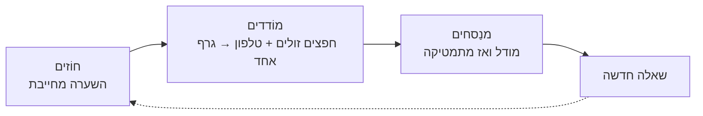

# תוכנית הדרכה מלאה — קורס פיזיקה מבוסס גילוי, ניסוי וסקרנות

> **מטרת המסמך:** זהו מסמך־האב לבניית הקורס. הוא מתכנן כל נושא, כל ניסוי וכל תיאוריה בצורה פורמלית ואחידה, כך שאפשר לבנות ממנו את הקורס יחידה אחר יחידה. כל יחידה כתובה לפי אותו תבנית חוזרת, וכוללת ציוד זול/ביתי + טלפון חכם, וכן משאבים דיגיטליים חינמיים (סימולציות ותוכנה) שנבדקו.
>
> _הערות עריכה:_ שמות כלים וכתובות אינטרנט נשארים באותיות לטיניות (PhET, phyphox…). המסמך מיועד לתצוגה בעברית מימין־לשמאל; הרינדור ב־GitHub מזהה עברית אוטומטית.

---

## 0 · איך להשתמש במסמך הזה

- **חלק 1 (עקרון־העל)** מגדיר את הרוח שמנחה כל שיעור. קִראו אותו פעם אחת — הוא חוזר על עצמו בכל יחידה.
- **חלק 2 (יחידת השיעור החוזרת)** הוא ה־DNA של הקורס: תבנית קבועה שכל ניסוי ממלא. כשבונים שיעור חדש — ממלאים את התבנית.
- **חלק 3 (ארגז הכלים)** מרכז את התוכנות והסימולציות החינמיות, כדי לא לחפש כל פעם מחדש.
- **חלק 4 (ציוד ובטיחות)** — רשימת קניות זולה + כללי בטיחות שאסור לוותר עליהם.
- **חלק 5 (מבני הקורס)** — שלוש גרסאות אורך + ציר זמן סמסטריאלי.
- **חלק 6 ואילך** — 16 המודולים, ובכל אחד הניסויים המפורטים (סה"כ 42 ניסויי־ליבה).
- **נספחים** — רשימת 100 הדגמות ה־WOW, מאגר הערכה, ומילון המושגים של השיטה.

**קהל היעד:** לומד יחיד בלימוד עצמי (אתר אישי). כל אזכור של "זוגות", "כיתה" או "מורה" במסמך הוא הרחבה אופציונלית — לא חלק מהמערכת הבסיסית.

מקור התוכן: מסמך הבלוּפרינט המחקרי [course-blueprint.md](course-blueprint.md).

---

## 1 · עקרון־העל: איך לומדים פיזיקה בקורס הזה

**כל נושא הוא שאלה שאפשר לבדוק, והלומד עונה עליה בעצמו — באותה לולאה בת שלוש פעימות, בכל פעם מחדש.**

### הלולאה: חוֹזים ← מוֹדדים ← מנַסחים

| הפעימה | מה קורה בה | המהלך הקוגניטיבי |
|---|---|---|
| **1 · חוֹזים** (השערה וציפייה) | הלומד מתחייב לחיזוי **בכתב או בקול, לפני שקורה משהו** | חיזוי אישי (בכתב/בקול); דיון עם חבר/ה — אופציונלי |
| **2 · מוֹדדים** (ניסוי במה שיש בבית + טלפון) | צופים פעם אחת, ואז מפיקים מספרים אמיתיים מחפצים רגילים | תצפית ← מדידה ← גרף מיד |
| **3 · מנַסחים** (מתמטיקה ותיאוריה) | בונים את המודל שמסביר את הגרף, ורק אז נותנים לו שם מתמטי | הסבר הפער ← הכללה ← שאלה חדשה |

הלולאה **מסתחררת** — היא לא נגמרת: אחרי הניסוח מגיעה שאלה חדשה וחדה יותר, שמזינה את השיעור הבא.
זהו כל הקורס בצורה אחת: **חוֹזים ← מוֹדדים ← מנַסחים ← שאלה חדשה**.

### ארבעת עמודי החוויה

כל יחידה חייבת לגעת בארבעה אלה — הם לא קישוט, הם המנוע:

1. **סקרנות** — פותחים בשאלה או באירוע שמעורר "רגע, למה?".
2. **הפתעה** — התוצאה סותרת את החיזוי הנאיבי. ההפתעה מלמדת *רק* אם הלומד התחייב לחיזוי קודם.
3. **הנאה** — חפץ ביד, משחק, ואתגר אישי. הפיזיקה נעשית במו הידיים.
4. **הבנה עמוקה** — לא נוסחה לשינון, אלא מודל שהלומד בנה מהגרף שהוא עצמו מדד.

### שלושה כללים שאסור לשבור

הכללים האלה הם ההבדל בין למידה לבין "הדגמה מגניבה":

1. **מתחייבים לחיזוי — בכתב או בקול — לפני המדידה.** לומד שרק *צופה* בהדגמה לא לומד יותר מלומד שלא ראה אותה כלל (Crouch & Mazur). ההפתעה מלמדת רק אם הלומד הימר קודם *ותיעד זאת* (רשומה קצרה או אמירה בקול). **אין חיזוי — אין ניסוי.** _(עבודה עם חבר/ה מחזקת, אך היא אופציונלית — לא חלק מהמערכת.)_
2. **המדידה ואי־הוודאות באות לפני הסמלים.** כל ניסוי מפיק **גרף אחד בעל משמעות** (שיפוע, נקודת חיתוך, דעיכה) *לפני* שכותבים את הנוסחה. המתמטיקה נכנסת בשכבות — יחידות ושיפועים לפני ריבועיות, ריבועיות לפני טריגונומטריה — ורק *אחרי* שהתלמיד כבר יודע מה הסמלים צריכים לייצג. לעולם לא פותחים במשוואה.
3. **הטלפון משרת את החשיבה, לא מחליף אותה.** אביזרים ביתיים + טלפון הם המעבדה שלנו (זה מה שהופך הכשרה ארוכה לזולה וניתנת לחזרה), אבל הכלל הוא: כל מדידת חיישן חייבת להצטמצם ל**גרף אחד שאפשר לפרש**, לעולם לא לערימת נתונים גולמית.

### המנטרה

> **חפצים פשוטים, חיזוי מחייב, גרף אחד כן — ואז המתמטיקה מרוויחה את מקומה.**

---

## 2 · יחידת השיעור החוזרת (ה־DNA של הקורס)

כל אחד מ־42 הניסויים כתוב לפי **אותה תבנית בת 13 שדות**. זה מה שהופך קורס ארוך לניתן לבנייה: לא ממציאים 42 פורמטים — ממלאים תבנית אחת 42 פעם.

| # | שדה | מה כותבים בו |
|---|---|---|
| 🎣 | **הוק / הפתעה** | האירוע הדיסוננטי שפותח: מה גורם ל"רגע, למה?" |
| ❓ | **השאלה הנחקרת** | שאלה אחת שאפשר לבדוק במדידה |
| 🔮 | **החיזוי** | מה מבקשים מהתלמיד להתחייב אליו + התשובה הנאיבית הצפויה |
| 🧰 | **ציוד** | חומרים זולים/ביתיים + חיישן הטלפון, כולל אומדן עלות |
| 🔬 | **ביצוע ומדידה** | הצעדים → **הגרף האחד** שמפיקים |
| 📐 | **תיאוריה ומתמטיקה** | המודל, המתמטיקה בשכבות, המשוואה המרכזית, דוגמה מספרית |
| 💡 | **הרגע המכונן** | ההבנה העמוקה: מה הגרף מוכיח, ואיפה ה"אהה" |
| 🧠 | **תפיסות שגויות ביעד** | איזו אינטואיציה שגויה ויציבה הניסוי מנפץ |
| ⚠️ | **אי־ודאות ומלכודות** | מקורות שגיאה עיקריים ואיך מקטינים אותם |
| 🖥️ | **משאבים דיגיטליים** | סימולציות / תוכנה / וידאו חינמיים (עם ציון זמינות בעברית) |
| 🚀 | **הרחבות וקשר לעולם** | הנדסה, יישום אמיתי, וקישור לרשימת ה־WOW |
| ⏱️ | **זמן ורמה** | משך משוער וטווח גילאים |
| ✅ | **עוגן הערכה** | משימת חיזוי / פירוש גרף / תכנון ניסוי שבודקת הבנה |

**הסקריפט הקוגניטיבי הקבוע** (חוזר בכל ניסוי; מותאם ללומד יחיד):
> 1. חוֹזים (אישית).  2. מנמקים את החיזוי — **בכתב או בקול**.  3. צופים פעם אחת בלי הפרעה.  4. מוֹדדים בזהירות.  5. משַרטטים גרף מיד.  6. מסבירים את הפער ומשקפים — **בכתב או בקול**.  7. מכלילים.  8. שואלים שאלה חדשה אחת.

**רפלקציה — בכתב או בדיבור:** אפשר לשקף ביומן/תיק עבודות **בכתב**, או **בקול** (הסבר בקול רם, הקלטה עצמית, או הסבר לחבר/ה) — שתי הדרכים תקפות באותה מידה. עבודה בזוגות/קבוצה היא הרחבה אופציונלית בלבד.

---

## 3 · ארגז הכלים הדיגיטלי (חינמי)

הכלים המרכזיים שחוזרים לאורך כל הקורס. משאבים ספציפיים לכל ניסוי מופיעים בתוך היחידות עצמן (חלק 6 ואילך).

> כל הכלים חינמיים ואומתו כפעילים. משאבים ספציפיים לכל ניסוי (כולל גרסאות עברית) מופיעים בתוך היחידות, חלק 6 ואילך.

| כלי | סוג | למה משמש בקורס | עברית |
|---|---|---|---|
| **PhET** (phet.colorado.edu) | סימולציות דפדפן | להראות את הבלתי־נראה: שדות, מעגלים, גלים, גזים, אפקט פוטואלקטרי | כן — [translated/iw](https://phet.colorado.edu/en/simulations/translated/iw); קוד השפה `iw` (לא `he`), הרצה `_iw.html` |
| **phyphox** (phyphox.org) | אפליקציית חיישני טלפון | תאוצה, סיבוב, שדה מגנטי, לחץ, קול (FFT), Doppler | חלקית |
| **Tracker** (physlets.org/tracker) | ניתוח וידאו (מחשב) | להפוך תנועה אמיתית לגרפים מכוילים | ממשק חלקית |
| **Falstad** (falstad.com) | סימולציות | מעגלים חשמליים, אדוות/גלים, פורייה | לא |
| **oPhysics** (ophysics.com) | סימולציות (GeoGebra) | מגוון רחב של אינטראקטיביות פיזיקליות | לא |
| **myPhysicsLab** (myphysicslab.com) | סימולציות דינמיקה | קפיצים, מטוטלות, מטוטלת כפולה (כאוס) | לא |
| **GeoGebra** (geogebra.org) | מתמטיקה/גרפים | לינאריזציה, התאמת מודל, אפלטים | כן |
| **Desmos** (desmos.com) | מחשבון גרפי | התאמת ישר/עקומה לנתוני ניסוי | כן |
| **GlowScript / Web VPython** (glowscript.org) | פיזיקה חישובית | מסלולים, שדות, כאוס, אינטואיציית וקטורים ב־3D | לא |
| **Stellarium Web** (stellarium-web.org) | פלנטריום | שמיים, מסלולים, הקשר אסטרונומי | כן |
| **Audacity** (audacityteam.org) | עריכת/ניתוח שמע | ספקטרום, FFT, מהירות הקול, נקישות | כן |
| **LibreOffice Calc** | גיליון אלקטרוני | טבלאות, גרפים והתאמות למדידות | כן |

#### מוקדי תוכן בעברית (מומלץ להתחיל מכאן)

- **[מרכז המורים הארצי לפיזיקה ע"ש ויצמן](https://ptc.weizmann.ac.il/)** — אפלטים, פעילויות ומאמרים בעברית לכל הנושאים.
- **[מכון דוידסון — מאגר מדע](https://davidson.org.il/)** — הסברים, סרטונים וכתבות בעברית.
- **[מעבדת ההדגמות, אוניברסיטת תל אביב](https://exact-sciences.tau.ac.il/physics-h)** — סרטוני הדגמה בעברית (מכניקה, חשמל ועוד).
- **[פורטל מדע וטכנולוגיה — משרד החינוך](https://pop.education.gov.il/)** — סימולציות (מבוססות PhET), שיעורים ודפי עבודה בעברית.
- **PhET בעברית** — קטלוג ב־[translated/iw](https://phet.colorado.edu/en/simulations/translated/iw); שימו לב שקוד השפה הוא `iw`, וכתובות ההרצה הן `<sim>_iw.html`.
- **[Tracker](https://opensourcephysics.github.io/tracker-website/)**, **[GeoGebra](https://www.geogebra.org/)** ו־**[Desmos](https://www.desmos.com/)** — בעלי ממשק בעברית.

---

## 4 · חומרים, ארגז ציוד זול, ובטיחות

### פילוסופיית החומרים
פרט לטלפון החכם, **הכול צריך להיות זול ונגיש**: חוט, בלונים, גולות, סרט הדבקה, סרגל, מגנטים, נוריות LED, סוללות AA, חוט נחושת, קשיות, בקבוקים, אטבי נייר, מראות, עדשת זכוכית מגדלת, משקפי שמש מקוטבים, מזרק. הפריטים היקרים ה"שקטים" שמנקזים תקציב הם דווקא המתכלים: בלונים, סרט, סוללות, קשיות, תמיסת סבון ותבניות מודפסות.

### ארגז ציוד בסיסי (לתלמיד/בית — כ־25–40 ₪... מוערך)
חוט · בלונים · גולות/כדורים · סרט הדבקה · סרגל · 2–3 מגנטים · נוריות LED · בית־סוללה AA · חוט נחושת מבודד · קשית · בקבוקים ריקים · אטבי נייר · עדשת זכוכית מגדלת · פס מקוטב (ממשקפי שמש) · מזרק גדול.

### כללי בטיחות — לא ניתנים למשא ומתן

| תחום | מדיניות בטוחה |
|---|---|
| לייזרים | רק מקורות הספק נמוך בטוחים לכיתה; לעולם לא אל העין או אל משטח מחזיר; עדיף חריץ עם פנס. |
| מגנטים | מגנטים קטנים חזקים הרחק מילדים; סכנת בליעה וסכנת צביטה. |
| סוללות | מתח נמוך DC בלבד; להימנע מקצר ממושך (התחממות); להוציא סוללות בסוף השיעור. |
| טלפונים | בלי נפילות, בלי מים, בלי ניסויי התנגשות, בלי חום גבוה, בלי סיבוב מהיר ללא כיסוי וקשירה. |
| קול | להימנע מטונים חזקים וממושכים קרוב לאוזן. |
| חום | להעדיף מים חמים ומקורות חשמל על פני להבה פתוחה. |
| קליעים | חפצים קלים בלבד ואזור בטיחות מוגדר. |
| זכוכית | להעדיף מכלי אופטיקה מפלסטיק. |

---

## 5 · מבני הקורס וציר הזמן

| מסלול | יחידות | קצב עצמי מתאים ל… | דגש |
|---|---|---|---|
| **מסלול קומפקטי** | 10–12 | טעימה ראשונה או זמן מוגבל | תנועה, אנרגיה, גלים, אופטיקה, מעגלים, שיא אסטרונומי |
| **מסלול מלא** | 14–18 | לימוד עצמי רציני לאורך עונה | מכניקה מלאה עד אלקטרומגנטיות + אופטיקה/תרמו/מודרנית |
| **מסלול שנתי** | 28–34 | העמקה לאורך שנה | כל המודולים כולל אסטרונומיה, מודרנית וכאוס |

### ציר זמן סמסטריאלי מומלץ (16 שבועות)

| שבוע | נושא |
|---|---|
| 1 | מדידה, גרפים, אי־ודאות, ניתוח וידאו של תנועה |
| 2 | תאוצה, כוחות, דיאגרמות כוחות |
| 3 | אינטראקציות ניוטוניות, חיכוך, תנועה מעגלית |
| 4 | עבודה ואנרגיה |
| 5 | תנע והתנגשויות |
| 6 | סיבוב ומומנט |
| 7 | תנודות ותהודה |
| 8 | גלים וקול |
| 9 | אור, מיקוד תמונה, שבירה |
| 10 | עקיפה, התאבכות, קיטוב, ספקטרוסקופיה |
| 11 | מעגלים, לוגיקת LED, חוק אוהם |
| 12 | שדות מגנטיים, מנועים, השראה |
| 13 | זורמים ולחץ |
| 14 | תרמודינמיקה וחוקי הגזים |
| 15 | פיזיקה מודרנית וגשר לאסטרונומיה |
| 16 | כאוס, סינתזה, אתגר תכנון, הערכת תיק עבודות |

---

## 6 · המודולים והניסויים

מיפוי 42 ניסויי הליבה ל־16 המודולים:

| # | מודול | שאלת־על | ניסויי ליבה |
|---|---|---|---|
| 1 | תנועה ומדידה | איך מתארים שינוי? | M1, M2, M4 |
| 2 | כוחות וחיכוך | מה משנה תנועה? | M6 (+ הרחבת Atwood) |
| 3 | אנרגיה | לאן היא הולכת? | M9, M10 |
| 4 | תנע | מה נשמר באינטראקציה? | M7, M8 |
| 5 | סיבוב | למה סיבוב שונה? | M5, M11, M12, M13 |
| 6 | תנודות | למה מערכות חוזרות ומחליקות מעבר? | M3, M14, M15, M16 |
| 7 | גלים | איך הפרעה מתפשטת? | M17, M18 |
| 8 | קול | למה שומעים גובה וגוון? | M19, M20 |
| 9 | אור (גיאומטרי) | מה קובע לאן האור הולך? | M21, M22, M23 |
| 10 | אופטיקה (גלית) | מתי אור מתנהג כגל? | M24, M25, M26 |
| 11 | חשמל | איך מטענים יוצרים מעגלים? | M27, M28 |
| 12 | מגנטיות ואלקטרומגנטיות | איך זרמים ושדות משתנים מגיבים? | M29, M30, M31 |
| 13 | זורמים | איך לחץ וזרימה יוצרים כוח? | M32, M33 |
| 14 | תרמודינמיקה | למה אנרגיה "שימושית" מתפזרת? | M34, M35, M36 |
| 15 | פיזיקה מודרנית | מתי התמונה הקלאסית נשברת? | M42, M37 |
| 16 | אסטרונומיה, יחסות וכאוס | מתי סקאלה, מערכת ורגישות חשובות? | M38, M39, M41, M40 |

## מודול 1 · תנועה ומדידה

**שאלת־על:** איך מתארים שינוי?
**רעיונות גדולים:** מיקום, מהירות ותאוצה; קריאת גרפים; בחירת מערכת ייחוס; אי־ודאות מדידה מהשבוע הראשון.
**תפיסות שגויות ביעד:** "גרף שטוח = מנוחה" (גם בגרף מהירות); "תלול יותר = מהיר יותר בכל גרף".
**מתמטיקה נכנסת:** יחידות, שיפועים, קריאת גרף; ואז x = x₀ + v₀t + ½at².

### M1 · מעבדת וידאו: קליע או גוף מתגלגל — ⏱️ 35–45 ד' · גיל 14+
- 🎣 **הוק:** תנועה רגילה במסדרון הופכת למקור נתונים עשיר בגרפים.
- ❓ **השאלה:** איך קשורים מיקום, מהירות ותאוצה בתנועה אמיתית?
- 🔮 **החיזוי:** שרטטו את צורת גרף x(t) *לפני* הצילום. נאיבי: "קו ישר" גם כשיש תאוצה.
- 🧰 **ציוד:** טלפון (מצלמה), סרגל/מטר בפריים לקנה־מידה, כדור/עגלה/מדרון. עלות ~0.
- 🔬 **ביצוע ומדידה:** מצלמים תנועה עם קנה־מידה בפריים; מנתחים ב־Tracker. **הגרף האחד:** v(t) ישר שהשיפוע שלו = a.
- 📐 **תיאוריה:** x=x₀+v₀t+½at². שכבה 1: קריאת שיפוע. דוגמה: מדרון נותן a≈0.82 m/s².
- 💡 **הרגע המכונן:** המהירות היא שיפוע גרף המיקום, והתאוצה שיפוע גרף המהירות — לא "תכונה של החפץ".
- 🧠 **מנפץ:** "מהירות = שיפוע בכל גרף" ו"גרף מעוקל = כוח לא סדיר".
- ⚠️ **אי־ודאות:** פרלקסה, קנה־מידה לא מדויק, טשטוש תנועה → מצלמה ניצבת, תאורה טובה.
- 🖥️ **משאבים דיגיטליים:** ⭐ [Tracker (עברית)](https://opensourcephysics.github.io/tracker-website/) · [Tracker Online](https://opensourcephysics.github.io/tracker-online/) · [PhET Projectile Motion (עברית)](https://phet.colorado.edu/sims/html/projectile-motion/latest/projectile-motion_iw.html) · [oPhysics — גרפי מיקום/מהירות/תאוצה](https://ophysics.com/k4.html) · [Direct Measurement Videos](https://serc.carleton.edu/sp/compadre/teachingwdata/video.html)
- 🚀 **הרחבות:** ראייה ממוחשבת, ניתוח ספורט. קשר WOW #36 (זריקת כדורסל ב־Tracker).
- ✅ **הערכה:** "איזה משלושת הגרפים מתאים לתנועה בתאוצה קבועה? נמקו מהשיפוע."

### M2 · שעון־עצר תנועה על מדרון — ⏱️ 25–35 ד' · גיל 13+
- 🎣 **הוק:** הטלפון "מתחיל את עצמו" ברגע שנוגעים בעגלה.
- ❓ **השאלה:** האם מד־תאוצה יכול להחליף שערי־זמן מסורתיים?
- 🔮 **החיזוי:** כמה זמן תעבור העגלה מרווחים שווים ברצף? נאיבי: "זמנים שווים".
- 🧰 **ציוד:** טלפון עם phyphox, עגלה/מכונית צעצוע, מדרון, סימוני סרט. ~5 ₪.
- 🔬 **ביצוע ומדידה:** מודדים זמנים בין נקישות/נקודות ביקורת; חוזרים על המדידה. **הגרף:** תאוצה מול זווית, או t² מול מרחק.
- 📐 **תיאוריה:** a≈2Δx/t² מהמנוחה. שכבה: ממוצע וסטיית תקן ממדידות חוזרות.
- 💡 **הרגע המכונן:** "דיגיטלי" אינו "מדויק" — המדידה החוזרת חושפת פיזור אמיתי.
- 🧠 **מנפץ:** "תזמון דיגיטלי מדויק תמיד".
- ⚠️ **אי־ודאות:** רגישות־יתר של החיישן, טריגרים מוטעים → ריפוד וחזרות.
- 🖥️ **משאבים דיגיטליים:** ⭐ [phyphox — Acoustic Stopwatch](https://phyphox.org/wiki/index.php/Experiment:_Acoustic_Stopwatch) · [GeoGebra — מדרון גלילאו](https://www.geogebra.org/m/XuMzkYKZ) · [oPhysics — גלגול/החלקה במדרון](https://ophysics.com/r3.html) · [Tracker](https://opensourcephysics.github.io/tracker-website/)
- 🚀 **הרחבות:** תזמון תעשייתי, טריגר חיישנים.
- ✅ **הערכה:** "כמה מדידות דרושות כדי לומר שהתאוצה 'קבועה'? איך תדעו?"

### M4 · תזמון נפילה חופשית באקוסטיקה — ⏱️ 20–30 ד' · גיל 14+
- 🎣 **הוק:** המיקרופון הופך שני צלילים לשעון נפילה חופשית.
- ❓ **השאלה:** איך מודדים זמן נפילה מבלי להפיל את הטלפון?
- 🔮 **החיזוי:** כמה זמן ייפול כדור מגובה 1 מ'? נאיבי: הערכה שרירותית.
- 🧰 **ציוד:** כדור, גובה נפילה ידוע, מגש מתכת/רצפה קשה, phyphox (כלי שמע). עלות ~0.
- 🔬 **ביצוע ומדידה:** מקליטים צליל שחרור וצליל פגיעה; מודדים Δt בין הפסגות. **הגרף:** h מול t².
- 📐 **תיאוריה:** h≈½gΔt². דוגמה: Δt=0.45 s → h≈0.99 m. שכבה: קשר ריבועי.
- 💡 **הרגע המכונן:** אפשר למדוד g בבית בדיוק מפתיע — בעזרת שני צלילים בלבד.
- 🧠 **מנפץ:** "אי־אפשר לתזמן אירועים קצרים בזול".
- ⚠️ **אי־ודאות:** עיכוב בין השחרור לצליל, הד, גודל הכדור → חדר שקט, שחרור אחיד.
- 🖥️ **משאבים דיגיטליים:** ⭐ [phyphox — (Acoustic) Free Fall](https://phyphox.org/experiment/free-fall-2/) · [Audacity](https://www.audacityteam.org/) (קריאת Δt מגל הקול) · [oPhysics — גרפי p/v/a](https://ophysics.com/k4.html) · [Tracker](https://opensourcephysics.github.io/tracker-website/)
- 🚀 **הרחבות:** חישה אקוסטית, תזמון בליסטי. קשר WOW #30.
- ✅ **הערכה:** "תכננו מדידת g בחדר מדרגות עם טלפון וחוט בלבד."

---

## מודול 2 · כוחות וחיכוך

**שאלת־על:** מה משנה תנועה?
**רעיונות גדולים:** חוקי ניוטון, אינטראקציות, דיאגרמות כוחות חופשיים.
**תפיסות שגויות ביעד:** "תנועה דורשת כוח מתמשך"; "כבד נופל מהר יותר".
**מתמטיקה נכנסת:** וקטורים ופירוק לרכיבים.

### M6 · חיכוך על מדרון מתכוונן — ⏱️ 30–40 ד' · גיל 13+
- 🎣 **הוק:** שינוי מרקם המשטח משנה את הסף — אך לא באופן פשטני.
- ❓ **השאלה:** מה קובע מתי מתחילה החלקה, וכמה גדול החיכוך הקינטי?
- 🔮 **החיזוי:** באיזו זווית יתחיל הבלוק להחליק? נאיבי: "שטח מגע גדול = חיכוך גדול".
- 🧰 **ציוד:** לוח, ספרים, בלוקים, נייר זכוכית/לבד/פלסטיק, מד־שיפוע בטלפון. <10 ₪.
- 🔬 **ביצוע ומדידה:** מעלים זווית עד תחילת ההחלקה (θc), ואז מודדים זמני תנועה. **הגרף:** תאוצה מול זווית.
- 📐 **תיאוריה:** μₛ≈tanθc; a=g(sinθ−μ_k·cosθ). שכבה: פירוק וקטור לאורך ולניצב למדרון.
- 💡 **הרגע המכונן:** חיכוך אינו "תמיד μN", ושטח המגע כמעט לא משפיע בהחלקה יבשה.
- 🧠 **מנפץ:** "חיכוך = μN תמיד" ו"שטח גדול = חיכוך גדול".
- ⚠️ **אי־ודאות:** שחרור לא חלק, משטחים משתנים → ניקיון וחזרות.
- 🖥️ **משאבים דיגיטליים:** ⭐ [oPhysics — חיכוך במדרון](https://ophysics.com/f2.html) · [Walter Fendt — מישור משופע](https://www.walter-fendt.de/html5/phen/inclinedplane_en.htm) · [PhET Forces and Motion: Basics (עברית)](https://phet.colorado.edu/sims/html/forces-and-motion-basics/latest/forces-and-motion-basics_iw.html) · [phyphox — Inclination](https://phyphox.org/experiment/inclination/) · [OpenStax — Inclined Planes](https://openstax.org/books/physics/pages/5-4-inclined-planes)
- 🚀 **הרחבות:** צמיגים, בלמים, ייצור. קשר WOW #39. *הרחבת Atwood:* שתי מסות על חוט מעל גלגלת → השוואה נקייה לחוק ניוטון השני.
- ✅ **הערכה:** "מדוע μₛ נמדד ברגע ההחלקה הראשון ולא אחריו?"

---

## מודול 3 · אנרגיה

**שאלת־על:** לאן האנרגיה הולכת?
**רעיונות גדולים:** עבודה, אנרגיה קינטית/פוטנציאלית/פנימית, העברה ואגירה.
**תפיסות שגויות ביעד:** "אנרגיה נצרכת/נעלמת"; "כוח ואנרגיה הם אותו דבר".
**מתמטיקה נכנסת:** שטח מתחת לגרף, פרופורציה, קשרים ריבועיים.

### M9 · איבוד אנרגיה בכדור מקפץ — ⏱️ 20–35 ד' · גיל 12+
- 🎣 **הוק:** תנועה מוכרת מסתירה איבוד שיטתי.
- ❓ **השאלה:** לאן הולכת האנרגיה המכנית בקפיצה?
- 🔮 **החיזוי:** איזה חלק מהגובה יחזור בכל קפיצה? נאיבי: "אותו יחס תמיד, בלי קשר למשטח".
- 🧰 **ציוד:** כדור, מטר/סרגל, טלפון (סלואו מושן). <5 ₪.
- 🔬 **ביצוע ומדידה:** מודדים גבהי קפיצה עוקבים. **הגרף:** מספר קפיצה מול גובה (בסקאלה לוגריתמית — קו ישר).
- 📐 **תיאוריה:** h_{n+1}/h_n≈e² (e = מקדם ההתאוששות). דעיכה גאומטרית.
- 💡 **הרגע המכונן:** האנרגיה לא "נעלמה" — עברה לחום, קול ועיוות; והדעיכה מבנית וניתנת לחיזוי.
- 🧠 **מנפץ:** "אנרגיה אבודה נעלמה" ו"אותו יחס החזרה לכל משטח".
- ⚠️ **אי־ודאות:** סיבוב, קפיצה מחוץ לציר, נראוּת קנה־מידה.
- 🖥️ **משאבים דיגיטליים:** ⭐ [Physics Aviary — Energy Loss Lab](https://www.thephysicsaviary.com/Physics/Programs/Labs/EnergyLossLab/) · [GeoGebra — Bouncing Ball](https://www.geogebra.org/m/qm6ZuvKf) · [phyphox — Acoustic Stopwatch](https://phyphox.org/experiment/acoustic-stopwatch/) · [Tracker](https://opensourcephysics.github.io/tracker-website/) · סרטון: [Coefficient of Restitution](https://www.youtube.com/watch?v=AOT23FKlVYo)
- 🚀 **הרחבות:** בדיקת חומרים, תקני כדורי ספורט. קשר WOW #12.
- ✅ **הערכה:** "צַפו את גובה הקפיצה החמישית מתוך שתי הראשונות."

### M10 · משגר קפיץ ועבודה־אנרגיה — ⏱️ 35–50 ד' · גיל 15+
- 🎣 **הוק:** שיגורים קטנים הופכים אגירת אנרגיה בלתי־נראית למוחשית.
- ❓ **השאלה:** איך אנרגיה אגורה בקפיץ הופכת לתנועה?
- 🔮 **החיזוי:** אם נכפיל את הדחיסה — פי כמה תגדל *המהירות*? נאיבי: "פי 4" (בלבול עם אנרגיה); למעשה פי 2 (v∝x), האנרגיה פי 4.
- 🧰 **ציוד:** קפיץ/גומייה, בלוק/גולה, סרגל, מסות. 5–12 ₪.
- 🔬 **ביצוע ומדידה:** מכיילים דחיסה x; מודדים מהירות/טווח. **הגרף:** v² מול x² (ישר).
- 📐 **תיאוריה:** ½kx²≈½mv². שכבה: ריבוע המהירות פרופורציוני לריבוע הדחיסה.
- 💡 **הרגע המכונן:** האנרגיה תלויה בדחיסה בריבוע — "יותר כוח" אינו "יותר אנרגיה" באופן ליניארי.
- 🧠 **מנפץ:** "יותר כוח = יותר אנרגיה" בלי הבחנת מרחק/עבודה.
- ⚠️ **אי־ודאות:** חיכוך, קפיץ לא אידיאלי, שחרור לא עקבי → דחיסות נמוכות וחזרות.
- 🖥️ **משאבים דיגיטליים:** ⭐ [Physics Aviary — Energy Transformation Lab](https://www.thephysicsaviary.com/Physics/Programs/Labs/EnergyTransformationLab/) · [PhET Hooke's Law (עברית)](https://phet.colorado.edu/sims/html/hookes-law/latest/hookes-law_iw.html) · [PhET Masses & Springs (עברית)](https://phet.colorado.edu/sims/html/masses-and-springs/latest/masses-and-springs_iw.html) · [oPhysics — אנרגיית קפיץ](https://ophysics.com/e1.html) · [Tracker](https://opensourcephysics.github.io/tracker-website/)
- 🚀 **הרחבות:** בליסטיקה, עיצוב צעצועים, מערכות מתלים. קשר WOW #53.
- ✅ **הערכה:** "פירוש גרף v² מול x²: מה מייצג השיפוע?"

---

## מודול 4 · תנע

**שאלת־על:** מה נשמר באינטראקציה?
**רעיונות גדולים:** אימפולס, שימור תנע, רתיעה, התנגשויות.
**תפיסות שגויות ביעד:** "מהירות גדולה = תמיד 'מכה' גדולה"; "תנע וכוח מתחלפים".
**מתמטיקה נכנסת:** מכפלות, סכומים וקטוריים.

### M7 · טיל בלון ואימפולס — ⏱️ 15–25 ד' · גיל 12+
- 🎣 **הוק:** כמעט אף אחד לא שוכח בלון שדוהר על חוט.
- ❓ **השאלה:** למה אוויר שנפלט מניע את הטיל קדימה?
- 🔮 **החיזוי:** מה יגדיל את הטווח — בלון גדול יותר או פתח צר יותר? נאיבי: "הבלון דוחף את האוויר, לא את עצמו".
- 🧰 **ציוד:** בלון, חוט, קשית, סרט, מטר. <3 ₪.
- 🔬 **ביצוע ומדידה:** משווים גודל בלון/פתח/מסה נוספת; מודדים זמן ומרחק. **הגרף:** טווח/מהירות מול גודל הניפוח.
- 📐 **תיאוריה:** שימור תנע — התנע קדימה = התנע של האוויר הנפלט אחורה. שכבה: מכפלת מסה×מהירות.
- 💡 **הרגע המכונן:** הרתיעה פועלת על הטיל עצמו — פעולה ותגובה, לא "דחיפה על האוויר".
- 🧠 **מנפץ:** "הטיל דוחף על האוויר שמאחוריו".
- ⚠️ **אי־ודאות:** שקיעת החוט, חיכוך הקשית, ניפוח לא עקבי → חוט מתוח.
- 🖥️ **משאבים דיגיטליים:** ⭐ [Physics Aviary — Impulse Lab](https://www.thephysicsaviary.com/Physics/Programs/Labs/ImpulseLab/) · [PhET Collision Lab (עברית)](https://phet.colorado.edu/sims/html/collision-lab/latest/collision-lab_iw.html) · [phyphox](https://phyphox.org/) · סרטון: [Balloon Rocket](https://www.youtube.com/watch?v=iV3NXFkdUyw) · [NASA JPL — Simple Rocket Science](https://www.jpl.nasa.gov/edu/resources/lesson-plan/simple-rocket-science/)
- 🚀 **הרחבות:** הנעה סילונית, כוחות תגובה בזורמים. קשר WOW #2.
- ✅ **הערכה:** "צַפו איזה שינוי (גודל/פתח/מסה) ישפיע הכי הרבה, ונמקו."

### M8 · התנגשויות גולות/עגלות בניתוח וידאו — ⏱️ 35–45 ד' · גיל 14+
- 🎣 **הוק:** העין מפספסת את התזמון — הסלואו מושן לא.
- ❓ **השאלה:** מה נשמר בהתנגשות?
- 🔮 **החיזוי:** האם התנע נשמר? האם האנרגיה הקינטית? נאיבי: "שניהם תמיד נשמרים".
- 🧰 **ציוד:** גולות/עגלות, סרגל, טלפון (סלואו מושן), משטח שטוח. <10 ₪.
- 🔬 **ביצוע ומדידה:** מחלצים מהירויות לפני/אחרי; מחשבים p ו־KE. **הגרף:** p לפני מול p אחרי (ישר, שיפוע 1).
- 📐 **תיאוריה:** Σp נשמר תמיד; KE נשמר רק בהתנגשות אלסטית. שכבה: סכום וקטורי.
- 💡 **הרגע המכונן:** התנע נשמר גם כשהאנרגיה "אובדת" — שני חוקים נפרדים.
- 🧠 **מנפץ:** "תנע ואנרגיה קינטית — שניהם תמיד נשמרים".
- ⚠️ **אי־ודאות:** פגיעות מחוץ לציר, חיכוך גלגול, זווית מצלמה → משטח מפולס.
- 🖥️ **משאבים דיגיטליים:** ⭐ [Tracker](https://physlets.org/tracker/) / [Tracker Online (עברית)](https://opensourcephysics.github.io/tracker-online/) · [PhET Collision Lab (עברית)](https://phet.colorado.edu/sims/html/collision-lab/latest/collision-lab_iw.html) · [oPhysics — התנגשויות](https://ophysics.com/e2.html) · [Walter Fendt — Collision](https://www.walter-fendt.de/html5/phen/collision_en.htm) · [ComPADRE — סרטוני התנגשות ל־Tracker](https://www.compadre.org/osp/items/detail.cfm?ID=16670)
- 🚀 **הרחבות:** שחזור תאונות, מדעי הספורט. קשר WOW #23, #61.
- ✅ **הערכה:** "איזו התנגשות איבדה אנרגיה? הוכיחו מהגרפים."

---

## מודול 5 · סיבוב

**שאלת־על:** למה סיבוב שונה מתנועה קווית?
**רעיונות גדולים:** מומנט, מומנט התמד, תנע זוויתי, מרכז מסה.
**תפיסות שגויות ביעד:** "אותו כוח = אותו סיבוב"; "הצד הכבד תמיד מכריע".
**מתמטיקה נכנסת:** זרוע כוח, מרכז מסה.

### M5 · צינור מתגלגל עם גירוסקופ — ⏱️ 35–50 ד' · גיל 15+
- 🎣 **הוק:** טלפון נסתר בתוך צינור קרטון הופך לחיישן גלגול.
- ❓ **השאלה:** איך מהירות זוויתית קשורה למהירות קווית בגלגול?
- 🔮 **החיזוי:** האם צינור כבד יותר יגיע מהר יותר לתחתית? נאיבי: "כן, כמו בנפילה".
- 🧰 **ציוד:** צינור דואר מקרטון, טלפון, ריפוד, מדרון. ~6 ₪.
- 🔬 **ביצוע ומדידה:** מודדים ω(t) בגירוסקופ; משתמשים ב־v=ωR. **הגרף:** מהירות שיא מול גובה מדרון.
- 📐 **תיאוריה:** תנאי אי־החלקה v=ωR; חלוקת אנרגיה בין תרגום לסיבוב. שכבה: יחס הרדיוס R.
- 💡 **הרגע המכונן:** חלק מהאנרגיה "נכלא" בסיבוב — ולכן גלגול איטי מהחלקה.
- 🧠 **מנפץ:** "גלגול והחלקה הם בעצם אותו דבר".
- ⚠️ **אי־ודאות:** טלפון לא ממורכז, החלקה, סחיפת גירו → ריפוד הדוק וריצות קצרות.
- 🖥️ **משאבים דיגיטליים:** ⭐ [phyphox — Roll](https://phyphox.org/wiki/index.php/Experiment:_Roll) · [oPhysics — גלגול במדרון](https://ophysics.com/r2.html) · [oPhysics — גלגול מול החלקה](https://ophysics.com/r3.html) · סרטון: [כדור מול דיסק מול טבעת](https://www.youtube.com/watch?v=FDvcIuNEgo0) · [DigiPhysLab — מדריך גלגול (PDF)](https://www.jyu.fi/sites/default/files/2023-06/Rolling_Smartphone_Instructor_English.pdf)
- 🚀 **הרחבות:** חיישני מהירות גלגל, ניווט אינרציאלי. קשר WOW #14, #37.
- ✅ **הערכה:** "מהגרף — האם הצינור התגלגל בלי להחליק? איך רואים?"

### M11 · מאזן מומנטים עם סרגל מטר — ⏱️ 20–35 ד' · גיל 13+
- 🎣 **הוק:** סרגל ארוך מאזן עומסים שנראים בלתי־אפשריים.
- ❓ **השאלה:** איך כוח וזרוע־מנוף מתחלפים זה בזה?
- 🔮 **החיזוי:** היכן לתלות מסה קטנה כדי לאזן מסה גדולה? נאיבי: "הצד הכבד תמיד יורד".
- 🧰 **ציוד:** סרגל מטר, מסות, חוט, נקודת משען. <10 ₪.
- 🔬 **ביצוע ומדידה:** חוזים לפני שמאזנים; מודדים מרחקים. **הגרף:** כוח מול אורך זרוע.
- 📐 **תיאוריה:** Στ=0. דוגמה: 0.20 ק"ג ב־0.10 מ' מאזן 0.10 ק"ג ב־0.20 מ'. שכבה: מכפלת כוח×זרוע.
- 💡 **הרגע המכונן:** מומנט מנצח משקל גולמי — הזרוע קובעת.
- 🧠 **מנפץ:** "הצד הכבד תמיד מכריע".
- ⚠️ **אי־ודאות:** התעלמות ממסת הסרגל וחיכוך במשען → לכלול מרכז מסה של הסרגל.
- 🖥️ **משאבים דיגיטליים:** ⭐ [PhET Balancing Act (עברית)](https://phet.colorado.edu/sims/html/balancing-act/latest/balancing-act_all.html?locale=iw) · [Physics Aviary — מסת סרגל מטר ממומנט](https://www.thephysicsaviary.com/Physics/APPrograms/FindMassOfMeterStickwithTorque/index.html) · [Walter Fendt — עקרון המנוף](https://www.walter-fendt.de/html5/phen/lever_en.htm) · עברית: [מכון דוידסון — מומנטים](https://davidson.org.il/read-experience/maagarmada/%D7%9E%D7%95%D7%9E%D7%A0%D7%98%D7%99%D7%9D-2/)
- 🚀 **הרחבות:** מנופים, ביומכניקה אנושית. קשר WOW #11.
- ✅ **הערכה:** "צַפו את נקודת האיזון לפני התלייה, ונמקו."

### M12 · פרדוקס הסליל/יו־יו המתגלגל — ⏱️ 15–25 ד' · גיל 14+
- 🎣 **הוק:** היפוך מנוגד לאינטואיציה — סליל שנמשך מתגלגל *לעבר* המושך.
- ❓ **השאלה:** למה סליל שמושכים בחוט יכול להתגלגל לעברך?
- 🔮 **החיזוי:** לאיזה כיוון יתגלגל הסליל כשמושכים בזווית מסוימת? נאיבי: "תמיד בכיוון המשיכה".
- 🧰 **ציוד:** סליל חוט/יו־יו, חוט, משטח. <5 ₪.
- 🔬 **ביצוע ומדידה:** משנים זווית משיכה וחוזים תנועה; מזהים זווית סף להיפוך. **הגרף:** כיוון תוצאה מול זווית.
- 📐 **תיאוריה:** מומנט סביב נקודת המגע המיידית; זווית קריטית. שכבה: כיוון המומנט.
- 💡 **הרגע המכונן:** הכיוון תלוי בזרוע ביחס לנקודת המגע — לא בכיוון המשיכה.
- 🧠 **מנפץ:** "חפצים נעים תמיד בכיוון המשיכה".
- ⚠️ **אי־ודאות:** חוט רופף, החלקה → משטח בעל אחיזה.
- 🖥️ **משאבים דיגיטליים:** ⭐ סרטון: [Steve Mould — The Spool Paradox](https://www.youtube.com/watch?v=qebMrMt4240) · [TU Delft — Pulling a Spool](https://interactivetextbooks.tudelft.nl/showthephysics/demos/demo56/demo56.html) · [Tracker](https://opensourcephysics.github.io/tracker-website/) · [NSTA — The Pulled Spool](https://www.nsta.org/science-teacher/science-teacher-aprilmay-2020/pulled-spool-which-way-does-it-roll)
- 🚀 **הרחבות:** גלגלות מסוע, עיצוב גלגלים. קשר WOW #3.
- ✅ **הערכה:** "מהי זווית הסף בין 'לעבר' ל'הרחק'? הסבירו במונחי מומנט."

### M13 · תנע זוויתי עם כיסא מסתובב וגלגל — ⏱️ 15–25 ד' · גיל 15+
- 🎣 **הוק:** תגובה דרמטית של כל הגוף כשמסובבים גלגל אופניים.
- ❓ **השאלה:** למה סיבוב גלגל מסובב את הגוף?
- 🔮 **החיזוי:** מה יקרה לגוף כשתהפכו את ציר הגלגל המסתובב? נאיבי: "כלום — רק כוחות חשובים".
- 🧰 **ציוד:** כיסא/שרפרף מסתובב, גלגל אופניים/גלגל ממושקל. עלות נמוכה אם יש גלגל.
- 🔬 **ביצוע ומדידה:** בעיקר איכותי + אומדני מהירות זוויתית מווידאו; השוואת סיבוב הגוף לשינוי האוריינטציה.
- 📐 **תיאוריה:** שימור תנע זוויתי — L הכולל נשמר. שכבה: וקטור L וכיוונו.
- 💡 **הרגע המכונן:** מצב הסיבוב עצמו נשמר — הגוף "מפצה" על שינוי הגלגל.
- 🧠 **מנפץ:** "רק כוחות משנים תנועה, לא מצב סיבובי".
- ⚠️ **אי־ודאות:** חיכוך בכיסא, גלגל לא מאוזן → לפנות שטח.
- 🖥️ **משאבים דיגיטליים:** ⭐ [oPhysics — אדם על פלטפורמה מסתובבת](https://ophysics.com/r9.html) · [BU/Duffy — קפיצה על קרוסלה](https://physics.bu.edu/~duffy/HTML5/jumping_on_merrygoround.html) · סרטון: [Walter Lewin — Wheel Momentum](https://www.youtube.com/watch?v=NeXIV-wMVUk) · עברית: [מעבדת ההדגמות אונ' ת"א — גלגל אופניים](https://exact-sciences.tau.ac.il/physics-h/demolab_mechanics_exp101) · [מכון דוידסון — תנע זוויתי](https://davidson.weizmann.ac.il/online/maagarmada/physics/%D7%94%D7%A7%D7%A9%D7%A8-%D7%91%D7%99%D7%9F-%D7%94%D7%97%D7%9C%D7%A7%D7%94-%D7%A2%D7%9C-%D7%94%D7%A7%D7%A8%D7%97-%D7%9C%D7%AA%D7%A0%D7%A2-%D7%96%D7%95%D7%99%D7%AA%D7%99)
- 🚀 **הרחבות:** בקרת יציבה של חלליות, גלגלי תגובה. קשר WOW #57.
- ✅ **הערכה:** "נמקו בעזרת שימור L מדוע הגוף הסתובב."

## מודול 6 · תנודות

**שאלת־על:** למה מערכות חוזרות ומחליקות מעבר לנקודת שיווי המשקל?
**רעיונות גדולים:** תנועה הרמונית פשוטה (SHM), מחזור, דעיכה, זרעי תהודה.
**תפיסות שגויות ביעד:** "מטוטלת כבדה מתנדנדת מהר יותר"; "המשרעת משנה מאוד את המחזור בזוויות קטנות".
**מתמטיקה נכנסת:** גרפים, לינאריזציה, וטריגונומטריה בהמשך.

### M3 · מטוטלת עם מד־תאוצה — ⏱️ 35–45 ד' · גיל 15+
- 🎣 **הוק:** הטלפון מתנדנד "עיוור", אך הגרף חושף את הקצב.
- ❓ **השאלה:** מה קובע את מחזור המטוטלת?
- 🔮 **החיזוי:** האם מטוטלת כבדה יותר תתנדנד מהר יותר? נאיבי: "כן" (למעשה המסה לא משפיעה).
- 🧰 **ציוד:** טלפון, חוט, מלחציים, סרט, כיסוי רך. ~3 ₪.
- 🔬 **ביצוע ומדידה:** משווים אורכים ומשרעות; מודדים מחזור מפסגות התאוצה. **הגרף:** T² מול L (ישר).
- 📐 **תיאוריה:** T=2π√(L/g). לינאריזציה: T² ∝ L, והשיפוע נותן g. דוגמה: L=0.64 מ', T=1.60 ש' → g≈9.87.
- 💡 **הרגע המכונן:** המסה לא משנה; המחזור נקבע מהאורך — והגרף הישר הוא "גילוי" של g.
- 🧠 **מנפץ:** "מטוטלת כבדה מתנדנדת מהר יותר".
- ⚠️ **אי־ודאות:** משרעת גדולה (שוברת קירוב זווית קטנה), חיכוך ציר, מסת הטלפון המזיזה אורך אפקטיבי.
- 🖥️ **משאבים דיגיטליים:** ⭐ [PhET Pendulum Lab (עברית)](https://phet.colorado.edu/sims/html/pendulum-lab/latest/pendulum-lab_iw.html) · [oPhysics — מטוטלת](https://ophysics.com/f3a.html) · [Walter Fendt — מטוטלת פשוטה](https://www.walter-fendt.de/html5/phen/pendulum_en.htm) · [phyphox — Pendulum](https://phyphox.org/experiment/pendulum/) · סרטון: [phyphox Pendulum](https://www.youtube.com/watch?v=xY3NFcDG3ZU)
- 🚀 **הרחבות:** שעונים, סייסמומטרים. קשר WOW #24, #56.
- ✅ **הערכה:** "מה מייצג שיפוע גרף T² מול L? חשבו ממנו את g."

### M14 · מטוטלת פיתול ומודול הגזירה — ⏱️ 40–50 ד' · גיל 16+
- 🎣 **הוק:** הטלפון עצמו הופך למשקולת המטוטלת.
- ❓ **השאלה:** איך פיתול חושף את קשיחות החומר?
- 🔮 **החיזוי:** האם חוט עבה פי 2 יכפיל את הקושי לפתל? נאיבי: הערכה ליניארית (למעשה תלוי חזק ברדיוס).
- 🧰 **ציוד:** חוט/מוביל דיג, טלפון או משקל, מלחציים. 5–15 ₪.
- 🔬 **ביצוע ומדידה:** מפתלים מעט ומודדים מחזור. **הגרף:** T² מול I או מול אורך החוט.
- 📐 **תיאוריה:** T=2π√(I/κ); עבור חוט מכויל אומדים מודול גזירה. שכבה: מומנט מחזיר.
- 💡 **הרגע המכונן:** קשיחות רלוונטית גם לפיתול — לא רק למתיחה.
- 🧠 **מנפץ:** "קשיחות חשובה רק במתיחה".
- ⚠️ **אי־ודאות:** פיתול בזוויות גדולות, החלקת תמיכה → להגן על הטלפון מנפילה.
- 🖥️ **משאבים דיגיטליים:** ⭐ [UFC Virtual Lab — Torsion Pendulum](https://www.laboratoriovirtual.fisica.ufc.br/pendulo-torcao?lang=en) · [phyphox — Gyroscope](https://phyphox.org/topic/mechanics/) · [Harvard — Torsional Pendulum](https://sciencedemonstrations.fas.harvard.edu/presentations/torsional-pendulum) · [The Physics Teacher — Shear Modulus בטלפון (PDF)](https://www.researchgate.net/publication/350538359_Shear_Modulus_Determination_Using_the_Smartphone_in_a_Torsion_Pendulum)
- 🚀 **הרחבות:** חיישני מומנט, בדיקת חומרים.
- ✅ **הערכה:** "תכננו כיצד למדוד את κ של חוט לא מוכר."

### M15 · מתנד מסה־קפיץ עם טלפון — ⏱️ 35–45 ד' · גיל 14+
- 🎣 **הוק:** גרפי התאוצה מראים סינוסוֹידה סדירה ממערכת רגילה לחלוטין.
- ❓ **השאלה:** איך מסה וקבוע קפיץ שולטים בתדר?
- 🔮 **החיזוי:** אם נכפיל את המסה — פי כמה יגדל המחזור? נאיבי: "פי 2" (למעשה פי √2).
- 🧰 **ציוד:** קפיץ, טלפון או מחזיק מסה, מלחציים. 5–10 ₪.
- 🔬 **ביצוע ומדידה:** משווים מסות; מודדים מחזור. **הגרף:** T² מול m (ישר, שיפוע = 4π²/k).
- 📐 **תיאוריה:** T=2π√(m/k). לינאריזציה: T² ∝ m.
- 💡 **הרגע המכונן:** המחזור תלוי בשורש המסה — לא ליניארי; והמשרעת אינה משנה אותו במשטר ליניארי.
- 🧠 **מנפץ:** "משרעת גדולה = תנודה מהירה יותר".
- ⚠️ **אי־ודאות:** תנועה צדית, מתיחת קפיץ לא ליניארית.
- 🖥️ **משאבים דיגיטליים:** ⭐ [PhET Masses & Springs (עברית)](https://phet.colorado.edu/sims/html/masses-and-springs/latest/masses-and-springs_iw.html) · [oPhysics — מסה על קפיץ](https://ophysics.com/w1.html) · [Walter Fendt — Spring Pendulum](https://www.walter-fendt.de/html5/phen/springpendulum_en.htm) · [phyphox — Spring](https://phyphox.org/experiment/spring/) · סרטון: [phyphox Spring](https://www.youtube.com/watch?v=VbL4IInVAO4)
- 🚀 **הרחבות:** סייסמומטרים, מערכות מתלים. קשר WOW #25.
- ✅ **הערכה:** "מהשיפוע של T² מול m — חשבו את k."

### M16 · מטוטלות מצומדות ונקישות (beats) — ⏱️ 30–45 ד' · גיל 15+
- 🎣 **הוק:** מטוטלת אחת "מוסרת" את תנועתה לשנייה.
- ❓ **השאלה:** איך אנרגיה עוברת בין מתנדים מחוברים?
- 🔮 **החיזוי:** מה יקרה אם נניע רק מטוטלת אחת? נאיבי: "רק היא תנוע".
- 🧰 **ציוד:** שתי מטוטלות מחוברות בקפיץ/חוט קל. <10 ₪.
- 🔬 **ביצוע ומדידה:** מודדים את מחזור המעטפת ואת מחזור התנודה המהירה. **הגרף:** משרעת מול זמן.
- 📐 **תיאוריה:** אופנים נורמליים, צימוד, נקישות. שכבה: שני קני־זמן.
- 💡 **הרגע המכונן:** האנרגיה נודדת בלי מגע — דרך הצימוד.
- 🧠 **מנפץ:** "העברת אנרגיה דורשת התנגשות" ו"תדר = קנה־זמן יחיד".
- ⚠️ **אי־ודאות:** אורכים לא שווים, אי־התאמת דעיכה.
- 🖥️ **משאבים דיגיטליים:** ⭐ [PhET Normal Modes (עברית)](https://phet.colorado.edu/sims/html/normal-modes/latest/normal-modes_iw.html) · [Walter Fendt — Coupled Pendula](https://www.walter-fendt.de/html5/phen/coupledpendula_en.htm) · [Falstad — Coupled Oscillators](https://www.falstad.com/coupled/) · [Exploratorium — Coupled Resonant Pendulums](https://www.exploratorium.edu/snacks/coupled-resonant-pendulums)
- 🚀 **הרחבות:** מולקולות, גשרים, מסננים אלחוטיים. קשר WOW #15.
- ✅ **הערכה:** "הסבירו מדוע התנועה 'עוברת' הלוך ושוב בין המטוטלות."

---

## מודול 7 · גלים

**שאלת־על:** איך הפרעה מתפשטת?
**רעיונות גדולים:** מהירות, אורך גל, תדר, החזרה, סופרפוזיציה.
**תפיסות שגויות ביעד:** "החומר נע עם הגל"; "משרעת גדולה = גל מהיר יותר".
**מתמטיקה נכנסת:** יחסים וגרפים.

### M17 · מהירות פולס וסופרפוזיציה בסליל — ⏱️ 20–30 ד' · גיל 12+
- 🎣 **הוק:** ההחזרה הופכת (או לא) את הפולס — תלוי בגבול.
- ❓ **השאלה:** מה נע בגל, ומה קובע את מהירותו?
- 🔮 **החיזוי:** האם קצה קבוע יהפוך את הפולס? נאיבי: "החומר עצמו נוסע עם הפולס".
- 🧰 **ציוד:** סליל (סלינקי)/חבל, סרט, מטר. 5–10 ₪.
- 🔬 **ביצוע ומדידה:** מודדים זמן מעבר ומשווים v≈√(T/μ) איכותית. **הגרף:** מהירות מול מתיחות.
- 📐 **תיאוריה:** v=√(T/μ). שכבה: יחסים.
- 💡 **הרגע המכונן:** החומר מתנודד במקומו — רק ההפרעה נעה.
- 🧠 **מנפץ:** "החומר נע עם הגל".
- ⚠️ **אי־ודאות:** מתיחות לא אחידה, חוסר עקביות ביד.
- 🖥️ **משאבים דיגיטליים:** ⭐ [PhET Wave on a String (עברית)](https://phet.colorado.edu/sims/html/wave-on-a-string/latest/wave-on-a-string_iw.html) · [Walter Fendt — גל עומד מהחזרה](https://www.walter-fendt.de/html5/phen/standingwavereflection_en.htm) · [Falstad — Ripple Tank](https://www.falstad.com/ripple/) · [IOP Spark — Slinky pulses](https://spark.iop.org/pulses-and-continuous-waves-slinky-spring)
- 🚀 **הרחבות:** גלי רעש, קווי תמסורת. קשר WOW #29.
- ✅ **הערכה:** "צַפו מה יקרה בקצה חופשי לעומת קצה קבוע, ונמקו."

### M18 · גלים עומדים על מיתר — ⏱️ 30–45 ד' · גיל 14+
- 🎣 **הוק:** המיתר פתאום "ננעל" על תבנית יציבה.
- ❓ **השאלה:** למה רק תדרים מסוימים יוצרים תבניות יציבות?
- 🔮 **החיזוי:** האם כל תדר יעבוד אם נגביר מספיק? נאיבי: "כן, אם חזק מספיק".
- 🧰 **ציוד:** מיתר, משקולת, גלגלת, רמקול/מחולל טונים בטלפון. 8–15 ₪.
- 🔬 **ביצוע ומדידה:** מודדים תדרי תהודה. **הגרף:** f מול n (ישר).
- 📐 **תיאוריה:** f_n=n·v/2L. שכבה: יחס הרמוני.
- 💡 **הרגע המכונן:** המערכת "בוחרת" תדרים — סדר מתוך רעש.
- 🧠 **מנפץ:** "כל תדר עובד אם חזק מספיק".
- ⚠️ **אי־ודאות:** הנעה חלשה, שינוי מתיחות → להגן על האוזניים מטונים חזקים.
- 🖥️ **משאבים דיגיטליים:** ⭐ [PhET Wave on a String (עברית)](https://phet.colorado.edu/sims/html/wave-on-a-string/latest/wave-on-a-string_iw.html) · [oPhysics — גלים עומדים במיתר](https://ophysics.com/w8.html) · [oPhysics — מהירות ומתיחות](https://ophysics.com/waves9.html) · [Falstad — Loaded String](https://www.falstad.com/loadedstring/) · סרטון: [Standing Waves Demonstration](https://www.youtube.com/watch?v=-gr7KmTOrx0)
- 🚀 **הרחבות:** כלי נגינה, מהודי RF. קשר WOW #5, #82.
- ✅ **הערכה:** "צַפו את תדר ההרמוניה השלישית מתוך הראשונה."

---

## מודול 8 · קול

**שאלת־על:** למה שומעים גובה וגוון?
**רעיונות גדולים:** הרמוניות, תהודה, FFT, דופלר.
**תפיסות שגויות ביעד:** "עוצמה = גובה"; "גוון = עוצמה".
**מתמטיקה נכנסת:** תדר, ספקטרום.

### M19 · צינור תהודה ומהירות הקול — ⏱️ 30–40 ד' · גיל 14+
- 🎣 **הוק:** עמוד האוויר "בוחר" תדרים.
- ❓ **השאלה:** איך בקבוק או צינור חושפים את מהירות הקול?
- 🔮 **החיזוי:** האם גובה הצליל תלוי בעוצמה? נאיבי: "כן".
- 🧰 **ציוד:** בקבוק/צינור, מים לכיוון אורך, רמקול+מיקרופון בטלפון או קולן. <5 ₪.
- 🔬 **ביצוע ומדידה:** מודדים תדרי תהודה מול אורך. **הגרף:** f מול 1/L או מול מספר הרמוני.
- 📐 **תיאוריה:** צינור סגור f_n=(2n−1)v/4L; v≈4Lf₁. שכבה: הרמוניות.
- 💡 **הרגע המכונן:** מהירות הקול אינה תלויה בעוצמה או בגובה — היא תכונת המדיום.
- 🧠 **מנפץ:** "מהירות הקול תלויה בעוצמה/גובה".
- ⚠️ **אי־ודאות:** תיקון קצה, הדים בחדר → חדר שקט.
- 🖥️ **משאבים דיגיטליים:** ⭐ [Walter Fendt — גלים אורכיים עומדים](https://www.walter-fendt.de/html5/phen/standinglongitudinalwaves_en.htm) · [oPhysics — עמודות אוויר](https://ophysics.com/waves8b.html) · [PhET Sound Waves (עברית)](https://phet.colorado.edu/sims/html/sound-waves/latest/sound-waves_iw.html) · [phyphox — Audio Spectrum](https://phyphox.org/wiki/index.php/Experiment:_Audio_Spectrum) + [Tone Generator](https://phyphox.org/wiki/index.php/Experiment:_Tone_Generator) · סרטון: [Speed of Sound בצינור](https://www.youtube.com/watch?v=ICrz54aNOxE)
- 🚀 **הרחבות:** עוגבים, חישה אקוסטית. קשר WOW #16, #42.
- ✅ **הערכה:** "חשבו את v מהשיפוע של f מול מספר הרמוני."

### M20 · אפקט דופלר עם רמקול ומיקרופון — ⏱️ 25–35 ד' · גיל 15+
- 🎣 **הוק:** טלפון מתנופף משנה בעצמו את הטון שהוא משמיע.
- ❓ **השאלה:** למה הגובה משתנה עם התנועה?
- 🔮 **החיזוי:** האם רק העוצמה משתנה בתנועה? נאיבי: "כן, רק העוצמה".
- 🧰 **ציוד:** טלפון אחד/שניים, מחולל טונים, אפליקציית FFT. עלות ~0.
- 🔬 **ביצוע ומדידה:** מזיזים מקור מול מיקרופון או מסובבים על חוט (בזהירות). **הגרף:** תדר נצפה מול הערכת מהירות.
- 📐 **תיאוריה:** Δf/f≈v/v_קול למהירויות קטנות. שכבה: יחס מהירויות.
- 💡 **הרגע המכונן:** הגובה (התדר) נושא מידע על תנועה יחסית.
- 🧠 **מנפץ:** "רק העוצמה משתנה בתנועה".
- ⚠️ **אי־ודאות:** הד, רוח, הערכת מהירות → לא לנופף ליד פנים/חלונות.
- 🖥️ **משאבים דיגיטליים:** ⭐ [Walter Fendt — אפקט דופלר](https://www.walter-fendt.de/html5/phen/dopplereffect_en.htm) · [oPhysics — Doppler & Sonic Boom](https://ophysics.com/waves11.html) · [Falstad — Ripple Tank](https://www.falstad.com/ripple/) · [phyphox — Doppler Effect](https://phyphox.org/wiki/index.php/Experiment:_Doppler_Effect) · סרטון: [Doppler Effect explained](https://www.youtube.com/watch?v=2fyLpE-qp-4)
- 🚀 **הרחבות:** מכ"ם, אולטרסאונד רפואי. קשר WOW #4, #26.
- ✅ **הערכה:** "מהתדר הנצפה — אמדו את מהירות המקור."

---

## מודול 9 · אור (גיאומטרי)

**שאלת־על:** מה קובע לאן האור הולך?
**רעיונות גדולים:** החזרה, שבירה, יצירת תמונה.
**תפיסות שגויות ביעד:** "התמונה 'יושבת' על המראה/עדשה"; "שבירה = כיפוף לעבר המשטח ולא הנורמל".
**מתמטיקה נכנסת:** משולשים דומים ויחסי סינוסים.

### M21 · שבירה וזווית קריטית במים — ⏱️ 30–40 ד' · גיל 13+
- 🎣 **הוק:** הקרן כאילו "מחליטה מחדש" בגבול.
- ❓ **השאלה:** מה קובע את כיפוף האור?
- 🔮 **החיזוי:** לאיזה כיוון תיכפף הקרן במעבר? נאיבי: "לעבר המשטח" (במקום הנורמל).
- 🧰 **ציוד:** מכל שקוף/חצי־עיגול, מים, לייזר הספק נמוך או פנס עם חריץ. <10 ₪.
- 🔬 **ביצוע ומדידה:** מודדים θ₁,θ₂. **הגרף:** sinθ₁ מול sinθ₂ (ישר, שיפוע = n₂/n₁).
- 📐 **תיאוריה:** n₁sinθ₁=n₂sinθ₂. שכבה: משולשים ויחסי סינוסים.
- 💡 **הרגע המכונן:** האור נכפף ביחס לנורמל, ומעל זווית קריטית — החזרה פנימית מלאה.
- 🧠 **מנפץ:** "האור נכפף לעבר המשטח".
- ⚠️ **אי־ודאות:** קרן לא ברורה, ייחוס זווית שגוי → רק לייזר בטוח ובפיקוח.
- 🖥️ **משאבים דיגיטליים:** ⭐ [PhET Bending Light](https://phet.colorado.edu/en/simulations/bending-light) · [עברית](https://phet.colorado.edu/sims/html/bending-light/latest/bending-light_iw.html) | [oPhysics](https://ophysics.com/l7.html) · [Walter Fendt](https://www.walter-fendt.de/html5/phen/refraction_en.htm) · [Falstad Ripple](https://www.falstad.com/ripple/) · סרטון: [Bucket of Light (TIR)](https://www.youtube.com/watch?v=XrWB0KLXpn8) · עברית: [מכון דוידסון — שבירת אור](https://davidson.weizmann.ac.il/tags/%D7%A9%D7%91%D7%99%D7%A8%D7%AA-%D7%90%D7%95%D7%A8)
- 🚀 **הרחבות:** סיבים אופטיים, עדשות. קשר WOW #21, #46, #60.
- ✅ **הערכה:** "מהשיפוע של sinθ₁ מול sinθ₂ — חשבו את מקדם השבירה."

### M22 · יצירת תמונה בעדשה דקה — ⏱️ 30–40 ד' · גיל 13+
- 🎣 **הוק:** קיר פתאום הופך למסך.
- ❓ **השאלה:** היכן נוצרת תמונה ממשית ואיך משתנה הגודל?
- 🔮 **החיזוי:** האם העדשה קובעת גודל תמונה קבוע? נאיבי: "כן".
- 🧰 **ציוד:** זכוכית מגדלת/עדשה זולה, מסך/כרטיס, נר/LED, סרגל. 3–10 ₪.
- 🔬 **ביצוע ומדידה:** מודדים d_o,d_i. **הגרף:** 1/d_i מול 1/d_o (ישר).
- 📐 **תיאוריה:** 1/f=1/d_o+1/d_i; m=−d_i/d_o. שכבה: הופכיים.
- 💡 **הרגע המכונן:** הגודל והמיקום תלויים במרחק העצם — לא קבועים.
- 🧠 **מנפץ:** "העדשה קובעת גודל קבוע" ו"התמונה תמיד על העדשה".
- ⚠️ **אי־ודאות:** קירוב עדשה דקה, יישור לקוי.
- 🖥️ **משאבים דיגיטליים:** ⭐ [PhET Geometric Optics](https://phet.colorado.edu/en/simulations/geometric-optics) · [עברית](https://phet.colorado.edu/sims/html/geometric-optics/latest/geometric-optics_iw.html) | [Geometric Optics: Basics (עברית)](https://phet.colorado.edu/sims/html/geometric-optics-basics/latest/geometric-optics-basics_iw.html) · [oPhysics](https://ophysics.com/l12.html) · [Walter Fendt](https://www.walter-fendt.de/html5/phen/imageconverginglens_en.htm) · עברית: [מרכז המורים ע"ש ויצמן — עדשה מרכזת](https://ptc.weizmann.ac.il/?ArticleID=2502&CategoryID=508)
- 🚀 **הרחבות:** מצלמות, טלסקופים. קשר WOW #27.
- ✅ **הערכה:** "מהגרף 1/d_i מול 1/d_o — חשבו את f."

### M23 · מצלמת חור־סיכה — ⏱️ 25–35 ד' · גיל 10+
- 🎣 **הוק:** עולם הפוך בתוך קופסת נעליים.
- ❓ **השאלה:** איך נוצרת תמונה בלי עדשה?
- 🔮 **החיזוי:** האם התמונה תהיה הפוכה? נאיבי: "האור נושא תמונה שלמה".
- 🧰 **ציוד:** קופסה, נייר כסף, מסך נייר, סיכה. כמעט חינם.
- 🔬 **ביצוע ומדידה:** מודדים גודל תמונה מול מרחק חור–מסך; משתמשים במשולשים דומים.
- 📐 **תיאוריה:** גודל התמונה ∝ מרחק. שכבה: משולשים דומים.
- 💡 **הרגע המכונן:** האור נע בקווים ישרים — התמונה נבנית גיאומטרית, והיא הפוכה.
- 🧠 **מנפץ:** "האור נושא תמונה שלמה".
- ⚠️ **אי־ודאות:** חור גדול/קטן מדי → לא להתבונן בשמש ישירות.
- 🖥️ **משאבים דיגיטליים:** ⭐ [GeoGebra — Pinhole Camera](https://www.geogebra.org/m/D8DPMSUQ) · [Exploratorium — Personal Pinhole Theater](https://www.exploratorium.edu/snacks/personal-pinhole-theater) · עברית: [מכון דוידסון — קמרה אובסקורה](https://davidson.org.il/vod/videos/%D7%9E%D7%A6%D7%9C%D7%9E%D7%94-%D7%9E%D7%92%D7%9C%D7%99%D7%9C%D7%99-%D7%A0%D7%99%D7%99%D7%A8-%D7%A7%D7%9E%D7%A8%D7%94-%D7%90%D7%95%D7%91%D7%A1%D7%A7%D7%95%D7%A8%D7%94-%D7%99%D7%A1%D7%95%D7%93/)
- 🚀 **הרחבות:** מצלמות, לוגיקת פיקסלים ב־CCD. קשר WOW #10, #58.
- ✅ **הערכה:** "צַפו כיצד ישתנה גודל התמונה אם נכפיל את מרחק המסך."

---

## מודול 10 · אופטיקה (גלית)

**שאלת־על:** מתי אור מתנהג כגל?
**רעיונות גדולים:** עקיפה, התאבכות, קיטוב, ספקטרום.
**תפיסות שגויות ביעד:** "אור לבן פשוט"; "קיטוב = רק בהירות".
**מתמטיקה נכנסת:** יחסים ותבניות.

### M24 · ספקטרוסקופ מ־CD/DVD — ⏱️ 30–45 ד' · גיל 12+
- 🎣 **הוק:** קופסת דגנים ודיסק הופכים לספקטרוסקופ אמיתי.
- ❓ **השאלה:** איך אור לבן חושף מבנה?
- 🔮 **החיזוי:** האם כל אורות ה"לבן" זהים? נאיבי: "כן".
- 🧰 **ציוד:** חתיכת CD/DVD או סריג עקיפה, קופסה/צינור, סרט, חריץ. 0–5 ₪.
- 🔬 **ביצוע ומדידה:** משווים ספקטרום של LED/ליבון/פלואורסצנט. **הגרף:** מיקומי קווים/פסי צבע.
- 📐 **תיאוריה:** סריג d·sinθ=mλ. שכבה: יחסים ותבניות.
- 💡 **הרגע המכונן:** מקורות שונים = ספקטרום שונה — "טביעת אצבע" של אור.
- 🧠 **מנפץ:** "כל האורות הלבנים זהים".
- ⚠️ **אי־ודאות:** חריץ לקוי, אור סורר → לעולם לא להתבונן בשמש.
- 🖥️ **משאבים דיגיטליים:** ⭐ [JavaLab — קווי/רציף](https://javalab.org/en/spectrum_en/) · [oPhysics — Diffraction Grating](https://ophysics.com/l5b.html) · [JavaLab — Prism](https://javalab.org/en/prism_en/) · סרטון: [Exploratorium — CD Spectroscope](https://www.youtube.com/watch?v=SA6UKzE7WRw) · [NASA/JPL — Using Light to Study Planets](https://www.jpl.nasa.gov/edu/resources/lesson-plan/using-light-to-study-planets/)
- 🚀 **הרחבות:** אסטרונומיה, חישה מרחוק, זיהוי חומרים. קשר WOW #6, #97.
- ✅ **הערכה:** "השוו את ספקטרום שלושת המקורות — מי רציף ומי קווי?"

### M25 · קיטוב ותבניות מאמץ — ⏱️ 20–35 ד' · גיל 12+
- 🎣 **הוק:** משקפי שמש מוצלבים חושפים תבניות נסתרות בפלסטיק.
- ❓ **השאלה:** מה הקיטוב מסנן?
- 🔮 **החיזוי:** מה יקרה כשנסובב מקטב שני ב־90°? נאיבי: "קיטוב = צבע".
- 🧰 **ציוד:** משקפי שמש/יריעות מקוטבות, כלי פלסטיק שקופים/צלופן, מסך טלפון/מחשב כמקור מקוטב. 5–15 ₪.
- 🔬 **ביצוע ומדידה:** מסובבים אנלייזר ובוחנים העברה. **הגרף:** עוצמה מול זווית (איכותי, או עם חיישן אור).
- 📐 **תיאוריה:** חוק מאלוס I=I₀cos²θ (איכותי). שכבה: יחסים.
- 💡 **הרגע המכונן:** הקיטוב מסנן כיוון תנודה — ומאמץ מכני נעשה גלוי.
- 🧠 **מנפץ:** "מקוטב = צבעוני".
- ⚠️ **אי־ודאות:** מקורות לא מקוטבים → לשמור איכותי בלי חיישן טוב.
- 🖥️ **משאבים דיגיטליים:** ⭐ סרטון: [Steve Mould — Birefringence](https://www.youtube.com/watch?v=-6U4uembaNQ) · [oPhysics — Polarization](https://ophysics.com/l3.html) · [SUNY — Photoelasticity](https://labdemos.physics.sunysb.edu/m.-wave-optics/m8.-optical-activity-and-birefringence/photoelasticity)
- 🚀 **הרחבות:** מסכי LCD, ניתוח מאמץ, צילום. קשר WOW #18, #28, #59.
- ✅ **הערכה:** "צַפו את זווית ההחשכה המלאה, ונמקו."

### M26 · התאבכות בקרום סבון — ⏱️ 15–25 ד' · גיל 12+
- 🎣 **הוק:** פסי צבע נעים בקרום סבון — בלי שום פיגמנט.
- ❓ **השאלה:** למה קרומים דקים מראים צבע בלי צבען?
- 🔮 **החיזוי:** מאין מגיע הצבע? נאיבי: "חייב פיגמנט".
- 🧰 **ציוד:** תמיסת סבון, לולאת חוט, רקע כהה. <5 ₪.
- 🔬 **ביצוע ומדידה:** צופים במעבר הצבעים ובניקוז; מודל דק־קרום איכותי.
- 📐 **תיאוריה:** התאבכות בקרום דק תלוית עובי ואורך גל. שכבה: יחסים.
- 💡 **הרגע המכונן:** הצבע נוצר מהתאבכות — לא מחומר צבעוני.
- 🧠 **מנפץ:** "צבע חייב לבוא מצבען".
- ⚠️ **אי־ודאות:** קרומים לא יציבים, תאורה → רצפה חלקלקה.
- 🖥️ **משאבים דיגיטליים:** ⭐ [oPhysics — Thin Film](https://ophysics.com/l6.html) · [PhET Wave Interference (עברית)](https://phet.colorado.edu/sims/html/wave-interference/latest/wave-interference_iw.html) · סרטון: [Harvard — Thin Film](https://youtu.be/4I34jA1fDp4) · [Exploratorium — Soap Film](https://www.exploratorium.edu/snacks/soap-film-interference)
- 🚀 **הרחבות:** ציפויים, כתמי שמן. קשר WOW #9.
- ✅ **הערכה:** "הסבירו מדוע הצבע משתנה ככל שהקרום מתנקז."

## מודול 11 · חשמל

**שאלת־על:** איך מטענים יוצרים מעגלים ושדות?
**רעיונות גדולים:** הפרש פוטנציאלים, זרם, התנגדות.
**תפיסות שגויות ביעד:** "הזרם 'נגמר'"; "סוללה = מקור זרם קבוע".
**מתמטיקה נכנסת:** גרפים והתאמות ליניאריות.

### M27 · סוללת מטבעות ונורית LED — ⏱️ 25–35 ד' · גיל 12+
- 🎣 **הוק:** מטבעות, נייר ורדיד יוצרים חשמל אמיתי.
- ❓ **השאלה:** איך תאים כימיים קטנים מצטברים ומדליקים LED?
- 🔮 **החיזוי:** כמה תאים צריך? נאיבי: "הזרם יוצא מקוטב אחד ונעלם בנורה".
- 🧰 **ציוד:** מטבעות/דסקיות, רדיד/אבץ, דסקיות נייר בחומץ־מלח, LED. 3–8 ₪.
- 🔬 **ביצוע ומדידה:** מודדים מתח לתא ומתח מחסנית. כ־3 תאים מדליקים LED אדום סביב 1.7V.
- 📐 **תיאוריה:** מתחים בטור מצטברים. שכבה: חיבור.
- 💡 **הרגע המכונן:** המעגל שלם — הזרם לא "נצרך" בנורה.
- 🧠 **מנפץ:** "הזרם יוצא מקוטב אחד ונעלם".
- ⚠️ **אי־ודאות:** מגע לקוי, מפרידים יבשים → ניקוי חומרים חומציים.
- 🖥️ **משאבים דיגיטליים:** ⭐ סרטון: [Exploratorium — Penny Battery](https://www.exploratorium.edu/video/penny-battery-introduction) · [מדריך בנייה](https://www.exploratorium.edu/snacks/penny-battery) · [PhET Battery Voltage](https://phet.colorado.edu/en/simulations/battery-voltage) · [PhET CCK-DC (עברית)](https://phet.colorado.edu/sims/html/circuit-construction-kit-dc/latest/circuit-construction-kit-dc_iw.html) · [Falstad CircuitJS](https://www.falstad.com/circuit/)
- 🚀 **הרחבות:** סוללות, קורוזיה. קשר WOW #19.
- ✅ **הערכה:** "צַפו את מתח המחסנית מתוך מתח תא בודד."

### M28 · מעגלים פשוטים + Circuit Construction Kit — ⏱️ 40–50 ד' · גיל 12+
- 🎣 **הוק:** נורות זהות מתנהגות אחרת ממה שמצפים.
- ❓ **השאלה:** מה עושים מתח וזרם בטור ובמקביל?
- 🔮 **החיזוי:** האם שתי נורות בטור יאירו כמו אחת? נאיבי: "הזרם נצרך" / "הסוללה מספקת זרם קבוע".
- 🧰 **ציוד:** סוללות AA, בתי־סוללה, LED/נורות, נגדים, מטריצה, חוטי גישור. 10–20 ₪.
- 🔬 **ביצוע ומדידה:** מודדים V ו־I. **הגרף:** I מול V (ישר, שיפוע = 1/R), או השוואת בהירות/זרם בטופולוגיות.
- 📐 **תיאוריה:** חוק אוהם V=IR. שכבה: התאמה ליניארית.
- 💡 **הרגע המכונן:** הזרם נשמר (רציפות) והמתח מתחלק — הסוללה מקור מתח, לא זרם.
- 🧠 **מנפץ:** "הזרם נגמר" ו"סוללה = זרם קבוע".
- ⚠️ **אי־ודאות:** LED הפוך, מגע לקוי → DC מתח נמוך בלבד.
- 🖥️ **משאבים דיגיטליים:** ⭐ [PhET CCK-DC (עברית)](https://phet.colorado.edu/sims/html/circuit-construction-kit-dc/latest/circuit-construction-kit-dc_iw.html) · [CCK-DC Virtual Lab (עברית)](https://phet.colorado.edu/sims/html/circuit-construction-kit-dc-virtual-lab/latest/circuit-construction-kit-dc-virtual-lab_iw.html) · [Physics Aviary — Series/Parallel](https://www.thephysicsaviary.com/Physics/Programs/Labs/SeriesCircuitLab/) · [Tinkercad Circuits](https://www.tinkercad.com/circuits) · עברית: [משרד החינוך — המעגל החשמלי](https://pop.education.gov.il/tchumey_daat/mada-tehnologia/chativat-beynayim/noseem_nilmadim/electrical-circuit/) · [סרטון עברי](https://www.youtube.com/watch?v=XTDad3iuA1U)
- 🚀 **הרחבות:** אלקטרוניקה, אבטיפוס. קשר WOW #98, #74.
- ✅ **הערכה:** "מהשיפוע של I מול V — חשבו את ההתנגדות."

---

## מודול 12 · מגנטיות ואלקטרומגנטיות

**שאלת־על:** איך זרמים ושדות משתנים מגיבים?
**רעיונות גדולים:** שדה מגנטי, השראה, מנועים, גנרטורים.
**תפיסות שגויות ביעד:** "מגנטים מושכים כל מתכת"; "שדה מגנטי רק ליד מגנט גלוי".
**מתמטיקה נכנסת:** חשיבת יד־ימין, פרופורציה.

### M29 · מיפוי שדה אורסטד (מצפן + מגנטומטר) — ⏱️ 30–45 ד' · גיל 14+
- 🎣 **הוק:** זרם מסובב מצפן באופן גלוי.
- ❓ **השאלה:** איך זרמים יוצרים שדות מגנטיים?
- 🔮 **החיזוי:** מה יקרה למחט המצפן ליד תיל נושא זרם? נאיבי: "מגנטיות רק ממגנטים קבועים".
- 🧰 **ציוד:** תיל, מארז סוללות, מפסק, מצפן, מגנטומטר בטלפון. 8–15 ₪.
- 🔬 **ביצוע ומדידה:** מודדים כיוון מצפן/עוצמת שדה מול מרחק/זרם. **הגרף:** B מול I או מול 1/r.
- 📐 **תיאוריה:** שדה סביב תיל B∝I/r. שכבה: פרופורציה, כלל יד־ימין.
- 💡 **הרגע המכונן:** זרם חשמלי הוא מקור שדה מגנטי — לא רק מגנטים.
- 🧠 **מנפץ:** "מגנטיות רק ממגנטים קבועים".
- ⚠️ **אי־ודאות:** שדה הארץ ברקע, גיאומטריה רופפת → להימנע מקצר ממושך.
- 🖥️ **משאבים דיגיטליים:** ⭐ [Walter Fendt — שדה סביב תיל](https://www.walter-fendt.de/html5/phen/magneticfieldwire_en.htm) · [PhET Magnets & Electromagnets (עברית)](https://phet.colorado.edu/sims/html/magnets-and-electromagnets/latest/magnets-and-electromagnets_iw.html) · [PhET Magnet & Compass (עברית)](https://phet.colorado.edu/sims/html/magnet-and-compass/latest/magnet-and-compass_iw.html) · [phyphox — Magnetometer](https://phyphox.org/) · [MagLab — Ørsted](https://nationalmaglab.org/magnet-academy/watch-play/interactive-tutorials/orsteds-compass/)
- 🚀 **הרחבות:** מנועים, ממסרים, חיישנים. קשר WOW #7, #38, #79.
- ✅ **הערכה:** "מהגרף B מול 1/r — מה הקשר בין שדה למרחק?"

### M30 · השראה: סליל+מגנט / גנרטור יד — ⏱️ 35–50 ד' · גיל 14+
- 🎣 **הוק:** נורה מהבהבת רק כשהמערכת משתנה.
- ❓ **השאלה:** מה עושה שטף מגנטי משתנה?
- 🔮 **החיזוי:** האם מגנט נייח בתוך סליל ייצר זרם? נאיבי: "שדה מגנטי לבדו מייצר זרם".
- 🧰 **ציוד:** חוט סליל, מגנט חזק, LED/גלוונומטר, אופציונלי מדחף/יד. 10–20 ₪.
- 🔬 **ביצוע ומדידה:** משווים משרעת אות מול מהירות המגנט/מספר הליפופים. פרשנות חוק פאראדיי איכותית.
- 📐 **תיאוריה:** חוק פאראדיי EMF=−dΦ/dt. שכבה: קצב שינוי.
- 💡 **הרגע המכונן:** רק *שינוי* שטף מחולל זרם — לא שדה סטטי.
- 🧠 **מנפץ:** "שדה מגנטי לבדו מייצר זרם".
- ⚠️ **אי־ודאות:** מגנטים חלשים, מעט ליפופים → טיפול בטוח במגנטים.
- 🖥️ **משאבים דיגיטליים:** ⭐ [PhET Faraday's EM Lab (עברית)](https://phet.colorado.edu/sims/html/faradays-electromagnetic-lab/latest/faradays-electromagnetic-lab_iw.html) · [PhET Faraday's Law (עברית)](https://phet.colorado.edu/sims/html/faradays-law/latest/faradays-law_iw.html) · [oPhysics — EM Induction](https://ophysics.com/em11.html) · [Walter Fendt — Generator](https://www.walter-fendt.de/html5/phen/generator_en.htm) · [MagLab — Induction](https://nationalmaglab.org/magnet-academy/watch-play/interactive-tutorials/electromagnetic-induction/)
- 🚀 **הרחבות:** אנרגיה מתחדשת, פיקאפים. קשר WOW #8, #88.
- ✅ **הערכה:** "צַפו כיצד ישתנה האות אם נכפיל את מהירות המגנט."

### M31 · מנוע פשוט / הומופולרי — ⏱️ 15–25 ד' · גיל 14+
- 🎣 **הוק:** תיל חשוף מתחיל להסתובב.
- ❓ **השאלה:** איך זרם בשדה מגנטי הופך לתנועה?
- 🔮 **החיזוי:** האם המנוע חייב חלקים מורכבים? נאיבי: "מנועים דורשים קופסה שחורה מורכבת".
- 🧰 **ציוד:** סוללת AA, מגנט, תיל נחושת, תמיכות. <5 ₪.
- 🔬 **ביצוע ומדידה:** בעיקר איכותי; השוואת אמינות התנעה מול גיאומטריה.
- 📐 **תיאוריה:** כוח לורנץ F=IL×B. שכבה: כיוון (יד־ימין).
- 💡 **הרגע המכונן:** מנוע = זרם + שדה + גיאומטריה — עיקרון פשוט.
- 🧠 **מנפץ:** "מנועים דורשים פנימיות מורכבת".
- ⚠️ **אי־ודאות:** חמצון בתיל, איזון לקוי → קצר מחמם, ריצות קצרות.
- 🖥️ **משאבים דיגיטליים:** ⭐ [Walter Fendt — DC Motor](https://www.walter-fendt.de/html5/phen/electricmotor_en.htm) · [oPhysics — DC Motor](https://ophysics.com/em10.html) · [oPhysics — Charged Particle in B](https://ophysics.com/em7.html) · סרטון: [Homopolar Motor](https://www.youtube.com/watch?v=0DwHz0zRIGM)
- 🚀 **הרחבות:** מנועים בכל קנה מידה. קשר WOW #17.
- ✅ **הערכה:** "נמקו בעזרת F=IL×B את כיוון הסיבוב."

---

## מודול 13 · זורמים

**שאלת־על:** איך לחץ וזרימה יוצרים כוח?
**רעיונות גדולים:** צפיפות, ציפה, רציפות, הפרשי לחץ.
**תפיסות שגויות ביעד:** "כבד תמיד שוקע"; "זרימה מהירה = לחץ גבוה".
**מתמטיקה נכנסת:** יחסים וגרפים.

### M32 · עמודת צפיפות ומד־צפיפות ביתי — ⏱️ 25–40 ד' · גיל 11+
- 🎣 **הוק:** חפצים "מרחפים" בעומק מסוים בנוזלים שכבתיים.
- ❓ **השאלה:** למה דברים צפים בעומק אחד ולא באחר?
- 🔮 **החיזוי:** האם חפץ כבד יותר תמיד ישקע? נאיבי: "כן".
- 🧰 **ציוד:** מים, תמיסת מלח, שמן, מזרק/מד־צפיפות מקשית, חרוזים/אטבים. <8 ₪.
- 🔬 **ביצוע ומדידה:** מכיילים עומק ציפה מול צפיפות. **הגרף:** עומק מול צפיפות הנוזל.
- 📐 **תיאוריה:** כוח עילוי = ρ_נוזל·g·V. שכבה: יחסים.
- 💡 **הרגע המכונן:** מה שקובע ציפה הוא *צפיפות* יחסית — לא משקל מוחלט.
- 🧠 **מנפץ:** "חפץ כבד תמיד שוקע".
- ⚠️ **אי־ודאות:** ערבוב שכבות, בועות לכודות → מגשי גלישה.
- 🖥️ **משאבים דיגיטליים:** ⭐ [PhET Buoyancy (עברית)](https://phet.colorado.edu/sims/density-and-buoyancy/buoyancy_iw.html) · [PhET Density (עברית)](https://phet.colorado.edu/sims/density-and-buoyancy/density_iw.html) · [oPhysics — Density Lab](https://ophysics.com/fl5.html) · [Exploratorium — Eyedropper Hydrometer](https://www.exploratorium.edu/snacks/eyedropper-hydrometer) · [GeoGebra (עברית)](https://www.geogebra.org/graphing?lang=he)
- 🚀 **הרחבות:** אוקיינוגרפיה, מד־צפיפות סוללה. קשר WOW #50.
- ✅ **הערכה:** "מהגרף עומק מול צפיפות — כיילו נוזל לא מוכר."

### M33 · ריחוף ברנולי / רצועת נייר — ⏱️ 15–25 ד' · גיל 11+
- 🎣 **הוק:** כדור פינג־פונג מרחף בזרם אוויר.
- ❓ **השאלה:** למה זרימה מהירה יכולה להוריד לחץ?
- 🔮 **החיזוי:** היכן הלחץ נמוך יותר — בזרם המהיר או סביבו? נאיבי: "זרימה מהירה = לחץ גבוה".
- 🧰 **ציוד:** מייבש שיער/קשית וכדור קל, רצועות נייר. 0–15 ₪.
- 🔬 **ביצוע ומדידה:** בעיקר איכותי + וידאו יציבות; לקשר לברנולי + סחיפת אוויר בזהירות.
- 📐 **תיאוריה:** ברנולי (איכותי): מהירות גבוהה ↔ לחץ נמוך יותר. שכבה: מושגי.
- 💡 **הרגע המכונן:** הפרש לחץ מייצב את הכדור — אך הסבר־יתר נפוץ; לדון בעקמומיות זרם וסחיפה.
- 🧠 **מנפץ:** "זרימה מהירה = לחץ גבוה".
- ⚠️ **אי־ודאות:** פישוט־יתר → להרחיק מחום.
- 🖥️ **משאבים דיגיטליים:** ⭐ [oPhysics — Bernoulli](https://ophysics.com/fl2.html) · [GeoGebra — Bernoulli](https://www.geogebra.org/m/ZUtgMEZt) · [phyphox — Pressure](https://phyphox.org/) · סרטון: [WSU — Paper-strip lift](https://www.youtube.com/watch?v=ORd2pgKbM6M) · [NASA Glenn — Bernoulli](https://www.grc.nasa.gov/www/k-12/airplane/bern.html)
- 🚀 **הרחבות:** מרססים, דיוני תעופה. קשר WOW #34.
- ✅ **הערכה:** "היכן הלחץ נמוך יותר, וכיצד תבדקו זאת?"

---

## מודול 14 · תרמודינמיקה

**שאלת־על:** למה אנרגיה "שימושית" מתפזרת?
**רעיונות גדולים:** טמפרטורה, מעבר חום, חוקי הגזים, שיווי משקל תרמי.
**תפיסות שגויות ביעד:** "קור זורם"; "מתכת 'קרה' יותר כי טמפרטורתה נמוכה".
**מתמטיקה נכנסת:** לינאריזציה, גז אידיאלי.

### M34 · חוק בויל במזרק וברומטריית מעלית — ⏱️ 30–45 ד' · גיל 14+
- 🎣 **הוק:** דחיסת מזרק "אוגרת" לחץ; גרף מעלית חושף גובה מלחץ.
- ❓ **השאלה:** איך קשורים לחץ, נפח וגובה?
- 🔮 **החיזוי:** אם נחצה את הנפח — מה יקרה ללחץ? נאיבי: "לחץ = כוח" בלי שטח.
- 🧰 **ציוד:** מזרק גדול, פקק, מסות/חיישן כוח; אופציונלי חיישן לחץ בטלפון. 3–8 ₪.
- 🔬 **ביצוע ומדידה:** מודדים P מול V (דחיסה איטית). במעלית — לחץ נותן גובה, נגזרת נותנת מהירות. **הגרף:** P מול 1/V (ישר).
- 📐 **תיאוריה:** PV≈קבוע (איזותרמי). שכבה: לינאריזציה (P מול 1/V).
- 💡 **הרגע המכונן:** לחץ הוא כוח לשטח, וברומטר עובד בכל מקום — לא רק בתחנות מזג אוויר.
- 🧠 **מנפץ:** "לחץ = כוח" ו"ברומטרים רק למזג אוויר".
- ⚠️ **אי־ודאות:** דליפות, דחיסה מהירה לא־איזותרמית.
- 🖥️ **משאבים דיגיטליים:** ⭐ [PhET Gas Properties (עברית)](https://phet.colorado.edu/sims/html/gas-properties/latest/gas-properties_iw.html) · [PhET Gases Intro (עברית)](https://phet.colorado.edu/sims/html/gases-intro/latest/gases-intro_iw.html) · [PhET Under Pressure (עברית)](https://phet.colorado.edu/sims/html/under-pressure/latest/under-pressure_iw.html) · [phyphox — Elevator](https://phyphox.org/experiment/elevator/) · סרטון: [Boyle's Law](https://www.youtube.com/watch?v=Nn08kwmPbcQ)
- 🚀 **הרחבות:** תעופה, מיזוג אוויר. קשר WOW #13, #49, #86.
- ✅ **הערכה:** "מהגרף P מול 1/V — הראו ש־PV קבוע."

### M35 · עקומות קירור וקלורימטריה — ⏱️ 30–45 ד' · גיל 13+
- 🎣 **הוק:** שתי כוסות ש"מרגישות דומה" מתקררות אחרת לגמרי.
- ❓ **השאלה:** איך חום זורם ואיך מסיקים קיבול חום?
- 🔮 **החיזוי:** האם שתי הכוסות יתקררו באותו קצב? נאיבי: "קור זורם פנימה".
- 🧰 **ציוד:** כוסות, מים, מסות מתכת, מדחום דיגיטלי/בדיקת מטבח. 10–15 ₪.
- 🔬 **ביצוע ומדידה:** מודדים T(t); התאמת דעיכה מעריכית איכותית או משוואת ערבוב לקלורימטריה. **הגרף:** T מול t.
- 📐 **תיאוריה:** קירור ניוטון; חום מוחלף Q=mcΔT. שכבה: לינאריזציה של דעיכה.
- 💡 **הרגע המכונן:** חום זורם מהחם לקר — "קור" אינו זורם; והמתכת פשוט מוליכה מהר.
- 🧠 **מנפץ:** "קור זורם" ו"מתכת קרה יותר".
- ⚠️ **אי־ודאות:** איבוד חום לאוויר ולכוס → מים חמימים ולא רותחים לתלמידים.
- 🖥️ **משאבים דיגיטליים:** ⭐ [PhET Energy Forms & Changes (עברית)](https://phet.colorado.edu/sims/html/energy-forms-and-changes/latest/energy-forms-and-changes_iw.html) · [SimuFísica — Calorimetry](https://simufisica.com/en/calorimetry/) · [Physics Aviary — Specific Heat](https://www.thephysicsaviary.com/Physics/Programs/Labs/SpecificHeatGuidedLab/index.html) · [phyphox — Temperature] · סרטון: [Specific Heat Capacity](https://www.youtube.com/watch?v=tIWt0Px2fy0)
- 🚀 **הרחבות:** ניהול תרמי, עיבוד חומרים. קשר WOW #83, #85.
- ✅ **הערכה:** "מהגרף T(t) — איזו כוס מאבדת חום מהר יותר ולמה?"

### M36 · הסעה והתפשטות תרמית — ⏱️ 20–35 ד' · גיל 12+
- 🎣 **הוק:** מים חמים צבועים יוצרים פלומות נעות; מוצקים מתרחבים במעט.
- ❓ **השאלה:** איך חימום יוצר תנועה ושינוי גודל?
- 🔮 **החיזוי:** מה יעשו מים חמים צבועים בתוך מים קרים? נאיבי: "חום עולה".
- 🧰 **ציוד:** מכל שקוף, צבע מאכל, מים חמים/קרים; אופציונלי רצועת מתכת. <10 ₪.
- 🔬 **ביצוע ומדידה:** בעיקר איכותי + מדידות התפשטות אופציונליות. **הגרף:** זמן מעבר פלומה מול הפרש טמפרטורה.
- 📐 **תיאוריה:** הסעה תלוית צפיפות; התפשטות ΔL=αLΔT. שכבה: יחסים.
- 💡 **הרגע המכונן:** לא "חום עולה" אלא נוזל חם (צפיפות נמוכה) עולה.
- 🧠 **מנפץ:** "חום עולה" (במקום: נוזל חם עולה).
- ⚠️ **אי־ודאות:** להעדיף מים חמים על להבה פתוחה.
- 🖥️ **משאבים דיגיטליים:** ⭐ [PhET Energy Forms & Changes (עברית)](https://phet.colorado.edu/sims/html/energy-forms-and-changes/latest/energy-forms-and-changes_iw.html) · [PhET States of Matter (עברית)](https://phet.colorado.edu/sims/html/states-of-matter/latest/states-of-matter_iw.html) · [PhET Gas Properties (עברית)](https://phet.colorado.edu/sims/html/gas-properties/latest/gas-properties_iw.html) · סרטון: [Convection Currents](https://www.youtube.com/watch?v=RCO90hvEL1I) · [IOP Spark — Colourful Convection](https://spark.iop.org/colourful-convection)
- 🚀 **הרחבות:** מזג אוויר, מבנים, קירור אלקטרוניקה. קשר WOW #33, #43, #72.
- ✅ **הערכה:** "צַפו לאן ינועו המים החמים, ונמקו בעזרת צפיפות."

---

## מודול 15 · פיזיקה מודרנית

**שאלת־על:** מתי התמונה הקלאסית נשברת?
**רעיונות גדולים:** בדידות, ספקטרום, אפקט פוטואלקטרי, מודלים אטומיים.
**תפיסות שגויות ביעד:** "אור בהיר = פוטונים אנרגטיים יותר"; "אטומים = מערכת שמש זעירה".
**מתמטיקה נכנסת:** גרפים וגבולות מודל.

### M42 · מתח סף של LED וגשר פוטואלקטרי — ⏱️ 35–45 ד' · גיל 15+
- 🎣 **הוק:** הצבע קשור לסקאלת אנרגיה אלקטרונית.
- ❓ **השאלה:** למה נוריות שונות נדלקות במתחים וצבעים שונים?
- 🔮 **החיזוי:** האם LED בהיר יותר = פוטונים אנרגטיים יותר? נאיבי: "כן".
- 🧰 **ציוד:** נוריות בצבעים, נגד, מקור מתח נמוך משתנה/מחסנית, מודד, ספקטרוסקופ מ־M24. 10–20 ₪.
- 🔬 **ביצוע ומדידה:** מודדים מתח סף לפי צבע ומשווים לסדר הצבעים הספקטרלי. **הגרף:** מתח סף מול תדר (≈ליניארי → h).
- 📐 **תיאוריה:** E=hf; מתח סף ∝ תדר. שכבה: קשר ליניארי וגבולות מודל.
- 💡 **הרגע המכונן:** אנרגיית הפוטון נקבעת מהתדר (הצבע), לא מהבהירות.
- 🧠 **מנפץ:** "בהיר יותר = פוטונים אנרגטיים יותר" ו"מתח וזרם מתחלפים".
- ⚠️ **אי־ודאות:** לא למכור כמדידת קבוע פלאנק מושלמת בקורס בסיסי.
- 🖥️ **משאבים דיגיטליים:** ⭐ [PhET Photoelectric Effect](https://phet.colorado.edu/en/simulations/photoelectric) · [PhET Blackbody Spectrum (עברית)](https://phet.colorado.edu/sims/html/blackbody-spectrum/latest/blackbody-spectrum_iw.html) · [Physics Classroom — Photoelectric](https://www.physicsclassroom.com/interactive/miscellaneous/photoelectric-effect) · [Falstad — LED I-V](https://www.falstad.com/circuit/) · סרטון: [Planck's constant with LEDs](https://www.youtube.com/watch?v=wV1cAi9cZFE) · עברית: [מרכז המורים ע"ש ויצמן — אפקט פוטואלקטרי](https://ptc.weizmann.ac.il/?CategoryID=964&ArticleID=1267)
- 🚀 **הרחבות:** מסכים, פוטו־וולטאיקה. קשר WOW #70.
- ✅ **הערכה:** "מהגרף מתח־סף מול תדר — מה מייצג השיפוע?"

### M37 · גשר ספקטרוסקופ → ספקטרוסקופיה כוכבית/פלנטרית — ⏱️ 25–40 ד' · גיל 13+
- 🎣 **הוק:** מנורות רגילות מייצרות טביעות אצבע נבדלות.
- ❓ **השאלה:** איך אור מספר לנו ממה עשוי גוף?
- 🔮 **החיזוי:** האם צבע בלבד מספיק לזהות מקור? נאיבי: "כן".
- 🧰 **ציוד:** אותו מבנה כמו M24 + מקורות להשוואה. 0–5 ₪.
- 🔬 **ביצוע ומדידה:** משווים תבניות ספקטרליות; דגש על זיהוי תבנית יותר מכיול מוחלט.
- 📐 **תיאוריה:** פליטה/בליעה; רמות אנרגיה. שכבה: תבניות וגבולות מודל.
- 💡 **הרגע המכונן:** קווי ספקטרום הם מידע — לא רק צבע.
- 🧠 **מנפץ:** "צבע לבדו מספיק לזיהוי"; מכין לקראת מודלים אטומיים.
- ⚠️ **אי־ודאות:** לא להבטיח גזירה קוונטית ישירה בקורס בסיסי.
- 🖥️ **משאבים דיגיטליים:** ⭐ [PhET Models of the Hydrogen Atom (עברית)](https://phet.colorado.edu/sims/html/models-of-the-hydrogen-atom/latest/models-of-the-hydrogen-atom_iw.html) · [NAAP — Hydrogen](https://astro.unl.edu/naap/hydrogen/hydrogen.html) · [NAAP — Blackbody](https://astro.unl.edu/naap/blackbody/blackbody.html) · [Stellarium Web](https://stellarium-web.org/) · [SDSS — Stellar Spectra](https://skyserver.sdss.org/dr12/en/proj/basic/spectraltypes/spectra.aspx)
- 🚀 **הרחבות:** ספקטרוסקופיה כוכבית ופלנטרית (NASA). קשר WOW #97.
- ✅ **הערכה:** "התאימו ספקטרום נצפה למקור לפי תבנית הקווים."

---

## מודול 16 · אסטרונומיה, יחסות וכאוס

**שאלת־על:** מתי סקאלה, מערכת ייחוס ורגישות חשובות?
**רעיונות גדולים:** מערכות ייחוס, מהירות אות סופית, פרלקסה, מסלולים, אי־ניבאות דטרמיניסטית.
**תפיסות שגויות ביעד:** "בו־זמניות אוניברסלית"; "סיבות קטנות תמיד נותנות תוצאות קטנות".
**מתמטיקה נכנסת:** יחסים, טריגונומטריה, אוריינות סימולציה.

### M38 · מדידת מרחק בפרלקסה משתי עמדות מצלמה — ⏱️ 25–40 ד' · גיל 13+
- 🎣 **הוק:** "קפיצת אצבע" הופכת לשיטה קוסמית.
- ❓ **השאלה:** איך שינוי עמדה חושף מרחק?
- 🔮 **החיזוי:** כיצד תשתנה ההיסטה עם המרחק? נאיבי: "שיטות אסטרונומיות לא קשורות לגיאומטריה יומיומית".
- 🧰 **ציוד:** מצלמת טלפון, בסיס נמדד/שתי עמדות, עצם רחוק, מד־זווית. ~0.
- 🔬 **ביצוע ומדידה:** טריאנגולציה בזווית קטנה או כיול היסט תמונה. **הגרף:** מרחק מוסק מול בסיס.
- 📐 **תיאוריה:** d≈b/θ (זווית קטנה). שכבה: משולשים, יחסים.
- 💡 **הרגע המכונן:** מרחק כוכבים מסתכם לגיאומטריה של משולש.
- 🧠 **מנפץ:** "אסטרונומיה לא קשורה לגיאומטריה יומיומית".
- ⚠️ **אי־ודאות:** עצם נע, בקרת בסיס לקויה.
- 🖥️ **משאבים דיגיטליים:** ⭐ [Science Buddies — Parallax](https://www.sciencebuddies.org/science-fair-projects/project-ideas/Astro_p019/astronomy/similar-triangles-using-parallax-to-measure-distance) · [NAAP — Distance Ladder / Parallax](https://astro.unl.edu/naap/distance/distance.html) · [Wolfram — Stellar Parallax](https://demonstrations.wolfram.com/StellarParallax/) · [Tracker](https://opensourcephysics.github.io/tracker-website/) + [GeoGebra](https://www.geogebra.org/)
- 🚀 **הרחבות:** מדידה, מרחקי כוכבים. קשר WOW #32.
- ✅ **הערכה:** "מהבסיס והזווית — חשבו את המרחק לעצם."

### M39 · שעון שמש ומעקב חצות סולרי — ⏱️ 30 ד' + מעקב · גיל 10+
- 🎣 **הוק:** בונים מכשיר מדעי אמיתי מקרטון.
- ❓ **השאלה:** איך השמש חושפת זמן וכיוון?
- 🔮 **החיזוי:** איך ינוע הצל במהלך היום? נאיבי: "השמש מקיפה את הארץ במסלול יומי פיזי".
- 🧰 **ציוד:** תבנית קרטון, עפרון כגנומון, פלסטלינה/סרט. 1–3 ₪.
- 🔬 **ביצוע ומדידה:** מודדים אורך וזווית צל לאורך היום. **הגרף:** זווית מול זמן / השוואת חצות סולרי לשעון.
- 📐 **תיאוריה:** תנועה סולרית נראית; סיבוב הארץ. שכבה: יחסים.
- 💡 **הרגע המכונן:** המראה תלוי מערכת ייחוס — סיבוב הארץ מייצר את "מסלול" השמש.
- 🧠 **מנפץ:** "השמש מקיפה את הארץ פיזית".
- ⚠️ **אי־ודאות:** תלוי מזג אוויר; דרושה שמש וחזרות.
- 🖥️ **משאבים דיגיטליים:** ⭐ [NASA — Make Your Own Sundial](https://www.nasa.gov/stem-content/make-your-own-sundial/) · [NASA Science — Create a Sundial](https://science.nasa.gov/learn/heat/resource/create-a-sundial-activity/) · [astroEDU — Making a Sundial](https://astroedu.iau.org/activities/making-a-sundial/) · [Stellarium Web](https://stellarium-web.org/)
- 🚀 **הרחבות:** ניווט, אסטרונומיה היסטורית. קשר WOW #20, #96.
- ✅ **הערכה:** "השוו חצות סולרי לשעון — מה ההפרש ולמה?"

### M41 · מודל מופעי ירח עם מנורה וכדור — ⏱️ 20–30 ד' + יומן · גיל 10+
- 🎣 **הוק:** התלמידים יכולים "להיות כדור הארץ" ולראות את המופעים.
- ❓ **השאלה:** למה המופעים משתנים אם תמיד חצי הירח מואר?
- 🔮 **החיזוי:** מדוע רואים מופעים שונים? נאיבי: תפיסת ליקוי (צל כדוה"א).
- 🧰 **ציוד:** מנורה, כדור קלקר על שיפוד, חדר חשוך. <5 ₪. + יומן תצפית חודשי.
- 🔬 **ביצוע ומדידה:** צופים ברצף המופעים ובזמני הנראות; קישור למחזור 29.5 ימים.
- 📐 **תיאוריה:** גיאומטריית הארה מסלולית. שכבה: זוויות ותצפית.
- 💡 **הרגע המכונן:** המופעים הם גיאומטריה של הארה — לא ליקוי.
- 🧠 **מנפץ:** תפיסת הליקוי לגבי מופעים.
- ⚠️ **אי־ודאות:** מבנה חדר, נקודת מבט צופה שגויה.
- 🖥️ **משאבים דיגיטליים:** ⭐ [UNL — Lunar Phase Simulator](https://ccnmtl.github.io/astro-simulations/lunar-phase-simulator/) · [NASA — Lunar Phases Simulation](https://www.nasa.gov/stem-content/lunar-phases-simulation/) · [astro.unl — Moon Phases (mobile)](https://astro.unl.edu/smartphone/MoonPhases/) · [Stellarium Web](https://stellarium-web.org/)
- 🚀 **הרחבות:** הארת כוכבי לכת. קשר WOW #31, #94.
- ✅ **הערכה:** "צַפו את המופע בעוד שבוע, ונמקו גיאומטרית."

### M40 · כאוס במטוטלת כפולה / מגנטית — ⏱️ 30–45 ד' · גיל 15+
- 🎣 **הוק:** התחלות כמעט זהות מתפצלות דרמטית.
- ❓ **השאלה:** איך חוקים דטרמיניסטיים מייצרים אי־ניבאות?
- 🔮 **החיזוי:** האם שתי הרצות מאותה התחלה יישארו זהות? נאיבי: "דטרמיניסטי = ניתן לחיזוי לטווח ארוך".
- 🧰 **ציוד:** מטוטלת כפולה DIY או מטוטלת מעל מגנטים נסתרים. 10–20 ₪.
- 🔬 **ביצוע ומדידה:** וידאו להשוואת מסלולים מהתחלות כמעט זהות; איכותי בקורס בסיסי.
- 📐 **תיאוריה:** רגישות לתנאי התחלה; מרחב פאזה. שכבה: אוריינות סימולציה.
- 💡 **הרגע המכונן:** דטרמיניזם אינו ניבאות — שגיאה זעירה מתפוצצת.
- 🧠 **מנפץ:** "דטרמיניסטי = חזוי בקלות לטווח ארוך".
- ⚠️ **אי־ודאות:** חיכוך, שחרור לא עקבי → שטח נדנוד פנוי.
- 🖥️ **משאבים דיגיטליים:** ⭐ [myPhysicsLab — Double Pendulum](https://www.myphysicslab.com/pendulum/double-pendulum-en.html) · [myPhysicsLab — Chaotic Pendulum](https://www.myphysicslab.com/pendulum/chaotic-pendulum-en.html) · [Falstad — Math/Physics](https://www.falstad.com/mathphysics.html) · [Web VPython](https://www.glowscript.org/) · [Tracker](https://opensourcephysics.github.io/tracker-website/)
- 🚀 **הרחבות:** אקלים, בקרה, מערכות לא־ליניאריות. קשר WOW #1, #51.
- ✅ **הערכה:** "הסבירו מהווידאו מדוע לא ניתן לחזות את הטווח הארוך."

---

## נספח א' · רשימת ה־WOW — 25 הדגמות פתיחה בלתי־נשכחות

מדורגת לפי הפתעה, נראוּת, מינוף רעיוני, עלות, בטיחות ומעורבות. (הרשימה המלאה בת 100 מופיעה ב־[course-blueprint.md](course-blueprint.md).) המספרים תואמים ל"קשר WOW" שביחידות.

| # | הדגמה | למה היא בלתי־נשכחת | ניסוי |
|---|---|---|---|
| 1 | מטוטלת כפולה — כאוס | דטרמיניזם הופך לבלתי־צפוי לעין | M40 |
| 2 | טיל בלון על חוט | תנע טהור במערכת צעצוע | M7 |
| 3 | סליל מתגלגל לעבר המושך | מנוגד לאינטואיציה מיידית | M12 |
| 4 | טון דופלר של טלפון מתנופף | שומעים תנועה יחסית | M20 |
| 5 | גל עומד על מיתר | תהודה "בוחרת" סדר מרעש | M18 |
| 6 | ספקטרוסקופ מ־CD | חפץ פסולת הופך למכשיר מדעי | M24 |
| 7 | קפיצת מצפן (אורסטד) | זרם בלתי־נראה הופך לשדה גלוי | M29 |
| 8 | הבזק LED מסליל ומגנט נע | תנועה יוצרת חשמל מול העיניים | M30 |
| 9 | קשת בקרום סבון | צבע בלי פיגמנט | M26 |
| 10 | מצלמת חור־סיכה | תמונה בלי עדשה | M23 |
| 11 | איזון בלתי־אפשרי בסרגל מטר | מומנט מנצח משקל | M11 |
| 12 | דעיכת כדור מקפץ בסלואו מושן | איבוד אנרגיה נעשה מובנה | M9 |
| 13 | ברומטר מעלית בטלפון | גובה נחשף מלחץ | M34 |
| 14 | טלפון בתוך צינור מתגלגל | סיבוב נסתר הופך למהירות נמדדת | M5 |
| 15 | חילופי אנרגיה במטוטלות מצומדות | תנועה נודדת בלי מגע | M16 |
| 16 | צינור תהודה רועם באורך אחד | עמוד אוויר "בוחר" תדרים | M19 |
| 17 | מנוע הומופולרי | תיל חשוף הופך למנוע | M31 |
| 18 | משקפי שמש מקוטבים על מסך LCD | חפצים יומיומיים חושפים סדר נסתר | M25 |
| 19 | סוללת מטבעות מדליקה LED | כימיה הופכת לחשמל גלוי | M27 |
| 20 | שעון שמש מנייר | חפץ פשוט עוקב אחר סיבוב הארץ | M39 |
| 21 | כיפוף קרן בשבירה במים | אור משנה כיוון בגבול | M21 |
| 22 | ריחוף פינג־פונג בזרם אוויר | יציבות מזרימה מפתיעה | M33 |
| 23 | התנגשויות בסלואו מושן | חוקי שימור נעשים ניתנים לבדיקה | M8 |
| 24 | גרף T² מול L במטוטלת | לינאריזציה מרגישה כמו גילוי מדעי | M3 |
| 25 | מתנד קפיץ עם טלפון | גרף התאוצה תואם לתחושת התנועה | M15 |

## נספח ב' · מאגר משימות הערכה

ההערכה מודדת מה תלמידים יכולים *לעשות עם רעיונות*, לא כמה נוסחאות הם זוכרים.

| סוג הערכה | מה נמדד | דוגמת שאלה |
|---|---|---|
| משימת חיזוי | העברה לתרחיש לא מוכר | "כדור כבד וכדור קל קשורים יחד — חַזו את הגרף לפני השחרור." |
| פירוש נתונים | אוריינות גרפים ובחירת מודל | "איזה מהגרפים עקבי עם גלגול בלי החלקה?" |
| תכנון ניסוי | חשיבה מדעית | "כיצד תאמדו g בחדר מדרגות עם טלפון וחוט בלבד?" |
| ביקורת אי־ודאות | תחכום מדידה | "איזו תוצאה אמינה יותר, ולמה?" |
| תזכיר תיקון מודל | גמישות אפיסטמית | "החיזוי נכשל. איזו הנחה נשברה?" |
| הסבר בקול (הקלטה עצמית / לחבר) | תקשורת ורפלקציה מדוברת | "הסבירו בקול את מודל המעגל בעזרת ראיות." |
| תיק עבודות (portfolio) | חשיבה מצטברת | דרוש: גרפים, רפלקציות, מקורות שגיאה, ומסקנות מתוקנות. |
| אתגר תכנון | סינתזה | "בנו או שפרו מכשיר: ספקטרוסקופ, מד־צפיפות, מנוע, מתקן לטלפון." |

## נספח ג' · מילון מושגי השיטה

- **ILD (הדגמות הרצאה אינטראקטיביות)** — רצף של חִזוי → דיון → תצפית → הסבר, שהופך צפייה פסיבית ללמידה.
- **ISLE** — למידה מבוססת ניסויי תצפית, השערות מרובות וניסויי בדיקה, בעזרת ייצוגים (גרפים, דיאגרמות).
- **Physics by Inquiry** — בניית מושגים מתצפית והיסק, עומק על פני רוחב.
- **לינאריזציה** — הפיכת קשר לא־ליניארי לישר (למשל T² מול L) כדי לחלץ פרמטר מהשיפוע.
- **מקדם התאוששות (restitution, e)** — יחס מהירויות אחרי/לפני התנגשות; קובע את איבוד האנרגיה.
- **אי־ודאות** — הערכת פיזור המדידה דרך חזרות, שונות שיפוע, שאריות ובדיקות סדר־גודל.
- **FFT** — התמרת פורייה מהירה; מפרקת אות קול לספקטרום התדרים שלו.
- **הסקריפט הקוגניטיבי** — שמונת הצעדים: חזה → הגן → צפה → מדוד → שרטט → הסבר → הכלל → שאל.
