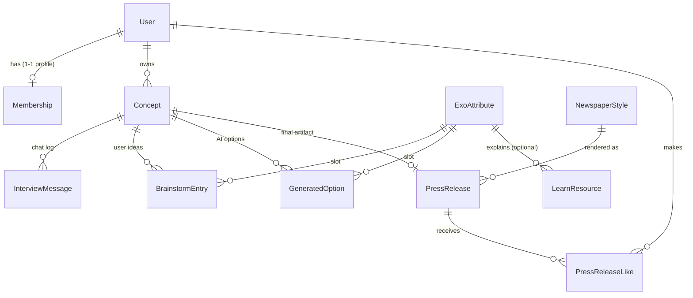

# exo — Data Model

> **Status: APPROVED, 2026-09-21.** Kickoff step 3 complete. This describes the
> shape of the data on its own; all six of Avi's decisions (§5) are applied and
> confirmed, including MTP as a field. Field lists are indicative, not exhaustive.
> Next kickoff step: the full spec, in high-level chapters.

Companion to [spec.md](spec.md). App label: `exo`. Everything here lives inside
the `exo` app; the only thing shared with the rest of the site is the login
(`User`), per `docs/building_an_app.md` Rules 1, 2 and 6 (DB models only, full
encapsulation, a DRF CRUD API over every model).

## The shape in one picture

Three groups of models:

- **Reference / content** (seeded once, admin-editable): `ExoAttribute`,
  `LearnResource`, `NewspaperStyle`.
- **Access**: `Membership` (the approval workflow) + a Django `Group` as the gate.
- **The builder journey** (per user, stateful): `Concept`, `InterviewMessage`,
  `BrainstormEntry`, `GeneratedOption`, `PressRelease`, `PressReleaseLike`.

---

## 1. Reference / content models

### `ExoAttribute` — the framework slots

The canonical building blocks, shared by both worlds: the public education pages
*and* the builder's brainstorm/options. Reference data, **seeded once** (Rule 1),
editable in admin.

- `key` (slug, unique) — e.g. `mtp`, `staff_on_demand`, `algorithms`…
- `name_he`, `name_en` — display name in each language (the framework's English
  term stays as the English value; the Hebrew value is the gloss)
- `category` — one of **MTP**, **SCALE** (5 external), **IDEAS** (5 internal),
  **EXTRA** (the 2 ExO-Canvas extra blocks: *sources of abundance*, *launch
  steps*). So 11 canonical + 2 extra = 13 rows, one model.
- `order` — display order within its category
- `short_def_he`, `short_def_en` — one-line definition
- `prompt_hint_he`, `prompt_hint_en` — guidance shown when brainstorming this slot

### `LearnResource` — the public handout content

The educational material (Rule 1: a model, not files). **Seeded once**, editable.

- `title_he`, `title_en`, `body_he`, `body_en` (markdown). A resource may be
  authored in one language with the other left empty; the page then falls back
  to the filled one rather than rendering blank.
- `youtube_url_he`, `youtube_url_en` (optional embeds — Avi's videos; may be the
  same video in both)
- `book_reference` (optional pointer into Salim's book)
- `attribute` — optional FK → `ExoAttribute` (a "summary of this principle"),
  null for general/handout pages
- `order`, `is_published`

### `NewspaperStyle` — selectable press-release looks

The set of newspaper/article templates the user picks from (§3.4 of the spec).
Reference data, **seeded**, extendable.

- `key` (slug), `name_he`, `name_en`, `description_he`, `description_en`
- `template_ref` / `css_ref` — how it renders (masthead, typography, layout)
- `preview_image` (optional), `is_active`

---

## 2. Access

### `Membership` — the approval workflow (1-1 profile on `User`)

Per Rule 2, app-specific user data is a one-to-one profile, never a change to the
shared `User`.

- `user` — OneToOne → `User`
- `status` — **requested → approved** (and **denied**); a person is `requested`
  until Avi acts
- `requested_at`, `decided_at`, `decided_by` (FK → `User`, the admin)
- `default_visibility` — the visibility a new press release starts with; default
  **`public`** (share forever). Per-release override lives on `PressRelease`.

**The gate itself is a Django `Group`** (e.g. `exo_members`), created by a
migration (the ustrip pattern in `building_an_app.md`). Approving a `Membership`
adds the user to the group; the one access check is "authenticated AND in group,"
with a named superuser bypass. `Membership` records the *workflow*; the group is
the *gate*.

---

## 3. The builder journey

### `Concept` — one user's ExO concept in progress  *(decision 1: named `Concept`)*

The central object, created when an approved user starts a build.

- `owner` — FK → `User`
- `title` — what they're building
- `language` — `he` / `en`; the language this journey runs in and the AI answers
  in. Defaults to the UI language at creation (§0.3 of the spec).
- `current_stage` — **interview → brainstorm → options → output** (drives resume)
- `mtp` — the distilled Massive Transformative Purpose, the anchor everything
  hangs from (output of stage 1)
- `special`, `unique` — the "what's special / what's unique" answers from the
  interview
- `position` — order in the owner's concept list (reorderable, spec §5.0)
- `created_at`, `updated_at`

> **Decision 5 — many per user, fully editable.** A user can have **as many
> Concepts as they like** ("the more the better"), and each is a real object they
> can **create, edit, delete, and reorder** — full CRUD, not an append-only list
> (the `building_an_app.md` "every item is a real object" rule). Deleting a
> Concept cascades to its journey rows and its `PressRelease`.
>
> **Decision 2 — MTP is a field on `Concept`.** ✅ Confirmed 2026-09-21. The
> interview writes and refines `mtp` directly on the Concept; no separate model,
> no version history.

### `InterviewMessage` — the stage-1 AI chat

The adaptive interview transcript. FK → `Concept`.

- `concept` — FK
- `role` — **user / assistant**
- `content`, `created_at`, `order`

### `BrainstormEntry` — the user's own ideas per slot (stage 2)

The user's raw thinking for each attribute (and the 2 extra blocks).

- `concept` — FK
- `attribute` — FK → `ExoAttribute`
- `text` — one idea (a slot can have several entries)
- `created_at`

### `GeneratedOption` — AI options per slot (stage 3)

The AI's 3-4 researched options per attribute; the user selects the ones they
like.

- `concept` — FK
- `attribute` — FK → `ExoAttribute`
- `content` — the option text
- `research_note` (optional — the "why / source" behind it)
- `is_selected` — the user's pick
- `is_user_authored` — true for an option the user typed themselves (spec §5.3
  "add my own"); such options are never replaced by a regenerate
- `order`

### `PressRelease` — the final artifact (stage 4)

Generated from the selected options. One per Concept (the museum piece).

- `concept` — OneToOne → `Concept`
- `headline`, `body` — the **press release** ("working backwards")
- `document_body` — the **detailed accompanying document** *(decision 4: keep
  both — a full detailed document AND the press release)*. Stays a field on this
  model for now; promoted to its own `ConceptDocument` model only if the document
  grows real internal structure (sections, versions).
- `newspaper_style` — FK → `NewspaperStyle`
- `language` — `he` / `en` of the generated text; defaults to `Concept.language`,
  overridable at stage 4 (D4.7). The museum's language filter reads this.
- `exponential_score` — **a single number** *(decision 3)*; a per-attribute
  breakdown can become its own `ScoreItem` model later if wanted
- `stress_test_feedback` — the AI "would a customer be excited?" critique
- **visibility** *(decision 6)* — how widely and for how long it is shown:
  - `visibility` — enum: **`public`** (in the museum forever — the **default**),
    `timed` (public until `public_until`, then owner-only), `specific` (only the
    users in `shared_with`), `private` (owner only, not in the museum)
  - `public_until` — nullable datetime, used by `timed` (e.g. 24h, "just for the
    workshop"). After it passes the release is treated as `private`: still fully
    visible **to its owner**, gone from the public museum and shares.
  - `shared_with` — M2M → `User`, used by `specific` (share with named people)
- `view_count` — integer
- `hidden_by_admin` — boolean; a superuser can hide a release from the museum
  regardless of the owner's visibility (moderation, spec §7.2). Revoking a member
  does not delete content; hiding is the tool.
- `created_at`, `updated_at`

**Effective visibility is computed, not just stored.** The museum listing and any
"can this user see it" check apply the rule live: a release is publicly visible
when `visibility == public`, or `visibility == timed` and `public_until` is in the
future; visible to a named user when `specific` and they are in `shared_with`;
always visible to the owner. A `timed` release does not need a job to "expire" it
— the query simply stops matching it once the time passes. The owner can change
any of this at any time (extend, re-share, make public again).

### `PressReleaseLike` — museum gamification

One row per (user, press release), so a like is attributable and idempotent.

- `press_release` — FK → `PressRelease`
- `user` — FK → `User`
- `created_at`
- unique together: (`press_release`, `user`)

(Likes are counted from these rows; `view_count` is a plain counter; "share" is an
action, not stored, unless we later want share analytics.)

---

## 4. Notes that shape the model

- **Seeding is one-time (Rule 1 / the ustrip lesson).** `ExoAttribute`,
  `LearnResource`, `NewspaperStyle` are seeded from a static source on first
  deploy and then left alone — the seed checks existence and does not overwrite
  rows a person could have edited. A test runs the seed twice and asserts nothing
  editable is touched the second time.
- **Encapsulation (Rule 2).** No model here reaches into another app. The only
  cross-app link is `User`, used read-only for identity; app-specific user data is
  on `Membership`.
- **DRF CRUD API (Rule 6).** Each model gets a documented REST API; the pages are
  consumers of it. Reference models are read-mostly for members, writable in
  admin; journey models (`Concept` and its children) are scoped to their owner
  with full create/read/update/delete.
- **Statefulness** is `Concept.current_stage` plus the child rows; resuming a
  journey is loading the Concept and jumping to its stage. No separate session
  store.

## 5. Decisions applied (2026-09-21)

1. **Central object named `Concept`.** ✅ (was `Project`).
2. **MTP** is a field on `Concept` (confirmed — no separate model). ✅
3. **Exponential score** is a **single number**. ✅
4. **Both** a **detailed document and the press release** are produced; kept as
   two fields on `PressRelease` for now. ✅
5. **Many Concepts per user**, each fully editable and deletable. ✅
6. **Per-release visibility** — default **public forever**; the owner can instead
   limit a release to **specific users** or make it **time-limited** (e.g. 24h for
   a workshop), after which it drops back to owner-only. Modeled on `PressRelease`
   as `visibility` + `public_until` + `shared_with`. ✅
7. **Addenda from the full spec (same day).** Three small fields the full spec
   needed, added here so the model does not drift silently: `Concept.position`
   (reorder), `GeneratedOption.is_user_authored` (the user's own typed option,
   never overwritten by a regenerate), `PressRelease.hidden_by_admin`
   (moderation). No new models. ✅
8. **Bilingual, default Hebrew (same day, Avi's emphasis).** The site is Hebrew
   and English with Hebrew the default, so: the reference models' user-facing
   text became `_he` / `_en` field pairs (`ExoAttribute` name / short_def /
   prompt_hint; `LearnResource` title / body / youtube_url; `NewspaperStyle`
   name / description), and `Concept` and `PressRelease` each gained a
   `language`. No new models. ✅
