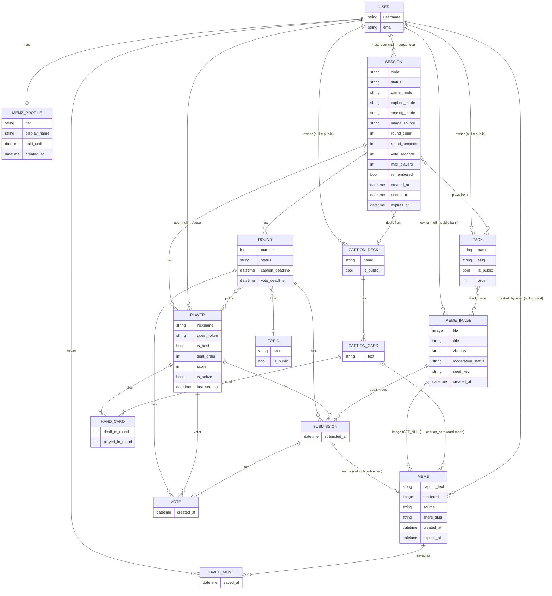

# memz — Data Model

This is the standalone data model called for by
[building_an_app.md](../building_an_app.md) Rule 4, and step 3 of the kickoff
sequence: written before any code, separate from [spec.md](spec.md) on
purpose, so the shape of the data can be read on its own.

> **Status: approved 2026-09-14**, after a second review that changed four
> things (listed under "Review changes" at the end). The full spec is built
> on this document; a change here means a change there.

Every model below will live in `memz/models.py`. Nothing is shared with
`app/`, `matazim/`, `ustrip/`, or any other app, except the site's `User`
account itself (Rule 2). Anything memz needs to know about a user beyond
"who is this" lives in memz's own profile model.

## Overview

Four groups of models:

1. **Accounts**: the shared `User`, plus memz's own `MemzProfile` for tier.
2. **The bank**: `MemeImage`, `Pack`, and the card-mode content
   (`CaptionDeck`, `CaptionCard`, `Topic`).
3. **A game**: `Session` → `Player` → `Round` → `Submission` → `Vote`, plus
   `HandCard` for card mode.
4. **Output**: `Meme` (a finished, rendered meme, from a game or from the
   solo creator) and `SavedMeme` (a user's collection).

## Accounts

### User: shared, untouched

The site's `django.contrib.auth` `User`. memz reads it for login and for
"who is this," nothing more. No new field on it.

### MemzProfile

One-to-one with `User`, created lazily the first time a logged-in person
does anything in memz (there is no reason to create a row for every babook
user who never opens the app).

| Field | Type | Notes |
| --- | --- | --- |
| `user` | OneToOne `User` | CASCADE |
| `tier` | choice: `free` / `paid` | default `free` |
| `display_name` | CharField | what other players see; defaults from the account's first name or username |
| `paid_until` | DateTimeField, null | paid tier is active while this is in the future; null on free |
| `created_at` | DateTimeField | |

**Tier caps are not rows.** Participants per session (5 / 10 / 50), upload
quota, and remembered-session limits are constants in code keyed by tier.
They are configuration, not data a person creates or edits, so Rule 1 does
not ask for a table. If tiers ever become something an admin edits in-app,
they become a `Tier` model then. A guest has no profile and no tier; the
guest caps are the same kind of constant.

## The bank

### MemeImage

One row per picture in the bank, public or private.

| Field | Type | Notes |
| --- | --- | --- |
| `file` | ImageField | the picture, no caption on it |
| `title` | CharField, blank | short label, for browsing and search |
| `owner` | FK `User`, null | **null means the public bank.** A user's own upload has an owner |
| `visibility` | choice: `public` / `private` | a user's upload is `private`. Whether one can ever become `public` is an open question in the spec; the field allows it without a schema change |
| `moderation_status` | choice: `pending` / `approved` / `rejected` | uploads start `pending`; only `approved` images are ever dealt into a game or shown in the creator. Seeded public images are created `approved` |
| `moderation_note` | TextField, blank | why it was rejected, or which check approved it |
| `seed_key` | CharField, blank, unique when set | the file name in the repo's seed folder. This is what makes the one-time seed idempotent: the seed checks for the key before creating, and never touches a row that exists (building_an_app.md, "Data" section) |
| `created_at` | DateTimeField | |

Delete rule: `owner` is CASCADE. If an account is deleted, its private
images go with it. Public images have no owner and are unaffected.

### Pack and PackImage

A pack is the organizing unit of the bank, the "family" or "animals" or
"our Poland trip" that a host picks from. It is also how a public
**category** works: the public bank's categories are simply public packs.
There is no separate category or tag model.

**Pack**: `name`, `slug`, `owner` (FK `User`, null = a public pack),
`is_public`, `description` (blank), `order` (for listing public packs),
`created_at`. A user builds their own packs from their own images and,
if they like, from public images too.

**PackImage**: `pack` FK, `image` FK `MemeImage`, `order`; unique per
(pack, image). An image can be in many packs.

### CaptionDeck and CaptionCard: card mode content

Card mode deals players a hand of pre-written captions. A deck is a set of
them.

**CaptionDeck**: `name`, `owner` (null = public), `is_public`, `language`
(`he` / `en`; card text is language-specific in a way images are not).

**CaptionCard**: `deck` FK, `text`, `order`.

### Topic

The theme for a round in Topics mode. `text` (the prompt shown to players,
e.g. "Monday morning"), `owner` (null = public), `is_public`, `language`.
A tiny model, but a real one: topics are content someone will want to add
and edit without touching code.

## A game

### Session

One row per party session, from the moment a host opens it. This is the
root of everything that happens in a game.

| Field | Type | Notes |
| --- | --- | --- |
| `code` | CharField | the join code players type, short and shouting-across-the-room friendly (letters and digits, no ambiguous ones). Unique among sessions that are not finished; reusable afterwards |
| `host_user` | FK `User`, null | **null means a guest hosted it.** SET_NULL so a finished session survives an account deletion |
| `status` | choice: `lobby` / `playing` / `finished` / `abandoned` | `abandoned` is what cleanup marks a session nobody finished |
| `game_mode` | choice: `normal` / `topics` / `same_meme` / `relaxed` | spec §3.2 |
| `caption_mode` | choice: `typed` / `cards` | spec §3.1 |
| `scoring_mode` | choice: `vote` / `judge` | spec §3.1; ignored in `relaxed` |
| `image_source` | choice: `public_random` / `packs` / `own_only` / `mix` | spec §2.2. Guests always get `public_random` |
| `packs` | M2M `Pack` | which packs the game draws from when `image_source` is `packs` or `mix` |
| `deck` | FK `CaptionDeck`, null | the deck for `cards` mode |
| `round_count` | int | host-set, within a range |
| `round_seconds` | int | captioning timer |
| `vote_seconds` | int | voting timer |
| `max_players` | int | **a snapshot** of the host's cap at creation (5 / 10 / 50), so a tier change mid-game changes nothing |
| `remembered` | bool | true when the host is logged in and the session is kept on their account; false for guest sessions. See Retention |
| `created_at` / `started_at` / `ended_at` | DateTimeField | |
| `expires_at` | DateTimeField, null | when cleanup may delete this session and everything under it. Set for guest sessions; null for remembered ones |

### Player

One row per seat in a session. This is also **the answer to "who wrote
what, without an account."**

| Field | Type | Notes |
| --- | --- | --- |
| `session` | FK `Session` | CASCADE |
| `user` | FK `User`, null | null for a guest. SET_NULL |
| `nickname` | CharField | what the room sees. Unique within the session |
| `guest_token` | CharField, unique | a random secret handed to the player's browser when they join, sent back on every request. This, not the nickname and not the session code, is how the server knows which player a request comes from. A logged-in player gets one too, so the game logic has one identity mechanism, with the account as extra information on top |
| `is_host` | bool | exactly one per session |
| `seat_order` | int | join order; used for judge rotation |
| `score` | int | a cache of points, refreshed when a round ends. The truth is the `Vote` rows; see Scoring |
| `is_active` | bool | false when they leave or drop; a game does not stall on someone who closed the tab |
| `last_seen_at` | DateTimeField | touched by every request from this player (the state poll counts). Presence is derived from it: a player not seen for a set number of seconds is shown as away and, past a longer threshold, marked inactive |
| `joined_at` | DateTimeField | |

The `guest_token` is the thing the spec's open question asked for: it costs
no account, survives a page reload (the browser keeps it), and is worthless
after the session ends. The player's privileges (save, own bank) come from
`user` being set, never from the token.

### Round

One row per round of a session.

| Field | Type | Notes |
| --- | --- | --- |
| `session` | FK | CASCADE |
| `number` | int | 1-based; unique per session |
| `topic` | FK `Topic`, null | set in `topics` mode |
| `judge` | FK `Player`, null | set in `judge` scoring; rotates by `seat_order` |
| `status` | choice: `captioning` / `voting` / `revealed` / `done` | the state machine every client reads. `relaxed` mode skips `voting` |
| `started_at` / `caption_deadline` / `vote_deadline` | DateTimeField | the timers, as absolute times so every phone shows the same countdown |

### Submission

What one player made in one round.

| Field | Type | Notes |
| --- | --- | --- |
| `round` | FK | CASCADE |
| `player` | FK `Player` | CASCADE |
| `image` | FK `MemeImage` | **the image this player was dealt**, assigned when the round starts. In `same_meme` mode every submission in the round gets the same one; there is no separate "round image" field |
| `meme` | OneToOne `Meme`, null | null until the player submits; then the actual content: image, caption, rendered picture. See Output |
| `submitted_at` | DateTimeField, null | set when they submit |

Unique per (round, player). **A row is created for every active player the
moment a round starts**, with the dealt image. A player who runs out the
clock has a row with `meme` null; that row is excluded from voting and
shown as "didn't make it" at the reveal. This removes the "no row or empty
row" ambiguity from the first draft.

### Vote

| Field | Type | Notes |
| --- | --- | --- |
| `round` | FK | CASCADE |
| `voter` | FK `Player` | CASCADE |
| `submission` | FK `Submission` | CASCADE |
| `value` | PositiveSmallInteger | SPR-Z.10: אוהב 2, ככה ככה 1, פחות 0. Judge mode writes the default and ignores it — there the pick is the whole thing |
| `created_at` | DateTimeField | |

**Changed in SPR-Z.10 (2026-09-18).** A row used to mean "who I picked
this round": unique per `(round, voter)`, no value, one per player. It now
means "what I thought of this meme": unique per
`(round, voter, submission)`, carrying `value`, one per meme per player,
cast during that meme's own slot in the reveal (spec Rule 4.6.1).

The constraint therefore **loosened**, and Judge mode's "exactly one pick
per round" moved from the database into `game.cast_vote`. That is the one
guarantee the change traded away; it is written here so nothing later
assumes the constraint still says what it used to.

**A player cannot vote for or rate their own submission**; that is enforced
in the API, not the database, and gets a test. The same table serves both
scoring modes; the mode changes who may act, how many rows they write, and
how points are computed — not the shape of the data.

### HandCard: card mode

Which caption cards a player holds.

| Field | Type | Notes |
| --- | --- | --- |
| `player` | FK `Player` | CASCADE |
| `card` | FK `CaptionCard` | |
| `dealt_in_round` | int | |
| `played_in_round` | int, null | null while still in hand |

A hand persists across rounds and is topped up each round to a fixed size,
the way card games work, so a strong card can be held for the right image.
Playing a card sets `played_in_round` and creates the `Submission` whose
`meme.caption_card` points at the card.

### Scoring: computed from votes, cached on the player

Points are derived from `Vote` rows by the session's `scoring_mode` (from
SPR-Z.10, in `vote` mode a meme scores the **sum of its rows' `value`**;
in `judge` mode the judge's single pick takes the round). `Player.score`
is a cache written when a round reaches `done`, so the leaderboard is one
query. The `Vote` rows are the truth; a recompute from them must always
reproduce the cached score, and a test checks that.

## Output

### Meme

**A finished meme is its own thing**, whether it came from a game or from
the solo creator. This is what gets shared, saved, and shown. A game
`Submission` points at one; the solo creator makes one directly.

| Field | Type | Notes |
| --- | --- | --- |
| `image` | FK `MemeImage`, null | SET_NULL. The first draft said PROTECT; that collided with `MemeImage.owner` being CASCADE (deleting an account would fail on the first meme anyone made from that user's picture) and would have stopped a user deleting their own picture from their bank. The `rendered` file is the meme's self-sufficient artifact; the link back to the bank image is a convenience, not a dependency |
| `caption_text` | TextField | the words on the meme. In card mode this is copied from the card so the meme is complete on its own |
| `caption_card` | FK `CaptionCard`, null | which card, when card mode; SET_NULL |
| `rendered` | ImageField | the composed picture (image plus caption), produced by the meme engine at submit time and stored, so sharing sends a file, not a recipe. Required: a `Meme` without a rendered file is not a meme |
| `source` | choice: `game` / `solo` | |
| `created_by_user` | FK `User`, null | null for a guest; SET_NULL |
| `share_slug` | CharField, unique | an unguessable slug for the share link. Share to mail or WhatsApp is the phone's share sheet sending this URL; nothing about the target is stored |
| `created_at` | DateTimeField | |
| `expires_at` | DateTimeField, null | see Retention: guest-made memes expire; anything saved does not |

### SavedMeme

A logged-in user's collection. `user` FK, `meme` FK, `saved_at`; unique per
(user, meme). Saving a meme clears its `expires_at`. This is available to
any logged-in player, not only the host, in the free tier too (spec §3.4).

## Retention: what lives how long

This answers the spec's open question about guest data.

- **A guest-hosted session** (`host_user` null) gets `expires_at` set to a
  fixed window after it ends (or after it was created, if it never
  finished). Cleanup deletes the session, its players, rounds, submissions
  and votes. The window is long enough for everyone to share what they
  liked that evening, short enough that nothing accumulates. The number is
  a design decision; the shape is settled.
- **Memes made in a guest session** get the same `expires_at`. A share link
  works until then. If a logged-in player saves one, its `expires_at` is
  cleared and it outlives the session: the `Meme` row stays, the
  `Submission` row is deleted with the session, and the meme keeps its own
  `image` and `caption_text` so it is complete without it.
- **A logged-in host's session** is `remembered` and has no `expires_at`.
  The free tier's cap on remembered sessions is enforced by count when a
  new one is opened (oldest gets `expires_at` set, or the host is asked),
  not by a scheduled purge. Paid: unlimited.
- **Guest tokens** are meaningless once the session is deleted. Nothing
  about a guest survives except memes someone chose to save.

## Moderation: the model holds the outcome, wherever the check runs

`MemeImage.moderation_status` and `moderation_note` are memz's own. Whether
the check that fills them is memz's own code, a call into the site's
existing moderation module, or a human in the admin, is the boundary
question the spec flagged. The data does not care; the rule that only
`approved` images are ever dealt or shown is memz's, and is tested in
memz. Recommendation, for when we get there: memz calls the site's
moderation function as an external service would (a plain function call
with an image in and a verdict out, no shared models, no imports of its
tables), which keeps Rule 2 intact.

## Deliberately not modeled

- **Tier caps** (5 / 10 / 50 players, upload quotas, remembered-session
  limits): code constants keyed by `MemzProfile.tier`. See Accounts.
- **Categories or tags** on images: a public pack *is* the category.
- **Share targets**: mail, WhatsApp and the rest are the phone's share
  sheet acting on a `Meme.share_slug` URL. Nothing to store.
- **Likes, comments, feeds**: not a social network (spec §6). "Things they
  liked" means share or save, both modeled.
- **Real-time transport**: what pushes a round's state change to every
  phone is design, not data. The state itself (`Round.status` and the
  deadlines as absolute times) is modeled so that polling and push both
  work off the same rows.
- **Payments**: the paid tier is `MemzProfile.tier` plus `paid_until`.
  How money moves is a later decision and its own models when it comes.
- **AI caption suggestions**: not in this chapter of the spec; nothing
  reserved for it, and nothing here would need to change to add it.

## Decisions, approved 2026-09-14

1. **`Meme` as its own model**, shared by game submissions and the solo
   creator, rather than the game having its own submission content. This is
   the "one engine, two front doors" idea made concrete in the data.
2. **Public packs are the categories.** No separate tag model.
3. **Card hands persist across rounds** and refill, rather than a fresh
   deal every round.
4. **One `Vote` table for both scoring modes**, with the mode deciding who
   may vote.
5. **Tier caps as code constants**, not rows. The numbers are in the spec
   (§2.4) as settings, so they can be tuned without a migration.
6. **Guest retention by `expires_at` plus a cleanup job.** The window is
   set in the spec (§8.5).

## Review changes (second pass, 2026-09-14)

1. **`Submission.image` added, `Submission.meme` made nullable, `Round.image`
   removed.** A submission row now exists for every active player from the
   start of a round, carrying the dealt image; the meme arrives when they
   submit. One path for all modes.
2. **`Meme.image` is SET_NULL, not PROTECT.** PROTECT collided with account
   deletion (CASCADE on the image's owner) and with a user deleting their
   own picture. The rendered file is what a meme *is*; the bank link is a
   pointer.
3. **`Meme.rendered` is required**, produced at submit time. A meme without
   a picture is not a meme, and rendering at submit means the reveal never
   waits.
4. **`Player.last_seen_at` added**, so presence ("away", "left") is derived
   from something the state poll already touches, instead of a separate
   heartbeat.
