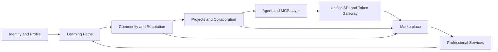
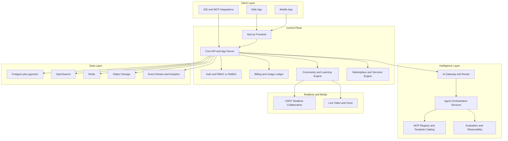

# מחקר שוק אסטרטגי וטכני לפלטפורמת קהילת AI משולבת

נכון ל־20 במאי 2026, התמונה התחרותית ברורה: אין כיום שחקן יחיד שמחבר היטב בין **למידת AI רב־שכבתית, קהילה מקצועית, סביבת בנייה למפתחים, שכבת Agentic/MCP, שער API/טוקנים, שוק שירותים מקצועיים ושוק מוצרים/אייג’נטים**. במקום זאת, השוק מפוצל לשלושה צבירים: פלטפורמות “business-in-a-box” ליוצרי קהילות וקורסים; אקוסיסטמים טכניים של קוד, מודלים ואייג’נטים; ושווקים/מרכזי מסחר של שירותים, אפליקציות וטוקנים. זו בדיוק הסיבה שהחזון שלכם הוא גם **בר־ביצוע אסטרטגית** וגם **קשה לביצוע תפעולית**: הוא יושב על נקודת התכנסות אמיתית, אבל מחייב sequencing קפדני, ארכיטקטורה מודולרית ואסטרטגיית network effects מכוונת. citeturn0search2turn0search1turn32search0turn31search15turn21search0turn22search1turn9search0turn36search1turn35search3turn15search15

הסינתזה המרכזית של המחקר היא כזו: פלטפורמה חדשה צריכה להיבנות לא כ“עוד LMS” ולא כ“עוד Discord לקהילת AI”, אלא כ־**control plane** שמחבר בין שלוש לולאות ערך: **ללמוד**, **לבנות**, **להרוויח**. ליבת המוצר צריכה להתחיל במקום שבו הביקוש כבר מוכח: מפתחים, builders, creators, ו־AI practitioners העוברים מ־prompting ו־vibe coding אל co-coding, orchestration, MCP ו־agentic workflows. הסיבה: גם Stack Overflow מראה אימוץ AI גבוה מאוד בתהליכי פיתוח, וגם פלטפורמות כמו GitHub, VS Code, Cursor, Replit, LangChain ו־MCP מתכנסות לסביבת עבודה agentic; במקביל Circle, Mighty, Kajabi, Heartbeat ו־Disco מוכיחות ביקוש למודלים משולבים של קהילה, קורסים, אירועים ומסחור. citeturn11search6turn11search10turn10search2turn10search1turn10search0turn9search0turn36search1turn0search2turn0search1turn31search15turn32search0turn1search18

הדיאגרמה למעלה משקפת את מבנה השוק הנוכחי ואת ההזדמנות: רוב השחקנים שולטים רק בשכבה אחת או שתיים; המנצח הפוטנציאלי בדור הבא יהיה מי שיבנה לולאה סגורה בין זהות, ידע, ארטיפקטים, שימוש במודלים, ואפיקי הכנסה. Hugging Face ו־GitHub כבר מוכיחים כמה חזקים network effects כשהם נשענים על artifacts ציבוריים, developer identity ו־distribution; מנגד, המודלים של Circle/Kajabi/Heartbeat מוכיחים שאינטגרציה של קהילה+מסחור משפרת retention, אבל נשארת בדרך כלל bounded ל־audience של המארח. citeturn22search1turn13search2turn9search2turn9search10turn0search2turn31search15turn32search13turn21search16

## מפת השוק וההתכנסות

הטבלה הבאה ממפה את פלחי השוק הרלוונטיים, את תפקידם באקוסיסטם, את השחקנים הדומיננטיים ואת הפער שאפשר לבנות עליו.

| קטגוריה | תפקיד באקוסיסטם | שחקנים בולטים | חוזקות עיקריות | חולשות ופער הזדמנות |
|---|---|---|---|---|
| פלטפורמות קהילה | בית ממותג לקהילה, discussion, events, memberships | Circle, Mighty, Heartbeat, Discourse, Discord, Slack, Kajabi Communities, Bettermode, Skool, Disco citeturn0search2turn0search1turn32search0turn21search0turn33search18turn1search4turn31search15turn31search4turn37search6turn1search18 | חיבור מהיר בין קהל, תוכן, אירועים ותשלומים; ב־Discourse גם durable knowledge ו־SEO; ב־Slack/Discord realtime engagement חזק מאוד. citeturn0search2turn0search1turn32search13turn21search8turn33search4turn1search7 | לרוב אין שכבת artifacts טכנית חזקה, אין AI gateway מובנה, ואין professional identity עמוקה; chat-first systems נוטות לידע קשה לחיפוש ולשחיקה ארכיונית. citeturn21search16turn33search2turn1search4 |
| LMS ו־creator learning platforms | יצירת קורסים, מכירה, coaching, certificates | Teachable, Thinkific, Kajabi, LearnWorlds, Moodle, Open LMS citeturn2search17turn2search12turn31search15turn3search8turn3search2turn3search1 | מסחור טוב, onboarding פשוט, mobile וברנדינג; Moodle/Open LMS מציעות גמישות גבוהה והרחבות. citeturn2search4turn2search1turn31search19turn3search11turn3search2turn3search13 | ברובם הקהילה או agent workflows הם שכבה משנית; Teachable אף עצרה השקעה בפיצ’ר Community. citeturn2search14turn3search15 |
| קהילות מודלים ו־AI artifacts | hosting, discovery, collaboration סביב מודלים, datasets ואפליקציות | Hugging Face, Replicate, Poe, Hugging Face Spaces citeturn22search1turn7search1turn8search7turn13search2 | network effects עמוקים סביב models/datasets/apps; discovery אורגני; קהילה טכנית אמיתית. citeturn22search1turn22search17turn13search2 | מסלולי למידה, mentorship, certifications ושירותים מקצועיים עדיין מפוזרים או חיצוניים. citeturn22search14turn22search17 |
| שערי API/טוקנים | unified inference, routing, cost control, provider abstraction | OpenRouter, Poe API, Amazon Bedrock, Cloudflare AI Gateway, Portkey, Helicone citeturn8search5turn8search7turn27search10turn27search1turn27search4turn27search3 | גישה אחידה למודלים, ניתוב, fallback, observability, rate limiting, cost controls. citeturn8search5turn27search1turn27search9turn27search17turn27search4turn27search3 | מעט מאוד מהם מחברים usage billing ללמידה, קהילה, trust, mentoring או שירותים מקצועיים. citeturn25search2turn25search5 |
| no-code ו־workflow AI ecosystems | אוטומציה, agents ו־integration למשתמשים לא־דיפ־טק | Zapier, n8n, Make, Bubble citeturn34search3turn34search0turn34search17turn34search1 | מורידים חסם כניסה, מחברים אלפי אפליקציות, מאפשרים agentic workflows גם ללא צוות הנדסי כבד. citeturn34search3turn34search7turn34search0turn34search17 | אין שכבת קהילה/מוניטין/בנייה מקצועית עמוקה; אין מסלול מסודר מ־beginner ל־pro. citeturn34search3turn34search0 |
| open-source AI communities | open science, שיתוף ידע, קוד ותרומות | Hugging Face, LangChain, MCP, n8n, Discourse, Moodle, GitLab citeturn22search1turn21search6turn36search1turn34search8turn21search8turn21search9turn19search8 | adoption מהיר, extensibility, תרומות קהילה, אמון מפתחים. citeturn21search6turn36search17turn19search8 | monetization קשה יותר בלי cloud/proprietary control plane; governance הופכת קריטית עם צמיחה. citeturn21search9turn36search13 |
| אקוסיסטמים agentic | frameworks, runtimes, orchestration, tools | LangChain/LangGraph, MCP, OpenAI Agents SDK, Microsoft Agent Framework, CrewAI, LiveKit, Mastra citeturn9search18turn36search1turn35search3turn35search1turn35search0turn28search11turn35search2 | השוק נע אל durable execution, human-in-the-loop, tool use, realtime multimodal agents. citeturn9search18turn35search3turn35search1turn28search3 | אין עדיין “home base” שמחבר בין לימוד, agent templates, gateway credits, certification והכנסה. citeturn36search20turn35search6 |
| רשתות מקצועיות ומאגרי ידע למפתחים | זהות מקצועית, Q&A, trusted knowledge, portfolios | GitHub, GitLab, Stack Overflow, VS Code ecosystem, Replit, Cursor citeturn9search10turn19search6turn11search1turn10search2turn10search0turn10search1 | artifacts ציבוריים, workflows אמיתיים, adoption אצל builders, ו־AI בתוך ה־DX עצמו. citeturn9search2turn19search0turn10search2turn10search21 | למידת עומק, mentoring, credentials, events והכנסה משירותים מפוצלים על פני כלים אחרים. citeturn11search6turn11search16 |
| שווקי שירותים ופרילנס | matching בין ביקוש להיצע, consulting ו־delivery | Fiverr, Upwork citeturn18search6turn15search15 | נזילות ביקוש, trust primitives בסיסיים, תשלומים גלובליים ו־take rates מוכחים. citeturn16search7turn16search0turn15search21turn15search24 | קשה לבנות continuity של learning-to-earning; identity מקצועית עמוקה מוגבלת; הלקח: מסחר בשירותים עובד טוב, אבל לא מייצר לבדו קהילת מומחיות איכותית. citeturn20search0turn17search1 |
| שווקי מוצרים דיגיטליים ואפליקציות | distribution של מוצרים, templates, assets, apps | Gumroad, AppSumo, Envato, GPT Store, Hugging Face Spaces citeturn12search2turn14search2turn12search11turn13search3turn13search2 | discovery, checkout, affiliate/distribution, דירוגים וקטלוג. citeturn12search22turn14search13turn12search7turn13search3 | ברובם אין מסגרת mentoring, cohort learning, trust מקצועי רציף או API gateway usage loop. citeturn13search3turn13search2 |
| אירועים וניהול קהילה פיזית/היברידית | RSVP, ticketing, discovery, meetups | Luma, Eventbrite, Meetup, LiveKit לתשתית realtime citeturn28search1turn28search5turn28search2turn28search0 | onboarding מהיר לאירועים; discovery חזק; realtime חזק ב־LiveKit. citeturn28search1turn28search9turn28search14turn28search3 | רובם לא מחברים events ל־curriculum, projects, reputation, gateway credits ושירותים מקצועיים. citeturn28search5turn28search2 |

מסקנת המיפוי: הפער הגדול ביותר הוא **בין מערכות שעושות “engagement + commerce” היטב לבין מערכות שעושות “artifacts + tooling + developer identity” היטב**. המרחב הפנוי אינו “עוד פלטפורמת קהילה”, אלא **ecosystem OS ל־AI practitioners**: מקום שבו אפשר ללמוד, לבנות, לפרסם, להרוויח, לקנות inference, ולמצוא מומחים — בלי לנתק בין הזהות, התוכן, הקוד והכסף. citeturn0search2turn21search0turn22search1turn9search2turn15search15turn13search2

## ניתוח הפלטפורמות הקיימות

### פלטפורמות קהילה

| פלטפורמה | קהל יעד | מודל ארכיטקטוני ואקסטנסיביליות | מסחור, קהילה ושימור | מוכנות ארגונית ומשמעות אסטרטגית |
|---|---|---|---|---|
| Circle | creators, educators, paid communities | SaaS all-in-one עם API ואינטגרציות; האתר, הדיונים, הקורסים, האירועים, התשלומים, email marketing ו־AI agents חיים תחת מותג אחד. citeturn0search2turn0search18 | strong native monetization; AI agents ו־workflows; retention דרך courses/events/email/community loops. citeturn0search2turn0search6 | white-label/mobile חזק במיוחד ב־fully branded app; מתאים לעסקים רציניים מבוססי קהילה, פחות לאקוסיסטם פתוח ציבורי. citeturn0search4turn0search14 |
| Mighty Networks | network-led communities, coaches, brands | SaaS opinionated שמחבר community, courses, events ו־commerce; emphasis על branded apps ו־AI Cohost. citeturn0search1turn0search13 | retention דרך member-led activity, spaces, livestreams, challenges ו־events. citeturn0search1turn0search9turn0search11 | branded app הוא differentiator גדול; מתאים לחיבור habit-forming community, אבל פחות “developer platform” עמוק. citeturn0search1turn0search15 |
| Skool | course-first creators עם קהילה פשוטה | SaaS opinionated עם calendar, classroom, leaderboards, discovery ו־Zapier plugin; extensibility מצומצמת יחסית. citeturn37search6turn37search8 | gamification חזקה מאוד ופשטות מוצרית; fees ברורים בשכבת תשלומים. citeturn37search1turn37search6 | טוב ל־fast monetization וקהילות קטנות/בינוניות; חלש יותר ב־enterprise, API depth ו־customization עמוק. citeturn37search1turn37search8 |
| Discord | realtime communities, gaming, creator/developer servers | שרתים, אפליקציות, forum channels, webhooks ו־premium app subscriptions; אקוסיסטם אפליקציות עשיר. citeturn33search2turn33search7turn33search12turn33search18 | realtime engagement חזק; server subscriptions ומוניטיזציה לאפליקציות. citeturn33search0turn33search12 | פחות מתאים ל־durable knowledge, white-label או governance ארגוני כבד; חזק כ־attention layer ולא כ־knowledge layer. citeturn33search4turn21search16 |
| Slack | work collaboration ו־enterprise communities | AI work platform עם Workflow Builder, apps, custom workflow steps ו־agentic platform. citeturn1search4turn1search7turn1search14 | automation ו־integration מעולות; מתאים ללמידה בתוך זרימת עבודה ארגונית יותר מאשר ל־creator economy. citeturn1search0turn1search7turn1search16 | enterprise readiness גבוהה, אך discovery ציבורי ו־creator monetization חלשים יחסית. citeturn1search10turn1search4 |
| Discourse | knowledge communities, forums, product communities | open-source/self-host או hosted; plugins, direct DB access, REST API; long-form + chat. citeturn21search0turn21search8turn21search20 | חזק במיוחד ב־searchable knowledge, moderation ו־SEO; פחות native commerce. citeturn21search16turn21search8 | הבחירה הטובה ביותר כש־durable knowledge חשוב יותר מ־feed/chat; בסיס חזק לקהילת מפתחים. citeturn21search0turn21search16 |
| Bettermode | embedded/headless communities ל־SaaS ו־brands | GraphQL API, app framework, dynamic blocks/shortcuts, bot/member actions. citeturn31search4turn31search0turn31search20 | flexibility גבוהה בבניית UX מותאם; community mechanics נבנים סביב apps. citeturn31search8turn31search12 | חזק ל־custom community בתוך מוצר אחר; פחות “business-in-a-box” לעומת Circle/Kajabi. citeturn31search8turn31search4 |
| Kajabi Communities | creator businesses שמוכרות courses/coaching/community | קהילה מחוברת ישירות לרכישות, billing ו־delivery באותה מערכת; all-in-one commerce. citeturn31search2turn31search15turn31search19 | threaded discussions, audio posts, badges, calendar views, event scheduling, announcements. citeturn31search2 | creator economy ו־commerce חזקים; extensibility ו־public ecosystem מוגבלים יותר מאשר בפלטפורמות developer-first. citeturn31search19turn31search7 |
| Heartbeat | creators, educators, entrepreneur communities | all-in-one community platform עם chats, courses, events, documents, workflows, payments; Pulse AI; API access בתוכניות גבוהות. citeturn32search0turn32search13turn32search8 | strong monetization, automations, badges, analytics, universal search למסמכים. citeturn32search13turn32search12turn32search10 | custom domain, branding removal, white-label emails ו־mobile apps; שחקן מעניין מאוד לקטגוריית “community business OS”. citeturn32search13turn32search17 |
| Disco | bootcamps, academies, L&D, cohort learning | AI-native social learning positioning; community + cohort experiences + AI automation. citeturn1search18turn1search2 | social learning ו־cohort engagement הם ליבת ההצעה; strong fit ל־academy businesses. citeturn1search6turn1search15 | חזק ל־B2B learning businesses; פחות הוכחה כ־broad public ecosystem. יש להתייחס לחלק מטענות הביצועים כ־vendor positioning. citeturn1search18turn1search9 |

הלקח מפלטפורמות הקהילה הוא חד: מה שמייצר retention אינו רק “פורום” או “צ’אט”, אלא **loop סגור של content, event cadence, identity, notifications, payments ו־next action**. Circle, Mighty, Heartbeat ו־Kajabi מבינות זאת היטב; Discourse מבינה ידע ארכיוני; Slack/Discord מבינות realtime. הפלטפורמה החדשה צריכה לשלב בין שלושת העולמות, במקום לבחור רק אחד מהם. citeturn0search2turn0search1turn32search0turn31search15turn21search16turn1search4turn33search4

### פלטפורמות למידה

| פלטפורמה | קהל יעד | מודל טכני ומוצרי | מסחור ושימור | קריאה אסטרטגית |
|---|---|---|---|---|
| Teachable | creator-educators שמוכרים courses/coaching | dedicated “school” לכל creator; courses, coaching and services. citeturn2search16turn2search17 | transaction fees משתנים לפי gateway/plan; iOS/Android apps; אבל Community ב־maintenance mode. citeturn2search13turn2search4turn2search14 | חזק ל־course commerce פשוט; חלש כבסיס לקהילת AI מקצועית עתירת collaboration. citeturn2search14turn3search15 |
| Thinkific | learning businesses בינוניות־גדולות | all-in-one courses + communities + payments; App Store; mobile/branded app. citeturn2search12turn2search6turn2search1 | app ecosystem משפר extensibility; community ותשלומים משולבים. citeturn2search5turn2search2 | נקודת אמצע טובה בין LMS מסחרי לגמישות; עדיין אינו ecosystem טכני עמוק. citeturn2search12turn2search6 |
| Kajabi | expert businesses, coaching, memberships, community | courses, coaching, communities, digital downloads, email ו־payments in one place. citeturn31search15turn31search7 | no revenue sharing; access tied to purchases; revenue ops מצוינים. citeturn31search19turn31search2 | מצוין ל־creator business; פחות מתאים ל־open developer ecosystem. citeturn31search19 |
| LearnWorlds | course brands עם דגש white-label | white-labeled course websites and mobile apps; AI tools; interactive video; higher tiers with SSO/SLA/DPA. citeturn3search8turn3search11 | strong premium learning UX; טוב לתוכניות structured/high-ticket. citeturn3search11 | מועמד חזק ל־academy layer, אך לא מספק לבדו community/tooling marketplace עמוק. citeturn3search8turn3search12 |
| Moodle | education/enterprise שצריכים גמישות מקסימלית | open-source LMS עם plugins/integrations ו־scale לארגונים בגדלים שונים. citeturn3search2turn21search9 | שליטה בנתונים, provider choice, extensibility ארוכת טווח. citeturn21search9turn21search1 | בסיס חזק למוסדות ו־enterprise learning, אך דורש יותר product wrapping כדי להיות community business מודרני. citeturn3search2turn21search9 |
| Open LMS | higher ed + corporate training | enterprise-ready Moodle-based LMS, customizable, hosted/support-heavy; multi-tenancy/theme support. citeturn3search1turn3search9turn3search13 | migration support, enterprise customization, open-source lineage. citeturn3search5turn3search16 | טוב כשדרושה אמינות ארגונית, לא כשמחפשים developer/agent ecosystem פתוח. citeturn3search9turn3search16 |

מסקנת שכבת הלמידה: **ה-LMS לבדו אינו moat**. המגמה הנוכחית דוחפת אל social learning, cohort accountability, mobile, AI authoring ו־commerce, אבל עדיין יש מרחק גדול בין “למכור קורס” לבין “לייצר אקוסיסטם מקצועי סביב AI”. זו בדיוק הזדמנות הבנייה. citeturn1search18turn31search15turn2search14turn3search8

### אקוסיסטמים של AI, מפתחים ואייג’נטים

| פלטפורמה | קהל יעד | מהו מנגנון ה־network effect | משמעות למוצר החדש |
|---|---|---|---|
| Hugging Face | חוקרי ML, builders, open-source AI community | models + datasets + apps + learning + public collaboration platform; open source/open science. citeturn22search1turn22search17turn22search9 | זו הדוגמה הטובה ביותר ל־artifact-centric network effect; כדאי ללמוד ממנה על identity, discovery ו־community contributions. |
| Replicate | builders שרוצים API-first model execution | model hosting/inference marketplace בסגנון API-first. citeturn7search1 | מראה ביקוש לשכבת execution monetized, אך לא פותרת community/learning עמוקים. |
| Poe | power users, creators of bots/apps | unified chat to 100+ models, millions of bots, Apps, API tool calling, monetization path. citeturn8search7turn8search5turn8search8 | מוכיח שיש demand אמיתי ל־consumer/prosumer layer מעל מודלים מרובים — אבל לא ל־professional reputation system שלם. |
| OpenRouter | developers שרוצים unified inference | single API key, model routing, provider abstraction, competitive pricing comparison. citeturn8search5 | מודל חשוב מאוד לשכבת gateway; הלקח הוא שה־gateway חייב להתווסף לשכבת trust, billing ו־learning ולא להישאר commodity proxy. |
| LangChain / LangGraph / LangSmith | agent builders, production AI teams | open-source frameworks + commercial observability/eval/control plane; downloads עצומים ולקוחות enterprise. citeturn9search0turn9search12turn9search18 | דוגמה מצוינת ל־open-core motion: OSS לקליטה, cloud לייצור הכנסה ול־enterprise governance. |
| MCP ecosystem | host/client/server builders | open protocol, registry, tools/resources/prompts, OAuth 2.1 authorization, app UIs. citeturn36search1turn36search0turn36search2turn36search17turn36search20 | זהו שכבת החיבור הקריטית לפלטפורמה החדשה; registry + templates + security + billing הם אזור בידול טבעי. |
| GitHub AI ecosystem | software teams | GitHub Models, MCP server, Actions AI inference, Copilot context/MCP. citeturn9search2turn9search6turn9search10turn9search13 | GitHub כבר מחזיקה את זהות המפתח והקוד; המוצר החדש לא צריך להתחרות ב־repo system אלא לחבר אותו ללמידה, קהילה, service exchange ו־gateway credits. |
| GitLab | DevSecOps teams, enterprise engineering | open core platform + AI agent platform + AI catalog/governance. citeturn19search0turn9search3turn19search6 | מראה כיצד AI governance ו־workflow automation מתכנסים לארגון גדול; חשוב ללמידה enterprise-facing. |
| Stack Overflow / Stack Internal | public Q&A + enterprise knowledge | reputation, votes, tags, trusted knowledge, MCP server לארגונים; survey מראה אימוץ AI חזק אצל מפתחים. citeturn11search1turn11search16turn11search18turn11search6turn11search10 | lesson קריטי: trust, reputation ו־knowledge structure חשובים יותר מ־feed במקרה של קהילה מקצועית עמוקה. |
| Replit | builders, vibe coders, enterprise AI dev | build and deploy collaboratively with AI; agent on mobile; enterprise governance. citeturn10search0turn10search20turn10search8turn10search12 | חזק ב־idea-to-deploy, אך אינו קהילה מקצועית שלמה. |
| Cursor | pro developers | AI-first editor/workspace עם desktop, terminal, web/mobile agent, official tutorials. citeturn10search1turn10search5turn10search13turn10search21 | מוכיח את speed wedge של AI coding, אבל גם מחדד שה־community וה־learning frame עדיין חיצוניים. |
| VS Code ecosystem | broad developer base | open source AI code editor, extension marketplace, dev containers, web + live share + MCP. citeturn10search2turn10search18turn10search6turn10search10turn10search14 | זוהי שכבת surface קריטית לאינטגרציות; צריך לחשוב עליה כ־distribution channel, לא כיעד מתחרה. |
| CrewAI / Microsoft Agent Framework / OpenAI Agents SDK / Mastra / LiveKit | advanced agent builders | כלים שונים למולטי־אייג’נט, orchestration, realtime multimodal, observability ו־deployment. citeturn35search0turn35search1turn35search3turn35search2turn28search11 | השוק יהיה מבוזר — לכן עדיף לבנות registry, templates, evaluation, education ו־gateway סביב frameworks קיימים, לא framework סגור מאפס. |

מסקנת שכבת ה־AI/developer ecosystem היא זו: **הנכס החזק ביותר הוא לא רק קהילה, אלא artifacts + identity + execution context**. GitHub, Hugging Face ו־VS Code חזקים כי הם יושבים על מקום העבודה עצמו; OpenRouter, Poe ו־Bedrock חזקים כי הם יושבים על execution/cost layer; LangChain/MCP/OpenAI Agents SDK חזקים כי הם מגדירים abstractions. הפלטפורמה החדשה צריכה לחבר את כל זה לשכבת social learning ומונטיזציה, לא לנסות להחליף כל שכבה בעצמה. citeturn22search1turn9search2turn10search2turn8search5turn27search10turn36search1turn35search3

### מודלי marketplace

| מודל | דוגמה | מה עובד | מה חסר עבור החזון שלכם |
|---|---|---|---|
| שירותי פרילנס/ייעוץ | Fiverr, Upwork citeturn18search6turn15search15 | matching, payments, trust basics, take rate מוכח; ב־Fiverr המוכר מקבל 80% והקונה משלם service fee; ב־Upwork יש fees בשני צדי השוק. citeturn16search7turn16search0turn15search21turn15search24 | אין רצף טבעי מ־learn → prove skill → get hired בתוך אותו אקוסיסטם. |
| מכירת מוצרים דיגיטליים | Gumroad | ease of sale, discovery, simple payout/API/OAuth. citeturn12search2turn12search22turn12search26turn15search3 | אין collaboration, mentorship או project identity. |
| launch marketplace | AppSumo | distribution engine אדיר ל־SaaS: 2,000+ brands, 4M+ customers, 1.25M+ followers, 5,000+ affiliates. citeturn14search2turn14search13 | מעולה להפצת tooling, לא לבית מקצועי לאורך זמן. |
| asset marketplace | Envato | קטלוג גדול, מנגנון author fees, subscription to assets and AI tools. citeturn12search11turn12search7turn12search15 | לא מחזיק trust מקצועי או workflow AI עמוק. |
| app directory / GPT marketplace | OpenAI GPT Store, Hugging Face Spaces | discovery קטגורי, leaderboards ו־distribution לאפליקציות AI. citeturn13search3turn13search7turn13search2 | חסרה שכבת onboarding מקצועי, certifications, service exchange ו־multi-provider governance. |
| model/app infra marketplace | Hugging Face Spaces, Replicate | deployment/discovery לאפליקציות ומודלים. citeturn13search2turn7search1 | עדיין לא מחליף community business OS שלם. |

הלקח מה־marketplaces הוא פשוט: **מסחר לבדו לא מייצר קהילה, וקהילה לבדה לא מייצרת כלכלה**. הערך הגדול ייווצר אם תבנו marketplace רק אחרי שיש לכם trust graph, curriculum graph ו־artifact graph. citeturn15search15turn16search7turn13search3turn22search1

## ארכיטקטורה טכנית מומלצת

הבחירה הארכיטקטונית הנכונה עבור ה־MVP אינה microservices מלאים. ההמלצה המחקרית כאן היא **modular monolith multi-tenant SaaS עם event backbone**, ורק אחר כך פיצול לשירותים עצמאיים באזורים שיש בהם scale asymmetry אמיתי: inference gateway, realtime collaboration, search/recommendation, usage metering ו־media. AWS מדגישה שבמעבר ממונולית למיקרו־שירותים צריך לפרק בזהירות סביב boundaries ברורים, וש־event-driven architecture מייצרת loose coupling בין שירותים; בו־זמן, whitepaper ה־SaaS של AWS מדגיש ש־multi-tenancy הוא כלי יסוד לזריזות ולעלות־תועלת. citeturn25search0turn25search1turn25search4turn25search14turn25search18

הטבלה הבאה מסכמת את ה־tradeoffs המרכזיים ואת ההמלצה:

| החלטה | מה לבחור ל־MVP | למה | מתי לפצל/לשדרג |
|---|---|---|---|
| Monolith מול microservices | modular monolith | פחות overhead תפעולי, פיתוח מהיר יותר, boundaries ברורים מראש. citeturn25search0turn25search12 | כששכבות gateway, realtime, search או billing demand scale/latency עצמאיים. |
| Event-driven | כן, אבל רק סביב domain events קריטיים | decoupling ל־billing, notifications, recommendations, analytics ו־agent traces. citeturn25search1turn25search4turn25search10 | כשיש multi-team ownership וצרכי replay/observability. |
| Data model | Postgres-first + pgvector | transactionality, tenancy, billing, catalog ו־search בסיסי תחת DB אחת; pgvector מספיק לרוב ה־MVPs. Pinecone נהיית אטרקטיבית כשנדרש filtering/scale isolation מתקדם. citeturn26search6turn26search2turn26search12 | העבירו traffic חיפוש/embedding ל־dedicated vector DB רק אם latency/scale או isolation מצדיקים זאת. |
| Search | hybrid keyword + vector | community, docs, projects ו־courses דורשים גם full-text וגם semantic retrieval. citeturn26search6turn26search9turn32search10 | כשיש כמות גדולה של artifacts ומסמכים הטרוגניים. |
| AuthZ | ReBAC בסגנון Zanzibar דרך OpenFGA/Auth0 FGA | marketplace + mentors + teams + cohorts + orgs דורשים הרשאות יחסיות מורכבות. citeturn26search0turn26search17turn26search1turn26search5 | לא לחכות: זה foundational. |
| Billing | usage ledger + Stripe Billing | AI/token economics דורשים metering granular וחשבונאות usage-based. citeturn25search2turn25search5 | שדרוג למנוע billing ייעודי רק כשהחוזים והפרייסינג מתפצלים דרמטית. |
| AI Gateway | cloud gateway layer עם routing, fallback, logs ו־rate limits | זו שכבת control חיונית לעלות, אמינות ו־abuse prevention. citeturn27search1turn27search9turn27search17turn27search4turn27search3 | פיצול לשירות עצמאי יחסית מוקדם. |
| Realtime collaboration | Liveblocks/Yjs-style CRDT infra | שיתוף פעולה בין בני אדם ואייג’נטים באותו מסמך/פרויקט דורש conflict-free sync. citeturn26search3turn26search7 | אפשר להתחיל managed; self-host כשל־enterprise/data residency חשובים. |
| Live events | LiveKit-class infra | voice/video/physical AI agents ו־realtime classrooms דורשים media stack רציני. citeturn28search0turn28search3turn28search11turn28search7 | לא לבנות in-house בתחילת הדרך. |
| Kubernetes מול deployment פשוט | managed containers/serverless first | פחות cognitive load, יותר מהירות; EDA ו־workers אפשריים גם בלי K8s. citeturn25search1turn25search4 | עברו ל־K8s רק כשיש multi-region, GPU workloads פנימיים או פלטפורמה תפעולית בשלה. |

ה־stack המומלץ הוא **polyglot by intent**: ליבת control plane ב־TypeScript/Node, כדי ליהנות מהאינטגרציה עם React/Next.js, MCP, SDKs מודרניים וסביבת frontend עשירה; worker services ל־AI, ingestion, evals ו־ML education labs ב־Python/FastAPI. בשכבת הנתונים: Postgres, Redis, object storage, OpenSearch, event analytics, ו־pgvector בהתחלה. בשכבת realtime: פתרון managed ולא self-built. בשכבת media: LiveKit או שווה ערך. ובשער AI: pattern בסגנון Cloudflare/Portkey/Helicone, עם אפשרות enterprise ל־Bedrock/BYO provider. הסיבה אינה רק טכנית — זו גם החלטת עסק: היא משאירה את המוצר בגמישות מספקת כדי לחבר open models, closed models, local inference ו־enterprise proxies בלי להינעל מוקדם מדי. citeturn35search3turn35search2turn36search1turn27search1turn27search10turn27search4turn27search3turn28search3turn26search3

## דינמיקות קהילה, אמון ושימור

קהילות AI “דביקות” באמת אינן נשענות רק על תוכן. המחקר מראה ש־**social presence**, אינטראקציה, structure ו־motivation קשורים לשביעות רצון ולשימור בלמידה מקוונת; במקביל, קהילות מקצועיות מצליחות כאשר הן יוצרות זירת עבודה משותפת ו־community of practice, לא רק זירת צריכת תוכן. מחקרי MOOC ממשיכים להראות את בעיית ההשלמה בקורסים עצמיים, וסקירות על retention מדגישות שמוטיבציה, accountability ו־community design ממשיכים להיות מכריעים. citeturn30search17turn30search9turn30search15turn30search3turn30search6turn30search10

בפועל, מנגנוני השימור החזקים ביותר עבור פלטפורמת AI משולבת יהיו אלה:

| מנגנון | למה הוא עובד | יישום מומלץ |
|---|---|---|
| Durable knowledge base | קהילות עוברות משיחות לידע מצטבר רק כשאפשר למצוא, למיין ולשמר. Discourse/Make מראים מעבר מ־Facebook group ל־knowledge hub searchable. citeturn21search16turn21search0 | forum/thread layer עם tagging, accepted answers, canonical resources ו־AI summaries. |
| Cohort cadence | קבוצות מתוזמנות ותחושת ביחד מעלות accountability ומעבירות למידה מצריכה לעשייה. citeturn29search5turn30search15turn1search18 | מסלולי beginner→builder→pro→deep-tech עם start dates, checkpoints ו־demo days. |
| Reputation and badges | תגמולים מדורגים משפיעים על behavior; reputation עוזר לבנות trust אבל אינו מדד מושלם למומחיות. citeturn29search10turn29search6turn11search16 | points + verified contributions + skill tags + portfolio-backed credibility. |
| Mentorship | mentoring מסייע להתפתחות, אך חייב להיות בנוי עם הגדרות תפקיד ותוצאות ברורות. citeturn30search12turn30search4 | mentor marketplace עם appointment layer, feedback loops ו־eligibility based on reputation+artifact quality. |
| Community of practice | קהילה חזקה נוצרת סביב practice, לא סביב consumption בלבד. citeturn30search6turn30search14 | tracks לפי persona: prompt builders, agent engineers, MLOps, AI researchers, consultants. |
| Certification | תעודות לבדן אינן מספיקות; הן עובדות טוב יותר כשהן מחוברות ל־portfolio ולהזדמנויות אמיתיות. citeturn30search7turn29search22 | micro-credentials שמותנות בפרויקט, review ו־public proof. |
| Events | מפגש live ו־IRL מגביר belonging וממיר lurkers ל־contributors. citeturn28search1turn28search2turn28search5 | office hours, hack nights, meetups, summits, solution clinics. |

מדוע קהילות רבות נכשלות? בדרך כלל בגלל אחת מחמש סיבות מבניות: הן chat-only ולכן הידע נעלם; הן creator-dependent ולכן קורסות כשהיוצר מפסיק לדחוף; הן לא מחברות בין למידה לעשייה; אין להן trust system שמתגמל איכות; או שאין להן economy שמתגמלת תרומה. אפילו בדיוני מפתחים עדכניים ב־Reddit חוזרת שוב אותה נקודה: AI יכול להאיץ workflow, אבל לא מחליף architecture, judgment ו־human oversight; כלומר, קהילה מקצועית צריכה להיבנות סביב **שיפור שיפוט והוכחת כשירות**, לא סביב “עוד prompt packs”. יש להתייחס למקורות אלה כאנקדוטליים אך שימושיים להבנת תחושות השוק. citeturn38search3turn38search6turn38search0

מכאן נובע שהמוצר שלכם צריך לבנות **שלוש לולאות trust** במקביל:  
הראשונה היא **trust in knowledge** — Q&A, canonical answers, vetted resources.  
השנייה היא **trust in skill** — projects, reviews, badges, certifications.  
והשלישית היא **trust in delivery** — mentor ratings, consulting outcomes, service SLAs.  
רק השילוב הזה יכול להפוך community ל־ecosystem. citeturn11search1turn11search16turn15search15turn20search0

## שערי API, מודלים עסקיים וקוד פתוח

שוק ה־AI gateway מתפצל כיום לשלושה דגמים שימושיים. הראשון הוא **unified reseller/router** בסגנון OpenRouter או Poe API — שכבה אחת מעל ספקים רבים, עם השוואת תמחור, tool calling או שימוש בנקודות/credits. השני הוא **enterprise proxy/control plane** בסגנון Cloudflare AI Gateway, Portkey או Helicone — פחות “מוכרים מודלים”, יותר מנהלים observability, caching, fallback, logs, governance ו־rate limits. השלישי הוא **enterprise model access** בסגנון Bedrock — גישה מאוחדת ומאובטחת למודלים רבים בסביבה ארגונית מנוהלת. citeturn8search5turn8search7turn27search1turn27search17turn27search4turn27search3turn27search10

| דגם gateway | דוגמאות | יתרונות | סיכונים | התאמה לפלטפורמה החדשה |
|---|---|---|---|---|
| Unified reseller/router | OpenRouter, Poe API citeturn8search5turn8search7 | זמן לשוק מהיר; exposure למודלים רבים; pricing abstraction. | quality variance, provider routing opacity, statelessness overhead, policy mismatch. חלק מהדיווחים הללו עולים גם באופן אנקדוטלי בקהילות Reddit. citeturn38search0turn38search6turn38search12 | טוב ל־MVP credits ו־learning labs; לא מספיק לבדו ל־enterprise trust. |
| Enterprise proxy/control plane | Cloudflare AI Gateway, Portkey, Helicone citeturn27search1turn27search4turn27search3 | analytics, logs, rate limits, fallback, routing, guardrails, cost visibility. citeturn27search1turn27search9turn27search17turn27search4 | מוסיף שכבה תפעולית; אם אין metering ledger פנימי, קשה לחייב לקוחות נכון. | זהו הדגם המומלץ לליבה שלכם. |
| Enterprise model access | Amazon Bedrock citeturn27search10turn27search2 | secure, enterprise-grade, vendor choice, governance ו־evaluation. | פחות גמיש ל־community/open ecosystem economy. | מעולה ל־enterprise tenants וללקוחות regulated. |

בצד המשפטי והרגולטורי, אסור לבנות שער טוקנים כ־black box. ה־EU AI Act נכנס לתוקף ב־1 באוגוסט 2024, וחל במלואו ב־2 באוגוסט 2026, עם חריגות ולוחות זמנים מוקדמים לחלק מהוראות GPAI והוראות שקיפות. ה־Commission מציינת שגם כללי GPAI חלים מ־2 באוגוסט 2025, ושכללי שקיפות ל־AI-generated content רלוונטיים לקראת אוגוסט 2026. במקביל, NIST פרסמה את Generative AI Profile ל־AI RMF, ו־OWASP מונה סיכונים כמו prompt injection, sensitive information disclosure, supply chain, poisoning, excessive agency ו־vector weaknesses. לכן gateway מודרני חייב לכלול consent, logging, abuse throttling, provider policy mapping, secret isolation, payout/KYC לכל seller, ותיעוד provenance לתוכן רגיש. citeturn24search1turn24search15turn24search13turn23search1turn23search6turn23search10turn23search3turn23search11

מבחינת מודלים עסקיים, השוואת הציבוריות של שחקנים שונים נותנת benchmark טוב יותר מאשר תיאוריה מופשטת. GitLab מציגה gross margin סביב סוף שנות ה־80, Fiverr סביב תחילת ה־80, Upwork סביב סוף ה־70, ו־Coursera סביב אמצע ה־50. משמעות הדבר עבורכם היא ברורה: **הכסף היפה ביותר נמצא ב־software, gateway, subscriptions ו־enterprise control plane; הכסף הקשה יותר נמצא בשווקי שירותים ובתוכן אנושי עתיר labor**. citeturn19search1turn19search3turn20search0turn20search1turn17search1turn17search4turn18search2turn18search5

| זרם הכנסה | דוגמאות שוק | מרווח גולמי צפוי | מורכבות תפעולית | moat |
|---|---|---|---|---|
| SaaS subscription | Kajabi ללא revenue share; GitLab SaaS/open core. citeturn31search19turn19search3 | גבוה מאוד | בינונית | טוב כשיש switching costs ו־workflow ownership |
| Marketplace commissions | Fiverr, Upwork, Envato citeturn16search7turn15search21turn12search7 | בינוני־גבוה | גבוהה | liquidity + trust graph |
| Token consumption billing | Stripe usage-based billing + AI gateway layer citeturn25search2turn25search5turn27search1 | גבוה אם יש markup discipline | גבוהה | cost intelligence + routing data |
| Enterprise licensing | Open LMS, GitLab, Slack enterprise, Bedrock-style private tenants citeturn3search9turn19search3turn1search10turn27search10 | גבוה | גבוהה | governance, security, procurement |
| Cohorts/certifications | Disco, LearnWorlds, Kajabi, Teachable style products citeturn1search18turn3search8turn31search15turn2search17 | בינוני | בינונית | brand + outcomes |
| Sponsorship/events | Meetup/Eventbrite/Luma ecosystem patterns citeturn28search2turn28search5turn28search1 | בינוני | גבוהה | audience concentration |
| Consulting/mentors | Fiverr Pro / Upwork enterprise analogues citeturn16search2turn15search9 | נמוך־בינוני | גבוהה מאוד | trust + expert graph, לא software moat |

מכאן ההמלצה העסקית: **לא לבנות בהתחלה business model “שטוח”**. ההיררכיה צריכה להיות:  
ראשית subscription ל־community + learning + tooling access;  
אחר כך usage-based gateway credits;  
אחר כך cohort/certification upsell;  
אחר כך mentor/consulting marketplace;  
ורק לאחר שיש liquidity, לפתוח plugin/agent marketplace עם revenue share.  
זה גם אופטימלי למרווחים וגם מפחית operational complexity בשלב מוקדם. citeturn25search2turn19search3turn20search0turn18search2

מבחינת open source מול proprietary, התבנית שמנצחת שוב ושוב היא **hybrid open-core**. Discourse מוכיחה שאפשר open source + hosted SaaS; Moodle מוכיחה ש־open source נותן שליטה בנתונים ובספק; GitLab מוכיחה open core ב־enterprise scale; LangChain מוכיחה OSS adoption ענקי לצד cloud monetization; Hugging Face מוכיחה שאפשר לבנות brand גלובלי על open source/open science. המסקנה לפלטפורמה שלכם: **SDKs, MCP servers, course notebooks, agent templates ו־evaluation recipes צריכים להיות פתוחים; ה־control plane, billing, enterprise governance, identity graph ו־marketplace rails צריכים להישאר קנייניים**. citeturn21search8turn21search20turn21search9turn19search8turn21search6turn9search0turn22search1

## פער תחרותי ותוכנית פעולה

שאלת הכדאיות האסטרטגית מקבלת תשובה חיובית, אבל עם הסתייגות חשובה: **פלטפורמת AI unified באמת היא viable רק אם היא נכנסת דרך wedge ברור, ולא מנסה להיות “הכול לכולם” ביום הראשון**. הקטגוריות שכבר מתכנסות בפועל הן community + courses + events + payments; code editor + agents + MCP; ו־model access + gateway governance. מה שעדיין לא התכנס הוא learning-to-earning: מסלול שמתחיל ב־prompting, עובר דרך co-coding ו־agent building, ונגמר ב־portfolio, certification, consulting, hiring או plugin sales. זהו לב ההזדמנות. citeturn0search2turn0search1turn32search0turn10search2turn10search1turn36search1turn27search1turn15search15

מפת המיצוב הבאה עוזרת לראות היכן החלל האסטרטגי נמצא:

|  | אינטגרציה צרה | אינטגרציה רחבה |
|---|---|---|
| עומק טכני גבוה | Cursor, LangChain, MCP, OpenRouter, CrewAI, LiveKit citeturn10search1turn9search18turn36search1turn8search5turn35search0turn28search3 | GitHub, Hugging Face, GitLab — אך בלי social learning + services + unified marketplace מלא. citeturn9search2turn22search1turn19search0 |
| עומק טכני נמוך עד בינוני | Gumroad, AppSumo, Fiverr, Upwork citeturn12search2turn14search2turn18search6turn15search15 | Circle, Mighty, Kajabi, Heartbeat, Disco, LearnWorlds citeturn0search2turn0search1turn31search15turn32search0turn1search18turn3search8 |

המרחב הריק הוא אפוא **אינטגרציה רחבה + עומק טכני גבוה**, עם דגש AI-native. זהו מיקום תובעני, ולכן אין טעם לנסות להיכנס אליו עם פלטפורמה כללית. ה־wedge הנכון הוא **AI builders and professional upskillers**: אנשים שנמצאים בדיוק במעבר מ״משתמשי AI״ ל״בוני מערכות AI״. Stack Overflow כבר מראה עד כמה השוק הזה חי ונע לכיוון AI בתהליך העבודה היומיומי. citeturn11search6turn11search10

### SWOT של היוזמה

| מרכיב | הערכה |
|---|---|
| Strengths | התכנסות שוק אמיתית; שפע כלים ופרוטוקולים פתוחים לבנייה; צורך ברור ב־MCP/agents education; אפשרות לחבר subscription + usage + services. citeturn36search1turn35search3turn27search1turn11search6 |
| Weaknesses | מורכבות תפעולית גבוהה; סכנת scope creep; צריך לבנות trust system חזק ולא רק קהילה/קורסים; gateway economics עדינים. citeturn25search5turn23search1turn23search6 |
| Opportunities | underserved audience של builders מקצועיים; fragmentation חזק בין tools/community/learning/earning; עליית MCP ו־agent frameworks יוצרת שוק חדש ל־registry, templates ו־governance. citeturn36search17turn35search1turn35search2turn35search3 |
| Threats | incumbent adjacency מ־GitHub/Hugging Face/Circle/Kajabi/OpenRouter; Regulators; provider dependence; vendor feature creep. citeturn9search2turn22search1turn0search2turn8search5turn24search1 |

### ה־MVP המומלץ

ה־MVP לא צריך להיות marketplace מלא. הוא צריך להיות **academy + community + builder lab + gateway credits**. כלומר:

| יכולת MVP | למה עכשיו |
|---|---|
| Structured learning tracks בשלוש רמות: beginner → builder → deep tech | זהו החיבור החסר בין LMS מסחרי לבין developer workflow אמיתי. citeturn22search17turn11search6 |
| Community layer כפול: forum-like knowledge + chat-like energy | Discourse מוכיחה את ערך הידע הארכיוני; Discord/Slack מוכיחים את ערך ה־realtime. citeturn21search16turn33search4turn1search4 |
| Project portfolio ו־GitHub integration | כדי להפוך למידת AI ל־proof of work. citeturn9search10turn9search2 |
| MCP and agent template catalog | זה ה־on-ramp המעשי ביותר ל־agentic builders. citeturn36search17turn36search20turn35search3 |
| Unified credits for model access | מייצר usage loop, monetization ו־hands-on labs. citeturn8search5turn27search1turn25search2 |
| Weekly live labs, office hours, cohort drops | social presence ו־cohort accountability משפרים satisfaction ושימור. citeturn30search17turn29search5 |
| Reputation + badges + verified project reviews | trust graph בסיסי להמשך marketplace. citeturn29search10turn11search16 |
| Mentor booking | הנתיב הראשון ל־learn-to-earn ול־professional services. citeturn30search12turn15search15 |

### מפת דרכים בשלבים

| שלב | מה בונים | מה לא בונים עדיין | KPI מוביל |
|---|---|---|---|
| השקה ראשונית | academy, community, profiles, projects, live events, credits wallet, basic gateway, search, badges | marketplace פתוח, enterprise tenancy עמוקה, multi-provider billing מורכב | WAU, completion, project publish rate |
| שלב product-market fit | GitHub sync, MCP registry, mentor marketplace, certifications, usage analytics, cohort ops | full plugin marketplace, local inference marketplace | retention, paid conversion, mentor booking rate |
| שלב צמיחה | enterprise orgs, team spaces, fine-grained auth, policy engine, advanced routing, B2B academy sales | self-hosted infra product | NRR, org expansion, gross margin |
| שלב ecosystem | agent/plugin marketplace, consulting/advisory exchange, partner API, white-label tenants | generalized “everything app” expansion | GMV, take rate, supply-side liquidity |

### אסטרטגיית השקה

ההשקה המומלצת היא **community-first but artifact-backed**. לא להסתפק בניוזלטר + Discord. במקום זאת:  
להשיק “school of practice” סביב שלושה שימושים חדים — prompting/productivity, AI coding/agents, deep-tech AI engineering.  
לייצר labs שמחייבים output אמיתי, לא רק צפייה.  
לתת credits מנוהלים, לא “BYO key only”.  
ולחבר כבר מהיום הראשון בין completion ל־portfolio ול־mentor feedback.  
זה ייתן לפלטפורמה differentiation עמוק מול Kajabi/Circle/Skool מצד אחד, ומול GitHub/OpenRouter/LangChain מצד שני. citeturn0search2turn31search15turn37search6turn9search2turn8search5turn9search0

### אסטרטגיית בידול

הבידול הגדול ביותר של שחקן חדש לא יהיה “יותר פיצ’רים”. הוא יהיה **better graph design**:

- **Knowledge graph**: courses, prompts, MCP servers, agent templates, canonical answers.  
- **Skill graph**: projects, badges, reviews, certifications.  
- **Execution graph**: credits, models, tools, providers, costs.  
- **Commercial graph**: mentors, consultants, plugin sellers, cohort instructors.  

ככל שהגרפים האלה מחוברים יותר, כך switching costs עולים, recommendations משתפרות, ו־network effects נעשים אמיתיים ולא מדומים. זה גם המקום שבו פלטפורמות החיתוך הקיימות עדיין חלשות יחסית. citeturn22search1turn9search2turn36search17turn27search1turn15search15

המלצת הסיום של המחקר היא ברורה: **לבנות עכשיו**, אבל לבנות כ־AI professional community operating system ולא כ־generic community platform. ה־MVP צריך להתחיל במקום שבו ה־market pull, the willingness to pay וה־artifact creation כבר קיימים — builders ומקצועני AI בתווך שבין learning לבין production. אם תנסו להתחיל מ“marketplace לכולם”, תייצרו cold-start משולש. אם תתחילו מ־academy + community + gateway credits + portfolio trust, תוכלו לייצר את הליבה שממנה marketplace אמיתי, enterprise motion ו־agent ecosystem יגדלו באופן אורגני. citeturn11search6turn22search17turn27search1turn25search2turn15search15turn19search3