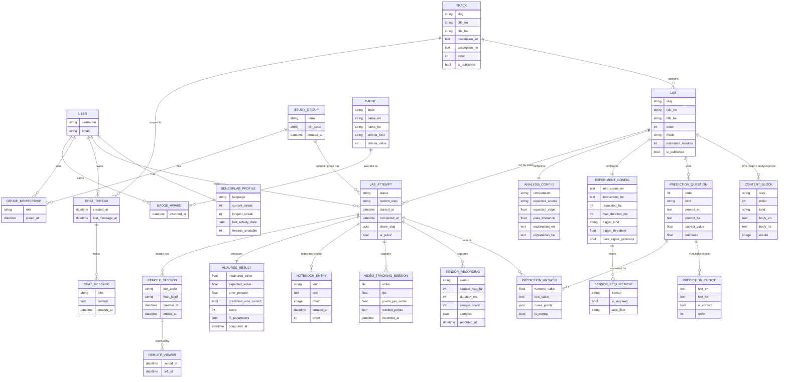

# SensorLab — Data Model

This is the standalone data model document called for by
[building_an_app.md](../building_an_app.md) Rule 4 — separate from
[spec.md](spec.md) on purpose, so the shape of the data can be read and
reasoned about on its own.

**Status: approved; §2–4 are now built.** Identity landed in SL-A2 and
SL-C2, the curriculum in SL-B1. Everything from §5 onward is still design.
Decisions I made without asking are listed explicitly at the bottom (§12),
so they are easy to overturn rather than buried in prose — and where a name
changed once the code met a real phone, this document was amended in place
rather than left to disagree with `sensorlab/models.py`.

Every model below will live in `sensorlab/models.py`. Nothing here is
shared with `app/`, `matazim/`, `ustrip/`, or any other app's models — see
spec §8 and Rule 2. The one shared thing is the account itself.

---

## 1. Overview

---

## 2. Access and identity: almost not a model

There is no SensorLab-specific user, login, or password. Authentication is
babook's shared `User` and auth backend (spec §8) — a person signs in with
the account they already have. That is the one thing every app on this
site is allowed to share, and the sharing stops at the account.

**`SensorLabProfile`** is the app's own one-to-one extension of that
account, which is Rule 2 working as intended: everything SensorLab knows
about a person that is not "who is this person" lives here, in SensorLab's
own table, never as new columns on babook's `User`.

| Field | Type | Notes |
|---|---|---|
| `user` | OneToOneField → `User` | CASCADE |
| `language` | Char, `en` / `he` | The flip switch from spec §1. Persisted per user, not inferred from the browser each visit |
| `current_streak` | Int | |
| `longest_streak` | Int | Kept so a broken streak still leaves a personal best |
| `last_activity_date` | Date, null | What a new day's activity is compared against |
| `freezes_available` | Int | The "freeze" grace mechanism from spec §6 |
| `freezes_used` | Int | |

**Streaks are fields here, not their own model.** A streak is profile
state, not an entity with its own identity or history — nobody edits a
streak, lists streaks, or deletes one. If a day-by-day activity history is
ever wanted (a contribution-graph view), that is a new `ActivityDay` model
added then, not something to carry speculatively now.

**Totals are computed, not stored.** `labs_completed`, accuracy rate and
score are aggregates over `LabAttempt` / `AnalysisResult`, not counters on
the profile. Counters drift the moment anything is deleted or backfilled,
and this app has no scale problem that justifies that risk. If a
leaderboard query ever gets slow, denormalize *then*, with a number
measured to prove it — not now.

---

## 3. Curriculum: `Track` → `Lab`

Authored content. Written once by whoever builds the course, read by
everyone. This half of the model is deliberately separate from the attempt
half (§4): content is the curriculum, an attempt is one person's run
through it, and conflating them is how a course becomes un-editable
without destroying student history.

**`Track`** — one physics topic (spec §3, "מסלולים"). `slug`,
`title_en`/`title_he`, `description_en`/`description_he`, `order`,
`is_published`, optional `icon`/`cover_image`.

**`Lab`** — one experiment inside a track. `track` FK, `slug`,
`title_en`/`title_he`, `summary_en`/`summary_he`, `order`, `is_published`,
`estimated_minutes`, and:

- `mode` — `live_sensor` / `video_tracking` / `signal_generator`, the three
  experiment modalities spec §4 commits to. A code-level `TextChoices`,
  not a model: which modalities the platform supports is a capability of
  the app, not content someone edits.
- `prerequisite_lab` — self-referential FK, nullable. Explicit unlocking
  rather than implicit "previous by `order`", so a track can branch later
  without a migration. This is what backs "unlocked content" in spec §8.

`Lab.slug` is unique **site-wide**, not per track — tightened in SL-B2. It
was per track here, which supports a nested URL; the API serves a flat
`labs/<slug>/`, and a lab is the thing people link to and share (§5, spec
§6). A shareable link that needs two slugs to be unambiguous is worse.

Both carry a `published` manager alongside the default one (added in
SL-B1). There is no staging site here — authoring happens against the live
database — so "written" and "shown" have to be separate states, or a
student walks into a lab that is half-typed.

**Sensor types are `TextChoices`, not a table**, for the same reason as
`mode`: `accelerometer`, `linear_acceleration`, `gyroscope`,
`magnetometer`, `barometer`, `light`, `proximity`, `microphone`,
`gps`, `camera`. Adding one is a code change (there is new capture code
behind it either way), not a row someone adds in an admin screen.

---

## 4. The five steps, as data

Spec §3's flow is **Intro → Learn → Predict → Experiment → Analysis**. The
five steps do *not* map to five models, and this is the one place I
changed my mind while designing — worth stating rather than hiding, since
I told Avi in chat I leaned the other way.

The reason: three of the five steps (Intro, Learn, and the explanation
shown during Analysis) are *the same shape* — ordered blocks of bilingual
prose and media. Giving each its own near-identical model would be three
tables that differ only by name. The other two steps have genuinely
different shapes and do need their own structure.

So:

### 4.1 `ContentBlock` — Intro, Learn, and the Analysis explanation

One model, `lab` FK, discriminated by a `step` field
(`intro` / `learn` / `analysis`):

| Field | Type | Notes |
|---|---|---|
| `lab` | FK → `Lab` | CASCADE |
| `step` | Char | `intro` / `learn` / `analysis` |
| `order` | Int | Ordering within that step |
| `kind` | Char | `text` / `image` / `video` / `formula` / `callout` |
| `body_en` / `body_he` | Text | **Markdown** — see below |
| `media` | Image/File, blank | For `image` / `video` blocks |

**Body format, settled in SL-B1: Markdown, with raw HTML escaped before
conversion.** `markdown` is already a dependency of this site (`app/blog.py`,
`app/forum_views.py`) and plain text cannot carry the emphasis, lists and
occasional table teaching prose needs. The usual next step — a restricted
HTML subset cleaned with `bleach` — is unavailable: `bleach` is not
installed and adding a dependency is Avi's call, so rather than ship
unsanitised HTML, none is produced at all. Escaping `& < >` before
conversion means author-written markup renders as visible text; Markdown
reads `&lt;` as an entity and leaves it, so the escape survives.

Authoring is admin-only today, which makes the exposure small — but §12
anticipates a teacher role, and by then the course is written. The format
was flagged blocking for exactly that reason.

Only `kind = text` goes through Markdown. `formula`, `image`, `video` and
`callout` stay structured kinds, so instrument mode can render them
differently and each language can carry its own, instead of markup frozen
inside a paragraph the day it was typed.
Each block is a real, individually editable object — add, edit, delete,
reorder — which is the "every item is a real object" rule applied to
course authoring. A Learn step is usually several blocks (the concept, the
formula, a worked example); an Intro is usually one.

### 4.2 `PredictionQuestion` + `PredictionChoice` — the Predict step

The Predict step is a quiz, and **a quiz is real data, not a JSON blob**.
This is exactly the failure Rule 1 was written from: questions that live
in a JSON file are documentation, not data — unqueryable, un-editable,
and invisible to any statistics about which questions students get wrong.

**`PredictionQuestion`**: `lab` FK, `order`, `prompt_en`/`prompt_he`, and
`kind`:

- `multiple_choice` — answered by a `PredictionChoice` row
- `numeric` — answered by a number, checked against `correct_value` within
  `tolerance`
- `free_text` — answered in prose, not auto-scored (the tutor can react to
  it; no correct answer stored)
- `graph_sketch` — the spec §3 interaction: the student draws the curve
  they expect on empty axes, before any data exists

**`PredictionChoice`**: `question` FK, `text_en`/`text_he`, `is_correct`,
`order`. Only used by `multiple_choice` questions.

### 4.3 `ExperimentConfig` + `SensorRequirement` — the Experiment step

**`ExperimentConfig`** — one-to-one with `Lab`. `instructions_en/he`
(what to physically do: "drop the phone onto the cushion"),
`requested_hz`, `max_duration_ms`, `trigger_kind`
(`manual` / `threshold`) + `trigger_threshold` for the auto-capture
described in spec §4, and `uses_signal_generator` plus its settings
(tone frequency, strobe rate) for generator-based labs.

**`SensorRequirement`** — `config` FK, `sensor` (the `TextChoices` above),
`is_required`, `axis_filter` (e.g. only the z-axis matters). Many per
config, which is what makes spec §4's "two sensors captured
simultaneously" expressible as data instead of a special case in code.

**`requested_hz`, renamed from `default_sample_rate_hz` in SL-B1.** The
spike in spec §4.1 asked a real phone for 200 Hz and got 63. A lab *asks*
for a rate; the device answers; the recording (§6) stores what actually
arrived. The old name read like a setting the app controls, which quietly
promised something no browser will honour — and a field name is the
documentation most people read.

There is deliberately **no fallback/degradation field** here — spec §1
decided SensorLab does not accommodate phones missing a sensor. A lab that
requires a sensor the device lacks is refused with a clear message, not
silently reshaped.

### 4.4 `AnalysisConfig` — the Analysis step

One-to-one with `Lab`. What the app should compute from the captured data
and what to compare it against:

| Field | Type | Notes |
|---|---|---|
| `computation` | Char | `peak` / `mean` / `slope` / `period` / `fft_peak` / `curve_fit` / `area` |
| `expected_source` | Char | `constant` (a known value like g = 9.81) or `formula` (derived from the student's own inputs) |
| `expected_value` | Float, null | Used when `expected_source = constant` |
| `pass_tolerance` | Float | Percent error still counted as a successful result |
| `explanation_en/he` | Text | Shown after results — *why* the number came out as it did |

---

## 5. An attempt: one person's run through one lab

**`LabAttempt`** is the spine. Everything a person produces in a single run
hangs off it.

| Field | Type | Notes |
|---|---|---|
| `user` | FK → `User` | CASCADE |
| `lab` | FK → `Lab` | PROTECT — deleting a lab must not silently erase student history |
| `group` | FK → `StudyGroup`, null | Set when the run is part of a group session (spec §6) |
| `status` | Char | `in_progress` / `completed` / `abandoned` |
| `current_step` | Char | Which of the five steps to resume on |
| `started_at` / `completed_at` | DateTime | |
| `share_slug` | UUID | The shareable read-only link from spec §4 |
| `is_public` | Bool | Whether that link resolves for anyone holding it |

**Built in SL-D1, with three things this table did not say.**

- `lab` is **PROTECT** and `user` is **CASCADE**, deliberately opposite. A
  lab belongs to the course, so deleting one that has history is refused
  out loud; an attempt belongs to the person, so deleting them takes it.
- **Unfinished runs resume; finished runs never reopen.** The open question
  in §12 ("should an attempt be re-runnable?") is closed: yes, but a second
  attempt starts *beside* the first rather than replacing it, because spec
  §6 wants improvement over time and overwriting destroys that signal. The
  price is that every later epic must ask *which* attempt.
- `current_step` names a step in `LAB_STEPS`, which can change under a
  stored row. `resume_step` falls back to the first step and
  `step_is_known` reports that it did, so a screen can say so rather than
  throw or silently reset.

**Sharing is a field, not a model.** A share is a property of a result
("this one is visible by link"), not a thing with its own lifecycle. If
per-recipient sharing or expiry is ever wanted, *that* is a model; a
public flag plus an unguessable slug is not.

**`PredictionAnswer`** — `attempt` FK, `question` FK, and exactly one
answer payload depending on the question kind: `selected_choice` FK
(nullable), `numeric_value`, `text_value`, or `curve_points` for a sketched
curve. Plus `is_correct` (nullable — null for `free_text`, which is not
auto-scored).

`is_correct` is **stored, not computed on read**, because spec §6 wants
"hypothesis accuracy improving over time" as a tracked learning signal.
Recomputing it later would mean re-running a question's grading rules that
may have since been edited — and the honest record is what the student got
right *against the question as it was asked*.

**`NotebookEntry`** — `attempt` FK, `kind` (`note` / `photo`), `text`,
`photo`, `created_at`, `order`. One row per note or photo, fully editable
and deletable by its owner. This is the lab-notebook capability from spec
§3, and unlike sensor samples (§6 below) these genuinely are individual
objects a person adds and removes one at a time.

**`AnalysisResult`** — one-to-one with the attempt. `measured_value`,
`expected_value`, `error_percent`, `prediction_was_correct`, `score`,
`fit_parameters`, `computed_at`.

**Derived, but stored on purpose.** ustrip computes schedule times on every
read rather than storing them, and that was right there. Here it is the
opposite call and the reason is leaderboards: spec §6 wants statistics and
group rankings, and recomputing an FFT over raw sensor payloads for every
row of every leaderboard query is absurd. The result is stamped once when
the attempt completes.

---

## 6. Captured data: the one deliberate exception to Rule 1

Rule 1 says every piece of real data is a row in the database, not a blob.
**Sensor sample streams are the exception, and this is the "specific
reason, stated at the time" that the rule itself asks for.**

**`SensorRecording`** — `attempt` FK, `sensor`, `sample_rate_hz`,
`duration_ms`, `sample_count`, `recorded_at`, `label`, and `samples`: the
time-series payload as a structured field on the row (`JSONField`, or a
compressed binary field if volume demands it later).

Why not one row per sample: a sixty-second capture at 100 Hz on three axes
is 18,000 readings. That is a metrics stream, not a domain entity. More to
the point, Rule 1's actual test is *"if a person cannot see it, act on it,
or query it through the app, it is not data, it is documentation"* — and a
single accelerometer reading fails that test in the other direction.
Nobody edits sample #4,312. The **recording** is the object a person sees,
names, replays, exports and deletes; the samples are its contents.

The line this must not cross: the payload lives **in the database on a real
row**, never as a file on disk the app merely points at. That was the
actual ustrip failure — data sitting in a JSON file the app had no
knowledge of. A recording is queryable, owned by an attempt, owned by a
user, and deleted with them.

**`VideoTrackingSession`** — same reasoning, for spec §4's video
motion-tracking mode. `attempt` FK, `video` (FileField — the video itself
is genuinely a media file), `fps`, calibration (`pixels_per_meter`,
`origin_x`, `origin_y`), and `tracked_points` as a payload field. The
derived position/velocity/acceleration series are computed from the tracked
points, not stored separately.

---

## 7. The chat tutor

**`ChatThread`** — `user` FK, `track` FK, `created_at`, `last_message_at`.
**Unique on (user, track)**: spec §5 says the chat is per *track*, not per
lab — the tutor's memory spans the whole topic, which is the point of it
being persistent.

**`ChatMessage`** — `thread` FK, `role` (`user` / `assistant` / `system`),
`content`, `created_at`, and `context_attempt` FK (nullable).

That last field is what makes spec §5's claim real rather than aspirational.
The tutor is supposed to see the student's *actual* sensor data — so the
record has to say which attempt's data it was looking at when it answered.
Without it, a conversation six weeks later is unreadable: the hint
references a graph nobody can identify any more.

---

## 8. Groups

**`StudyGroup`** — `name`, `join_code` (unguessable, how someone joins),
`created_by` FK, `created_at`.

Named `StudyGroup`, **not `Group`**, on purpose: `django.contrib.auth.models.Group`
already exists in this project and ustrip uses it for access control. Two
things called `Group` in one Django project is a naming trap that costs
somebody an hour at the worst possible moment.

**`GroupMembership`** — `group` FK, `user` FK, `role` (`owner` / `member`),
`joined_at`, unique on (group, user).

A group is a social container, **not an access-control mechanism**.
SensorLab membership does not grant permissions; it scopes leaderboards and
shared runs. Access to the app itself is the shared account (§2).

---

## 9. Remote / multi-device capture

Spec §4 commits to phyphox's most distinctive capability: one phone
captures, other browsers watch live.

**`RemoteSession`** — `attempt` FK (the host's run), `join_code`,
`host_label`, `created_at`, `ended_at`.

**`RemoteViewer`** — `session` FK, `user` FK (nullable), `joined_at`,
`left_at`.

The live streaming itself is transient — websockets, not rows; nobody
should be writing a database row per sensor frame per viewer. What is
persisted is the *session*: that it happened, who hosted it, who watched,
and for how long. That is real data (it answers "did the class actually
see this?"), and it is cheap.

`RemoteViewer` is the one model here I would happily cut from a first
build if the viewer list turns out to be noise — flagged rather than
quietly assumed necessary.

---

## 10. Badges, and what leaderboards are not

**`Badge`** — `code`, `name_en/he`, `description_en/he`, `icon`,
`criteria_kind` (`labs_completed` / `track_mastered` / `streak_days` /
`prediction_accuracy`), `criteria_value`.

**`BadgeAward`** — `badge` FK, `user` FK, `awarded_at`, unique on
(badge, user).

Badges are a catalog in the database, not constants in code, precisely so
a new badge is content someone adds — the Rule 1 instinct applied to
gamification.

**Leaderboards are computed, not stored.** A leaderboard is an aggregate
query over `AnalysisResult` / `LabAttempt`, scoped to a `StudyGroup` and a
time window. There is no `Leaderboard` table.

The exception worth naming: this means **no historical record of who won
week 3** — once the window passes, the standing is recomputed from current
data, and a deleted attempt changes the past. If permanent weekly standings
matter, the fix is a `LeaderboardSnapshot` model stamped at each week's
close, and it is purely additive — nothing here needs restructuring to add
it later. I did not include it because the spec asks for "statistics,"
which this satisfies, and a snapshot table nobody reads is dead weight.
**This is one of the two calls I would most like confirmed (§12).**

---

## 11. Bilingual content: duplicate fields, not a translation table

Every authored, user-facing string is stored twice: `*_en` and `*_he`.

The alternative — a separate translations table keyed by (model, field,
language), or `django-modeltranslation` — is the right answer when the set
of languages is open-ended. Here it is exactly two, named in spec §1, and
the content is curated rather than user-generated. Duplicate columns keep
every query a single-table read, keep the admin obvious, and make a missing
translation visible as an empty field instead of a missing row.

Resolution is a single helper on each model (`title` returns `title_he` or
`title_en` based on the active language, falling back to the other rather
than rendering blank). **If a third language is ever wanted, this is the
decision to revisit** — and it is a real migration, not a config change.
That trade is being made knowingly.

Note what is *not* duplicated: a student's own words. `NotebookEntry.text`,
`PredictionAnswer.text_value` and `ChatMessage.content` are written in
whatever language the person used, and are not translated.

---

## 12. Decisions I made without asking, and open questions

Listed plainly so they are easy to overturn at the gate.

**Calls made (I had a leaning and acted on it):**

1. **Three of the five steps share one `ContentBlock` model** rather than
   each getting its own — §4. This reverses what I told Avi in chat; the
   reason is that Intro, Learn and the Analysis explanation are identical
   in shape.
2. **Leaderboards are computed, not stored** — §10. Cost: no permanent
   "who won week 3." Additive to fix later.
3. **Sensor samples are a payload field on a recording row**, not a row per
   sample — §6. A named exception to Rule 1, with the reasoning stated.
4. **Bilingual via duplicate columns**, not a translation table — §11.
5. **Streaks are profile fields**, not a model — §2.
6. **Sharing is a flag + slug**, not a model — §5.
7. **`StudyGroup`, not `Group`** — §8, to avoid colliding with Django auth.
8. **Totals/accuracy are computed aggregates**, not denormalized counters
   on the profile — §2.
9. **`ContentBlock` bodies are Markdown with raw HTML escaped**, decided in
   SL-B1 after Avi left the choice to me three times — §4.1. The
   constraint that decided it was the absence of `bleach`.

**Genuinely open, would like an answer:**

- **Does a lab ever need more than one experiment capture?** Modelled as
  many `SensorRecording` rows per attempt (so "run it three times and
  compare" works). If a lab is always one capture, this could collapse to
  a one-to-one — but I would rather keep the many and not need it.
- **Is `RemoteViewer` worth keeping** (§9), or is "the session happened"
  enough?
- ~~**Should an attempt be re-runnable?**~~ **Closed in SL-D1:** yes, and
  a second attempt starts beside the first rather than replacing it —
  overwriting would throw away the improvement-over-time signal spec §6
  asks for. An unfinished run resumes instead of duplicating, because two
  half-done attempts at one lab is a state nothing downstream can read.
- **Teacher/author role**: nothing here models "who may author a track."
  Right now that is the Django admin and a superuser. If teachers are
  meant to author content in-app, that is a role concept this model does
  not yet have.

---

*Next, once this is approved: the full spec in high-level chapters
(kickoff step 4), then backlog and sprints (step 5).*
