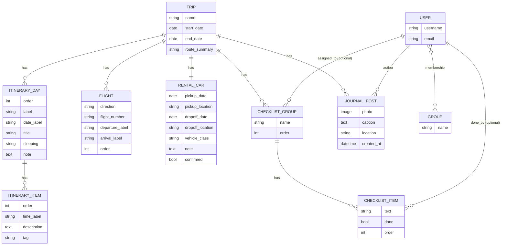

# ustrip — Data Model

This is the standalone data model document called for by
[building_an_app.md](../building_an_app.md) Rule 4 — separate from
[spec.md](spec.md) on purpose, so the shape of the data can be read on its
own. ustrip was built before that rule existed, so this is a reverse
engineering of what actually shipped, written now so Avi can confirm we're
aligned before anything more is built on top of it, rather than written
before the code the way the kickoff sequence now specifies for future
apps.

Every model below lives in `ustrip/models.py`. Nothing here is shared with
`app/`, `matazim/`, or any other app's models — see spec §2.2 and Rule 2.

## Overview

## Access: not a model, Django's own auth

There is no ustrip-specific access model. Access is: `User.is_superuser`,
or membership in the standard Django auth `Group` named `family`
(`django.contrib.auth.models.Group`, a many-to-many Django already ships).
No new field on `User`, no new table — this is the encapsulation rule
(Rule 2) working correctly on the one thing every app is allowed to share:
the account itself. See spec §3.

## Trip — the root

One row, in practice (spec §0: this is one specific trip, not a general
trip-management feature). Everything else hangs off it by a `trip`
foreign key (or, for the rental car, a one-to-one).

| Field | Type | Notes |
|---|---|---|
| `name` | CharField | e.g. "USA Trip 2026" |
| `start_date` / `end_date` | DateField | |
| `route_summary` | CharField, blank | one-line route, shown on Home |

## Itinerary — `ItineraryDay` → `ItineraryItem`

Day-by-day plan (spec §4.1). A day has many items; both are user-editable
in-app (add, edit, delete, reorder — no creator lock).

**ItineraryDay**: `trip` FK, `order` (sort key — `label` like "12-13" does
not sort as text), `label`, `date_label` (free text, e.g. "Tue Sep 22"),
`title`, `sleeping` (free text, where the family sleeps that night), `note`
(blank text — a whole-day heads-up or open decision, not tied to one
timeline item; e.g. Day 3's "could swap for the Jets game instead"). Added
2026-09-13 after a full audit of the source JSON found two days' notes
were silently dropped by the importer — the field didn't exist yet.

**ItineraryItem**: `day` FK, `order`, `time_label` (free text or blank),
`description`, `tag` (`plan` or `optional`).

## Flight

One row per leg (spec §0's harvested `flights` block, now a real model
instead of JSON text — see building_an_app.md's "Data" section for why
this mattered). `trip` FK, `direction` (`outbound`/`return`),
`flight_number`, `departure_label`, `arrival_label` (both free text —
the source data is not clean structured datetimes), `order`. Editable
in-app; not deletable (there are exactly two, always).

## RentalCar

One row per trip (`trip` is a `OneToOneField`). `pickup_date`,
`pickup_location`, `dropoff_date`, `dropoff_location`, `vehicle_class`,
`note`, and `confirmed` (bool, default `False`) — the one field that
matters most: it is the difference between "researched proposal" and
"actually booked," and reseeding from the source JSON never touches a
confirmed record. Editable in-app; not deletable.

## Packing — `ChecklistGroup` → `ChecklistItem`

Shared or per-person checklists (spec §4.2). `ChecklistGroup`: `trip` FK,
`name`, `assigned_to` (nullable FK to `User` — blank means shared),
`order`. `ChecklistItem`: `group` FK, `text`, `done`, `done_by` (nullable
FK to `User`, set when checked), `order`. Both levels support add, edit
(item text only), delete, and reorder in-app; deleting a group cascades
its items.

## JournalPost

Reverse-chronological photo diary (spec §4.3). `trip` FK, `author` FK to
`User`, `photo` (ImageField, optional), `caption`, `location`,
`created_at` (auto). No likes, no comments, no reordering — chronological
order is the point. Add, edit (caption/location only), and delete in-app.

**Worth confirming:** `author` is `on_delete=CASCADE` — if a family
member's account is ever deleted, their journal posts are deleted with it,
not kept and attributed to "someone." That's different from
`ChecklistItem.done_by`/`ChecklistGroup.assigned_to` below, which are
`SET_NULL` (the checklist item survives, it just shows no one checked it).
Low-risk for five accounts that basically never get deleted, but it is a
real choice, flagging it rather than leaving it implicit.

## Deliberately not modeled

- **Lodging** (the source JSON's `lodging` array): the same fact as each
  `ItineraryDay.sleeping`, grouped by night-block instead of by day. A
  second model would just be two copies of one fact free to disagree —
  see backlog.md's Sprint 2 note.
- **`rejected_ideas`** from the source JSON: planning-process trivia (what
  the family decided against), not trip data the app needs to show or act
  on. Stays in the JSON as a historical note, nothing to model.
- **`duration_days`** on the source `trip` object: derivable from
  `start_date`/`end_date`. Storing it too would just be a second number
  free to disagree with the dates if either is ever hand-edited.
- **`family`** (the source's plain name list, `["Avi", "Nirit", ...]`) is
  not a `Trip` field. It's superseded by something better: the real
  `family` Django Group and actual `User` accounts (spec §3), which is
  live data — who has really signed up and been granted access — rather
  than a static list of first names.

## Full audit against the source JSON

Checked 2026-09-13 after "did you fill all data?" turned out not to have
an obviously-yes answer without actually diffing every key: every
top-level field in `trip-data/usa-2026.json` is now either modeled (the
day-level `note` field above was the one real gap, found by this audit and
fixed the same day) or deliberately not modeled, for the stated reasons
above. Nothing is silently missing.

## Known gaps against building_an_app.md's Rule 4

This document is new; `docs/ustrip/` now also has `dashboard.html` (added
2026-09-13), so Rule 4 is fully met.
